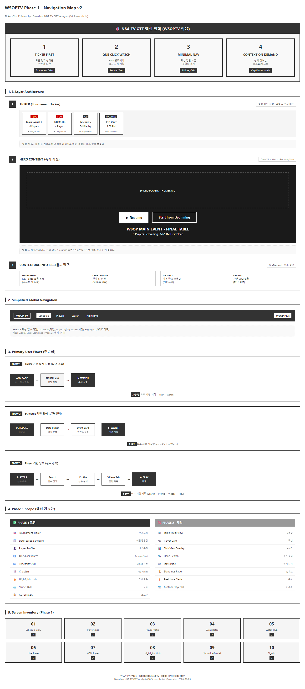
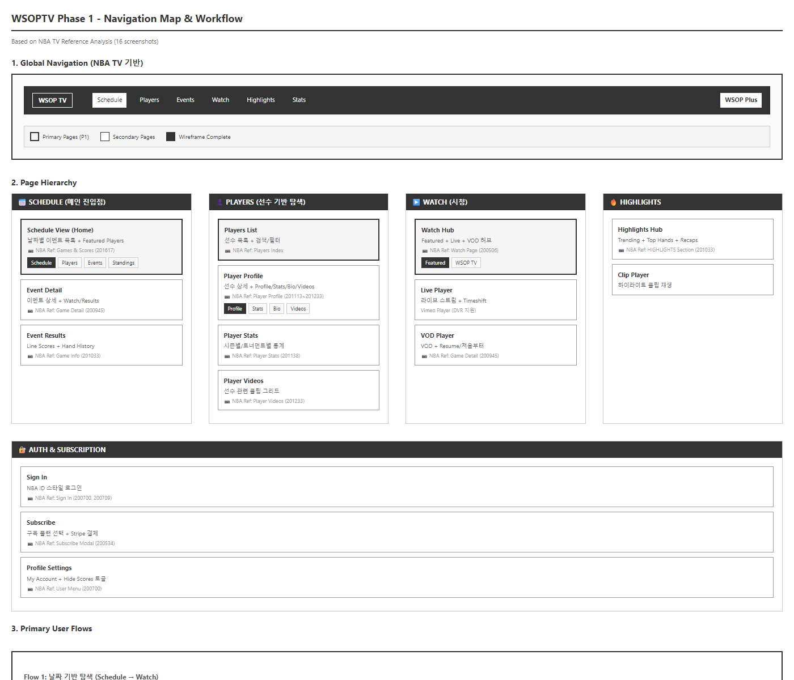
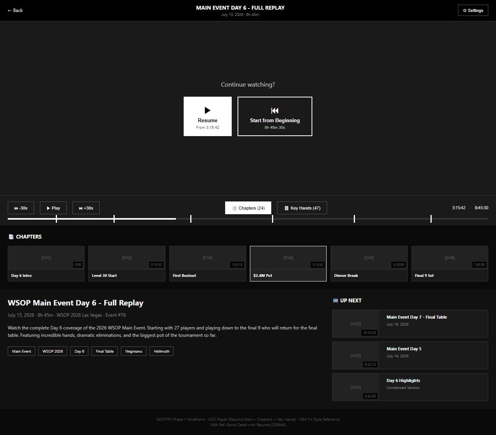

# Phase 1-01: MVP Spec (Vimeo 기반 NBA TV 스타일)

| 항목 | 값 |
|------|---|
| **Phase** | 1 (MVP) |
| **Version** | 5.1.0 |
| **Updated** | 2026-02-04 |
| **Status** | ⭐ Active |
| **Target** | Q3 2026 론칭 |
| **Depends** | [01-vision](../01-phase0/01-vision.md), [02-business](../01-phase0/02-business.md) |

---

## 용어 정의

> 모든 문서에서 동일한 용어를 사용합니다. 상세 정의: [01-vision](../01-phase0/01-vision.md)

### 핵심 개념

| 용어 | 정의 | MVP 포함 |
|------|------|:--------:|
| **Single Video** | 한 번에 하나의 비디오만 시청 | ✅ |
| **Selected View** | 보고 싶은 방송을 선택해서 볼 수 있는 기능 | ✅ |
| **Multi-video** | 여러 비디오 플레이어를 동시에 재생 | ❌ Phase 2+ |
| **Timeshift** | 라이브 중 되감기 기능 | ✅ |
| **StatsView** | 플레이어 통계 HUD 오버레이 | ❌ Phase 2+ |

### Selected View vs Multi-video

| 구분 | Selected View (MVP) | Multi-video (Phase 2+) |
|:----:|---------------------|----------------------|
| **정의** | 어떤 방송을 볼지 **선택** | 여러 방송을 **동시에** 재생 |
| **구현** | 기본 OTT 기능으로 충분 | 커스텀 플레이어 개발 필요 |
| **Vimeo 지원** | ✅ 기본 제공 | ❌ 미지원 |

> **핵심 인사이트**: MVP에서는 Selected View만 구현하면 됨. 기본 OTT 솔루션(Vimeo)으로 다중 생방송 중 선택 시청 가능.

---

## Executive Summary

**Vimeo 기본 템플릿**을 활용하여 **NBA TV League Pass**와 최대한 유사한 UX를 제공하는 Phase 1 MVP 기획서입니다.

### 핵심 원칙

| 원칙 | 설명 |
|------|------|
| **Vimeo 제약 내 설계** | 커스텀 개발 없이 Vimeo 기본 기능만 활용 |
| **NBA TV UX 복제** | 검증된 스포츠 OTT UI 패턴 적용 |
| **빠른 론칭** | 최소 기능 → 피드백 기반 확장 |

### NBA TV OTT 핵심 철학 (4대 원칙)



| 원칙 | NBA TV 구현 | WSOPTV Phase 1 적용 |
|:----:|-------------|---------------------|
| **① TICKER FIRST** | Score Strip으로 모든 경기 상태 한눈에 | **Tournament Ticker** 상단 고정 |
| **② ONE-CLICK WATCH** | Hero 영역에 Resume/Start 버튼 | **즉시 시청 버튼** 중앙 배치 |
| **③ MINIMAL NAV** | 핵심 탭 4-5개만 노출 | **Schedule / Players / Watch / Highlights** |
| **④ CONTEXT ON DEMAND** | 상세 정보는 스크롤/탭으로 | Chip Counts, Key Hands는 하단/탭 |

> **핵심 인사이트**: NBA TV는 상단의 복잡한 요소들을 단순화하여 **Ticker를 통한 방송 접근**에만 집중. 시청자가 **2-3 클릭 내에 원하는 방송 시청**을 시작할 수 있도록 설계됨.

### Phase 1 범위 요약

| 포함 ✅ | 제외 ❌ (Phase 2+) |
|--------|-------------------|
| **Single Video** 라이브/VOD | **Multi-video** (여러 플레이어 동시 재생) |
| **Selected View** (방송 선택 시청) | Player Cam (선수별 직캠 동시 표시) |
| Timeshift/DVR | Table Multi-video (테이블 동시 시청) |
| 날짜/선수 기반 브라우징 | StatsView (HUD 오버레이) |
| 구독 결제 (Stripe) | 핸드 검색 |
| 5개 플랫폼 앱 | 커스텀 플레이어 UI |

> **MVP 핵심**: Selected View로 다중 생방송(Feature Table, Player Cam 스트림 등) 중 원하는 것을 **선택**하여 시청 가능. **동시 재생(Multi-video)**은 Phase 2+.

---

## 1. 목표 및 배경

### 1.1 왜 Phase 1인가?

**전략 변경 배경** (02-business 기준):

| 항목 | 기존 방향 | Phase 1 방향 |
|------|----------|-------------|
| **솔루션** | 메가존 Full-Custom (50억+) | Vimeo SaaS (~1억) |
| **접근법** | 모든 기능 동시 구현 | MVP 론칭 → 점진적 확장 |
| **리스크** | 높은 초기 투자, 긴 개발 기간 | 빠른 시장 진입, 낮은 리스크 |
| **예상 TCO (3년)** | 80~100억 | 7~10억 |

### 1.2 Phase 1 목표

| 목표 | 성공 지표 |
|------|----------|
| **Q3 2026 론칭** | 2026년 WSOP 메인 이벤트 전 서비스 시작 |
| **GG 생태계 통합** | GGPass 로그인, 크로스 프로모션 연동 |
| **NBA TV 수준 UX** | Vimeo 제약 내 최대한 유사한 사용자 경험 |
| **구독자 확보** | 6개월 내 1만 유료 구독자 |

---

## 2. NBA TV 레퍼런스 분석

### 2.1 NBA TV 핵심 UI 요소

*NBA TV 메인 화면 참조 (Games & Scores 페이지)*

#### 3계층 구조 (POC 기본 레이아웃)

> **기본 레이아웃 와이어프레임**: [POC Layout Wireframe](../00-poc/poc-layout-wireframe.png)

| 계층 | NBA TV | WSOPTV Phase 1 (POC 확정) |
|:----:|--------|---------------------------|
| **① Top - Live Ticker** | Score Strip (실시간 경기 스코어) | LIVE/VOD/Upcoming 토너먼트 가로 스크롤 |
| **② Center - Video Player** | Hero 영역 (하이라이트/라이브) | 16:9 Video Player + Timeshift 컨트롤 |
| **③ Bottom - Content Section** | 콘텐츠 그리드 (Stories, Trending) | Highlights/Categories/Related Videos 탭 + 썸네일 그리드 |

> **POC 와이어프레임 확정 (2026-02-06)**: `docs/00-poc/poc-layout-wireframe.png`을 기본 레이아웃으로 채택. Vimeo 기술 팀 리뷰용 B&W 와이어프레임 기준.

### 2.2 NBA TV 플레이어 UI

*NBA TV 플레이어 참조 (Live Game Player UI)*

| UI 요소 | NBA TV | WSOPTV Phase 1 |
|---------|--------|----------------|
| **상단 타이틀** | "RAPTORS @ LAKERS" | "MAIN EVENT - TABLE 1" |
| **브로드캐스트 선택** | "Lakers (In-Arena) ⚙" | "Korean Commentary ⚙" |
| **레이아웃 버튼** | 1분할 / 2분할 / 4분할 | ❌ Phase 2+ (Vimeo 미지원) |
| **Streams 버튼** | 동시 진행 경기 목록 | ✅ 동시 진행 테이블 목록 |
| **Multi-video 버튼** | 4분할 모드 | ❌ Phase 2+ |
| **Key Plays 버튼** | 주요 장면 네비게이션 | ⚠️ Featured Hands (메타데이터 태깅) |
| **Timeshift 바** | DVR 컨트롤 | ✅ Vimeo 기본 지원 |

### 2.3 NBA TV 콘텐츠 브라우징

*NBA TV 콘텐츠 허브 참조 (Browse Content 페이지)*

| 섹션 | NBA TV | WSOPTV Phase 1 |
|------|--------|----------------|
| **STORIES** | 라이브 경기 썸네일 (LIVE 배지) | 라이브 대회 (🔴 LIVE 배지) |
| **TRENDING NOW** | 인기 하이라이트/뉴스 | 핫 핸드/빅 팟 하이라이트 |
| **50-POINT GAMES** | 시즌 특별 기록 | 밀리언 달러 팟, Bad Beat 모음 |
| **GAME RECAPS** | 경기 리캡 | 토너먼트 Day Recap |

### 2.4 NBA TV 상세 분석 (16개 스크린샷 기반)

> **분석 자료**: NBA TV 앱 스크린샷 16개 기반 분석 (2026-02-02)

#### Global Navigation 구조

| 메뉴 | NBA TV | WSOPTV Phase 1 |
|------|--------|----------------|
| 1 | Games | **Schedule** (메인 진입점) |
| 2 | Schedule | (Schedule에 통합) |
| 3 | Watch | **Watch** (Live/VOD Hub) |
| 4 | News | Highlights |
| 5 | Stats | Stats |
| 6 | Standings | Standings |
| 7 | Teams | Events |
| 8 | Players | **Players** (선수 기반 탐색) |
| CTA | League Pass | **WSOP Plus** |

#### 페이지 유형 매핑

| NBA TV 페이지 | 핵심 기능 | WSOPTV 대응 화면 | 와이어프레임 |
|--------------|----------|------------------|:------------:|
| **Games & Scores** | Date Picker + Game Cards + Game Leaders | Schedule View (Home) | ✅ 완료 |
| **Watch** | Featured + NBA TV 24/7 + Program List | Watch Hub | TODO |
| **Game Detail** | Hero Video + Resume/Start + Recap | Event Detail | ✅ 완료 |
| **Game Info** | Highlights + Box Score + Line Scores | Event Results | TODO |
| **Player Profile** | Hero + Stats/Bio/Videos Tabs | Player Profile | ✅ 완료 |
| **Player Stats** | Season Filter + Traditional Splits | Player Stats | TODO |
| **Player Videos** | Video Grid | Player Videos | TODO |

#### User Flow 분석 (클릭 수 최소화)

**Flow 0: Ticker 기반 즉시 시청 (최단 경로)** ⭐
```
ANY PAGE → Ticker 클릭 → ▶ WATCH (2 클릭)
```
> **핵심**: 어느 페이지에서든 상단 Ticker 클릭 한 번으로 해당 방송 페이지 이동

**Flow 1: 날짜 기반 탐색**
```
Schedule → Date Picker → Event Card → ▶ WATCH (3 클릭)
```

**Flow 2: 선수 기반 탐색**
```
Players → Search → Profile → Videos Tab → ▶ PLAY (4 클릭)
```

**Flow 3: 구독 전환**
```
Paywall → WSOP Plus CTA → Plan Select → Stripe → Access
```

---

## 3. Vimeo 기본 기능 매핑

### 3.1 Vimeo OTT 템플릿 기능

| Vimeo 기능 | 설명 | Phase 1 활용 |
|-----------|------|:------------:|
| **Video Player** | HLS 스트리밍, DRM | ✅ |
| **Live Streaming** | RTMP 수신, DVR/Timeshift | ✅ |
| **VOD Library** | 카테고리, 시리즈 구조 | ✅ |
| **Collections** | 콘텐츠 그룹핑 | ✅ |
| **Search** | 제목/설명 기반 검색 | ✅ |
| **Subscription** | Stripe 연동 결제 | ✅ |
| **Multi-platform Apps** | iOS, Android, Apple TV, Roku, Fire TV | ✅ |
| **Analytics** | 시청 데이터, 구독 지표 | ✅ |
| **Custom Metadata** | 콘텐츠 태깅 | ⚠️ 제한적 |
| **Custom Player UI** | 버튼/레이아웃 커스터마이징 | ❌ |
| **Multi-video** | 동시 다중 스트림 | ❌ |

### 3.2 Vimeo 제약사항 및 대응

| 제약사항 | 영향 | 대응 방안 |
|---------|------|----------|
| **Multi-video 미지원** | 4분할 동시 시청 불가 | "Streams" 버튼으로 테이블 전환 유도 |
| **커스텀 플레이어 UI 제한** | NBA TV 버튼 배치 불가 | 표준 Vimeo 플레이어 사용, 설명 텍스트 보완 |
| **고급 메타데이터 제한** | Hand 단위 태깅 어려움 | 시간 기반 챕터 + 설명 태그 활용 |
| **통계 오버레이 불가** | StatsView 구현 불가 | Phase 2+ 검토 |

---

## 4. Phase 1 화면 설계

### 4.1 메인 페이지 (Home) - 날짜/선수 기반 브라우징

**NBA TV 핵심 UX**: 날짜 기준(Schedule) + 선수 기준(Players) 콘텐츠 탐색

*와이어프레임: [HTML 원본](../99-archive/mockups/PRD-0012/01-home-schedule-view.html) | [스크린샷](../99-archive/images/PRD-0012/01-home-schedule-view.png)*

#### 핵심 UI 요소

| 요소 | NBA TV | WSOPTV Phase 1 |
|------|--------|----------------|
| **Tab Navigation** | Games / Schedule / Standings / Teams / Players | **Schedule** / Players / Events / Standings |
| **Date Picker** | 가로 날짜 선택 바 | ✅ 동일 구현 (월/일/요일) |
| **Game Cards** | 선택 날짜의 경기 목록 | ✅ 선택 날짜의 이벤트 목록 |
| **Featured Players** | 사이드바 선수 카드 | ✅ 참가 선수 프로필 |
| **Score Strip** | 상단 실시간 스코어 | ✅ Tournament Ticker |

#### 콘텐츠 브라우징 방식 비교

| 기존 OTT 방식 | NBA TV 방식 (채택) |
|--------------|-------------------|
| 카테고리 → 시리즈 → 에피소드 | **날짜 선택 → 해당 날짜 경기 목록** |
| "WSOP 2026" → "Main Event" → "Day 7" | **July 16** → Main Event Day 7, High Roller FT... |
| 검색: 제목 기반 | **선수 기반 + 날짜 기반 필터** |

#### Game Card 구조 (날짜별 목록)

| 필드 | 설명 | 예시 |
|------|------|------|
| **Status** | LIVE / UPCOMING / FINAL / VOD | 🔴 LIVE |
| **Time** | 시작 시간 또는 NOW | 2:00 PM / NOW |
| **Title** | 이벤트명 | Main Event - Final Table |
| **Subtitle** | Day + 상금/상태 | Day 7 · $10M+ First Place |
| **Players** | 참가 선수 목록 | Negreanu, Ivey, Hellmuth +5 |
| **Action** | 버튼 | ▶ WATCH / REMINDER / REPLAY |

#### NBA TV 매핑

| 영역 | NBA TV | WSOPTV Phase 1 |
|------|--------|----------------|
| **Tab Navigation** | Schedule, Players, Teams, Standings | **Schedule, Players, Events, Standings** |
| **Date Picker** | 가로 날짜 선택 (요일/일/월) | ✅ 동일 구현 |
| **Game Cards** | 날짜별 경기 목록 (시간, 팀, 상태) | ✅ 날짜별 이벤트 목록 (시간, 이벤트, 상태) |
| **Featured Players 사이드바** | 오늘의 주요 선수 | ✅ 참가 선수 프로필 |
| **Headlines** | 뉴스 섹션 | ✅ 포커 뉴스/하이라이트 |
| **Tournament Ticker** | Score Strip (실시간 스코어) | ✅ 진행 중 대회/테이블 상태 |

### 4.2 라이브 시청 페이지 (Watch Live)

*와이어프레임: 아래 ASCII 다이어그램 참조 (3계층 구조 텍스트 표현)*

> **기본 레이아웃 참조**: POC 와이어프레임(`docs/00-poc/poc-layout-wireframe.png`)이 기본 3계층 구조의 확정 버전입니다. 아래 ASCII 다이어그램은 해당 와이어프레임의 텍스트 표현입니다.

```
┌─────────────────────────────────────────────────────────────────────────────┐
│  [← Back]                 MAIN EVENT - TABLE 1                    [⚙ 설정]  │
│                           Korean Commentary                                  │
├─────────────────────────────────────────────────────────────────────────────┤
│                                                                              │
│  ┌─────────────────────────────────────────────────────────────────────────┐│
│  │                                                                          ││
│  │                                                                          ││
│  │                                                                          ││
│  │                         [VIDEO PLAYER]                                   ││
│  │                                                                          ││
│  │                          🔴 LIVE                                         ││
│  │                                                                          ││
│  │                                                                          ││
│  │                                                                          ││
│  └─────────────────────────────────────────────────────────────────────────┘│
│                                                                              │
│  ┌─────────────────────────────────────────────────────────────────────────┐│
│  │  [🎙 Streams 10]   [📍 Featured Hands]   [📊 Standings]                 ││
│  │                                                                          ││
│  │  ▶ ━━━━━━━━━━━━━━━━━━━━━━━━━━━━━━━━━━━━━━━━━━━━━━━━━━ 02:31:43    LIVE  ││
│  └─────────────────────────────────────────────────────────────────────────┘│
│                                                                              │
│  ─────────────────────────────────────────────────────────────────────────  │
│                                                                              │
│  📺 ALSO STREAMING NOW                                                       │
│  ┌────────────────┐ ┌────────────────┐ ┌────────────────┐                    │
│  │ 🔴 High Roller │ │ 🔴 $1K Daily  │ │ 🔴 Ladies Event│                    │
│  │ Final Table    │ │ Day 2          │ │ Day 1          │                    │
│  │ 9 Players      │ │ 180 Left       │ │ 312 Left       │                    │
│  │ [WATCH]        │ │ [WATCH]        │ │ [WATCH]        │                    │
│  └────────────────┘ └────────────────┘ └────────────────┘                    │
│                                                                              │
└─────────────────────────────────────────────────────────────────────────────┘
```

#### NBA TV 플레이어 UI 매핑

| 버튼 | NBA TV 기능 | WSOPTV Phase 1 | 구현 방식 |
|------|------------|----------------|----------|
| **Streams** | 동시 진행 경기 목록 | ✅ 동시 진행 테이블 목록 | 하단 "ALSO STREAMING NOW" 섹션 |
| **Multi-video** | 4분할 모드 | ❌ 미지원 | Phase 2+ |
| **Key Plays** | 주요 장면 점프 | ⚠️ Featured Hands | 시간 기반 챕터 (Vimeo Chapters) |
| **레이아웃 전환** | 1/2/4 분할 | ❌ 미지원 | Single Video만 제공 |

### 4.3 Players 페이지 (선수 기반 탐색)

#### 4.3.1 Players List (선수 목록)

**NBA TV 레퍼런스**: Player Index Page

*와이어프레임: [HTML 원본](../99-archive/mockups/PRD-0012/02-players-list.html) | [스크린샷](../99-archive/images/PRD-0012/02-players-list.png)*

#### 핵심 UI 요소

| 요소 | 설명 |
|------|------|
| **Search Bar** | 선수명 검색 |
| **Filters** | 국적, 정렬 옵션 (Bracelets, Earnings, Name) |
| **Alphabet Filter** | A-Z 알파벳 필터 바 |
| **Featured Players** | 현재 이벤트 참가 주요 선수 |
| **Player Cards** | 프로필 사진 + 국적 + Bracelets + Earnings |

#### 4.3.2 Player Profile (선수 프로필)

**NBA TV 레퍼런스**: DeMar DeRozan Profile (201113~201233)

*와이어프레임: [HTML 원본](../99-archive/mockups/PRD-0012/03-player-profile.html) | [스크린샷](../99-archive/images/PRD-0012/03-player-profile.png)*

#### NBA TV 탭 구조 매핑

| NBA TV 탭 | WSOPTV 탭 | 콘텐츠 |
|-----------|-----------|--------|
| **Profile** | **Profile** | Career Stats + Latest Videos + Last 5 Events |
| **Stats** | **Stats** | Season/Tournament별 통계 테이블 |
| **Bio** | **Bio** | Professional Career + Highlights |
| **Videos** | **Videos** | 선수 관련 클립 그리드 |

#### Hero 영역 (선수 정보)

| 필드 | NBA TV | WSOPTV |
|------|--------|--------|
| **메인 스탯** | PPG, RPG, APG | Bracelets, Earnings, POY Titles |
| **상세 정보** | Age, Height, Weight, Draft | Age, Hometown, WSOP Cashes |
| **액션 버튼** | ☆ FOLLOW | ☆ FOLLOW |

### 4.4 Event Detail (이벤트 상세)

**NBA TV 레퍼런스**: Game Detail Hero (200945) + Game Info (201033)

*와이어프레임: [HTML 원본](../99-archive/mockups/PRD-0012/04-event-detail.html) | [스크린샷](../99-archive/images/PRD-0012/04-event-detail.png)*

#### NBA TV 매핑

| 영역 | NBA TV | WSOPTV |
|------|--------|--------|
| **Hero Video** | 경기 영상 + Resume/Start | 이벤트 영상 + Resume/Start |
| **Score Box** | 팀 스코어 | 1ST PLACE PRIZE |
| **Details** | Date, Venue, Officials, Attendance | Date, Venue, Buy-in, Entries, Prize Pool |
| **HIGHLIGHTS** | 클립 그리드 | Key Hands 클립 그리드 |
| **LINE SCORES** | 쿼터별 점수 | **Chip Counts** (선수별 칩 현황) |
| **BOX SCORE** | 선수별 통계 | Final Table Results |

#### Key Hands 섹션 (NBA TV Key Plays 대응)

| 필드 | 설명 | 예시 |
|------|------|------|
| **Hand #** | 핸드 번호 | #47 |
| **Title** | 핸드 설명 | Negreanu vs Polk |
| **Type** | 핸드 유형 | 4-Bet Bluff · All-In |
| **Pot** | 팟 사이즈 | $2.4M |

### 4.6 Navigation Map & User Flow

**전체 네비게이션 맵 및 워크플로우 다이어그램**



[HTML 원본](../99-archive/mockups/PRD-0012/00-navigation-map.html)

#### Phase 1 Screen Inventory

| # | 화면명 | 상태 | NBA TV 레퍼런스 |
|:-:|--------|:----:|----------------|
| 01 | Home - Schedule View | ✅ 완료 | Games & Scores |
| 02 | Players List | ✅ 완료 | Player Index |
| 03 | Player Profile | ✅ 완료 | Player Profile |
| 04 | Event Detail | ✅ 완료 | Game Detail + Game Info |
| 05 | Watch Hub | ✅ 완료 | Watch Page |
| 06 | Live Player | ✅ 완료 | (Vimeo Player + Timeshift) |
| 07 | VOD Player | ✅ 완료 | Game Recap + Resume |
| 08 | Highlights Hub | ✅ 완료 | HIGHLIGHTS Section |
| 09 | Subscribe Modal | ✅ 완료 | League Pass Subscribe |
| 10 | Sign In | ✅ 완료 | Sign In with NBA ID |

### 4.7 Watch Hub (콘텐츠 허브)

**NBA TV 레퍼런스**: Watch Page (Featured + NBA TV 24/7 + Program List)

*와이어프레임: [HTML 원본](../99-archive/mockups/PRD-0012/05-watch-hub.html) | [스크린샷](../99-archive/images/PRD-0012/05-watch-hub.png)*

#### 핵심 UI 요소

| 요소 | NBA TV | WSOPTV |
|------|--------|--------|
| **Tab Navigation** | Featured / NBA TV / Replays / Shows | **Featured** / Live Now / Replays / Shows |
| **24/7 Channel** | NBA TV 24/7 Live | WSOP TV 24/7 (항상 방송 중) |
| **UP NEXT** | 다음 프로그램 스케줄 | 다음 라이브/프로그램 |
| **Collections** | 시리즈별 컬렉션 | 시리즈/이벤트별 컬렉션 |

#### Featured 영역 구조

| 섹션 | 설명 |
|------|------|
| **WSOP TV 24/7** | 항상 방송 중인 메인 채널 (Hero 영역) |
| **UP NEXT** | 다음 4-6시간 스케줄 |
| **LIVE NOW** | 현재 진행 중인 라이브 스트림 |
| **POPULAR THIS WEEK** | 주간 인기 콘텐츠 |

### 4.8 Live Player (라이브 플레이어)

**NBA TV 레퍼런스**: Live Game Player (Timeshift + Streams + Key Plays)

*와이어프레임: [HTML 원본](../99-archive/mockups/PRD-0012/06-live-player.html) | [스크린샷](../99-archive/images/PRD-0012/06-live-player.png)*

#### NBA TV 플레이어 UI 매핑

| 요소 | NBA TV | WSOPTV Phase 1 | Vimeo 지원 |
|------|--------|----------------|:----------:|
| **상단 타이틀** | RAPTORS @ LAKERS | MAIN EVENT - FINAL TABLE | ✅ |
| **브로드캐스트 선택** | Lakers (In-Arena) | Korean Commentary | ✅ |
| **Timeshift** | DVR 컨트롤 (-30s, Live) | ✅ 동일 | ✅ |
| **Streams** | 동시 진행 경기 목록 | 동시 진행 테이블 목록 | ✅ |
| **Key Plays** | 주요 장면 마커 | 🃏 Key Hands 마커 | ⚠️ Chapters |
| **Multi-video** | 4분할 모드 | ❌ Phase 2+ | ❌ |

#### Quick Actions

| 버튼 | 기능 |
|------|------|
| **Switch Stream** | 다른 테이블로 전환 |
| **Timeshift -5min** | 5분 전으로 되감기 |
| **Key Hands** | 주요 핸드 목록 열기 |
| **Chip Counts** | 현재 칩 카운트 표시 |
| **Alerts** | 핸드 알림 설정 |

### 4.9 VOD Player (VOD 플레이어)

**NBA TV 레퍼런스**: Game Detail Hero (200945) - Resume/Start + Chapters



[HTML 원본](../99-archive/mockups/PRD-0012/07-vod-player.html)

#### Resume/Start 기능

| 옵션 | 설명 |
|------|------|
| **Resume** | 마지막 시청 위치에서 이어보기 |
| **Start from Beginning** | 처음부터 시청 |

#### Chapters 기능 (NBA TV Key Plays 대응)

| 요소 | 설명 |
|------|------|
| **Chapter Cards** | 썸네일 + 타임스탬프 + 제목 |
| **Progress Markers** | 시크바 위 챕터 마커 |
| **Active Chapter** | 현재 재생 중인 챕터 하이라이트 |

#### Related Videos (UP NEXT)

| 필드 | 설명 |
|------|------|
| **다음 영상** | Main Event Day 7 - Final Table |
| **이전 영상** | Main Event Day 5 |
| **Condensed** | Day 6 Highlights (요약본) |

### 4.10 Highlights Hub (하이라이트 허브)

**NBA TV 레퍼런스**: HIGHLIGHTS Section + Trending Now

*와이어프레임: [HTML 원본](../99-archive/mockups/PRD-0012/08-highlights-hub.html) | [스크린샷](../99-archive/images/PRD-0012/08-highlights-hub.png)*

#### 핵심 UI 요소

| 요소 | 설명 |
|------|------|
| **Category Tabs** | All / Key Hands / Interviews / Best Moments / Player Focus |
| **Trending Now** | 🔥 실시간 인기 클립 (조회수 기반) |
| **Browse by Category** | 카테고리별 클립 그리드 |

#### 하이라이트 카드 구조

| 필드 | 설명 | 예시 |
|------|------|------|
| **Badge** | 카테고리 배지 | KEY HAND, INTERVIEW, MOMENT |
| **Thumbnail** | 클립 썸네일 | [VIDEO] |
| **Duration** | 클립 길이 | 2:45 |
| **Title** | 클립 제목 | Negreanu All-In Call |
| **Meta** | 이벤트 + 조회수 | Main Event Day 6 · 45.2K views |

### 4.11 Subscribe Modal (구독 모달)

**NBA TV 레퍼런스**: League Pass Subscribe Modal

*와이어프레임: [HTML 원본](../99-archive/mockups/PRD-0012/09-subscribe-modal.html) | [스크린샷](../99-archive/images/PRD-0012/09-subscribe-modal.png)*

> **참고**: 스크린샷은 초기 목업 가격($14.99/$99.99)을 표시합니다. 최종 가격은 아래 테이블 기준입니다. (권위 소스: [02-business](../01-phase0/02-business.md) 섹션 7)

#### 플랜 비교

| 항목 | WSOP Plus | WSOP Plus+ |
|------|-----------|------------|
| **가격** | $9.99/월 | $49.99/월 |
| **Live Events** | ✅ | ✅ |
| **Full Replays** | ✅ | ✅ |
| **Timeshift/DVR** | ✅ | ✅ |
| **Multi-platform** | ✅ (1대) | ✅ (3대) |
| **Ad-Free** | - | ✅ |
| **Offline Download** | - | ✅ |
| **Exclusive Content** | - | ✅ |

#### Features Comparison (Free vs Plus vs Plus+)

| Feature | Free | Plus | Plus+ |
|---------|:----:|:----:|:-----:|
| Highlights & Clips | ✓ | ✓ | ✓ |
| Live Events | — | ✓ | ✓ |
| Full Replays (VOD) | — | ✓ | ✓ |
| Timeshift / DVR | — | ✓ | ✓ |
| Multi-platform Access | — | ✓ (1) | ✓ (3) |
| Ad-Free Experience | — | — | ✓ |
| Offline Download | — | — | ✓ |
| Exclusive Content | — | — | ✓ |

#### CTA 영역

| 요소 | 설명 |
|------|------|
| **Primary CTA** | START WSOP PLUS - $9.99/month |
| **Trust Signals** | Secure payment via Stripe · Cancel anytime · 7-day money-back guarantee |
| **Alternative** | Already a member? Sign In / Redeem a Code |

### 4.12 Sign In (로그인)

**NBA TV 레퍼런스**: Sign In with NBA ID

*와이어프레임: [HTML 원본](../99-archive/mockups/PRD-0012/10-sign-in.html) | [스크린샷](../99-archive/images/PRD-0012/10-sign-in.png)*

#### 로그인 방식

| 방식 | 설명 |
|------|------|
| **Email/Password** | 기본 이메일 로그인 |
| **GGPass** | GG 생태계 SSO (우선 표시) |
| **Google** | Google OAuth |
| **Apple** | Apple Sign In |

#### 추가 옵션

| 옵션 | 설명 |
|------|------|
| **TV Provider** | 케이블 TV 가입자 인증 |
| **Redeem Code** | 프로모션 코드 입력 |
| **Forgot Password** | 비밀번호 재설정 |
| **Subscribe** | 신규 가입 유도 |

### 4.5 VOD 시리즈 페이지

```
┌─────────────────────────────────────────────────────────────────────────────┐
│  [← Series]              WSOP 2026 LAS VEGAS                                 │
├─────────────────────────────────────────────────────────────────────────────┤
│                                                                              │
│  ┌─────────────────────────────────────────────────────────────────────────┐│
│  │                          [SERIES BANNER]                                 ││
│  │                                                                          ││
│  │     WSOP 2026 LAS VEGAS                                                 ││
│  │     June 1 - July 17, 2026 | 89 Events | 10,000+ Players                ││
│  │                                                                          ││
│  └─────────────────────────────────────────────────────────────────────────┘│
│                                                                              │
│  [All Events] [Main Event] [High Rollers] [Daily Events] [Highlights]       │
│                                                                              │
│  🏆 MAIN EVENT                                                               │
│  ┌────────────────┐ ┌────────────────┐ ┌────────────────┐                    │
│  │ Day 1A         │ │ Day 1B         │ │ Day 1C         │                    │
│  │ 2,847 Entries  │ │ 3,012 Entries  │ │ 2,543 Entries  │                    │
│  │ 12:34:21       │ │ 11:45:33       │ │ 13:02:15       │                    │
│  └────────────────┘ └────────────────┘ └────────────────┘                    │
│  ┌────────────────┐ ┌────────────────┐ ┌────────────────┐                    │
│  │ Day 2          │ │ Day 3          │ │ Day 4          │                    │
│  │ ...            │ │ ...            │ │ ...            │                    │
│  └────────────────┘ └────────────────┘ └────────────────┘                    │
│                                                                              │
│  💎 HIGH ROLLERS                                                             │
│  ┌────────────────┐ ┌────────────────┐ ┌────────────────┐                    │
│  │ $100K High     │ │ $50K Poker     │ │ $25K Heads Up  │                    │
│  │ Roller         │ │ Players Champ  │ │ Championship   │                    │
│  └────────────────┘ └────────────────┘ └────────────────┘                    │
│                                                                              │
└─────────────────────────────────────────────────────────────────────────────┘
```

### 4.6 VOD 재생 페이지

```
┌─────────────────────────────────────────────────────────────────────────────┐
│  [← WSOP 2026]         MAIN EVENT DAY 7 - FINAL TABLE           [⚙ 설정]   │
├─────────────────────────────────────────────────────────────────────────────┤
│                                                                              │
│  ┌─────────────────────────────────────────────────────────────────────────┐│
│  │                                                                          ││
│  │                         [VIDEO PLAYER]                                   ││
│  │                                                                          ││
│  └─────────────────────────────────────────────────────────────────────────┘│
│                                                                              │
│  ┌─────────────────────────────────────────────────────────────────────────┐│
│  │  ◀◀  ▶  ▶▶  🔊  |  📍 Chapters  |  02:31:43 / 08:45:12                  ││
│  │                                                                          ││
│  │  ━━━━━━━━━━━━━━●━━━━━━━━━━━━━━━━━━━━━━━━━━━━━━━━━━━━━━━━━━━━━━━━        ││
│  │       │        │          │              │                               ││
│  │    Hand 1   Hand 15    Big Pot       All-In Confrontation                ││
│  └─────────────────────────────────────────────────────────────────────────┘│
│                                                                              │
│  [📊 Summary]  [📋 Box Score]  [📈 Game Charts]  [📜 Play-by-Play]          │
│                                                                              │
│  ┌─────────────────────────────────────────────────────────────────────────┐│
│  │  📊 SUMMARY                                                              ││
│  │                                                                          ││
│  │  Final Table - 9 Players                                                ││
│  │  Prize Pool: $98,726,800                                                ││
│  │  1st Place: $12,100,000                                                 ││
│  │                                                                          ││
│  │  CHIP LEADER: Daniel Negreanu - 45,200,000 (90 BB)                      ││
│  │  KEY HANDS: 15 All-Ins, 3 Eliminations                                  ││
│  └─────────────────────────────────────────────────────────────────────────┘│
│                                                                              │
└─────────────────────────────────────────────────────────────────────────────┘
```

#### Info Tabs (NBA TV 스타일)

| 탭 | NBA TV | WSOPTV Phase 1 | 구현 방식 |
|----|--------|----------------|----------|
| **Summary** | Game Summary | 대회 요약 (상금, 참가자, 결과) | Vimeo 설명 필드 |
| **Box Score** | 선수별 상세 통계 | 칩 카운트, 주요 지표 | 텍스트 기반 (이미지 없음) |
| **Game Charts** | 점수 변화 그래프 | ❌ Phase 2+ | 커스텀 개발 필요 |
| **Play-by-Play** | 양팀 액션 타임라인 | ⚠️ 주요 핸드 목록 | 시간 기반 챕터 |

---

## 5. Featured Hands (Key Plays 대응)

### 5.1 개념

NBA TV의 **Key Plays** 기능을 Vimeo **Chapters** 기능으로 대응합니다.

| NBA TV Key Plays | WSOPTV Featured Hands |
|------------------|----------------------|
| 주요 플레이 썸네일 + 설명 | 핸드 번호 + 설명 + 타임스탬프 |
| 클릭 시 해당 시점 점프 | 클릭 시 해당 챕터로 점프 |
| AI 자동 추출 | **수동 태깅** (GG Production) |

### 5.2 Featured Hands 태깅 가이드

#### 태깅 대상 핸드

| 우선순위 | 핸드 유형 | 예시 |
|:--------:|----------|------|
| P0 | All-In 상황 | "Negreanu All-In vs Ivey" |
| P0 | 탈락 핸드 | "Hellmuth Eliminated in 7th" |
| P1 | 빅 팟 (100BB+) | "$2.4M Pot - Triple Barrel Bluff" |
| P1 | 블러프/캐치 | "Sick Call by Dwan" |
| P2 | 레어 핸드 | "Royal Flush on the River" |
| P2 | 명장면 | "Hellmuth Walks Away" |

#### Vimeo Chapters 형식

```
00:15:23 - Hand #12: Negreanu 3-Bet vs Ivey
00:32:45 - Hand #28: $890K Pot - Polk Bluff Catch
00:48:12 - Hand #41: Hellmuth Eliminated (7th - $1.2M)
01:05:33 - Hand #56: All-In Three-Way - $2.4M Pot
01:22:18 - Hand #72: Negreanu Takes Chip Lead
01:45:00 - Hand #89: Heads-Up Begins
```

### 5.3 태깅 워크플로우

```
GG Production 영상 편집
       │
       ▼
┌─────────────────────┐
│ 핸드 태깅 (수동)      │
│ - 핸드 번호           │
│ - 타임스탬프          │
│ - 설명 (50자 이내)    │
└─────────────────────┘
       │
       ▼
┌─────────────────────┐
│ Vimeo 업로드         │
│ - Chapters 메타데이터 │
│ - 설명 필드           │
└─────────────────────┘
       │
       ▼
┌─────────────────────┐
│ WSOPTV 앱 표시       │
│ - 챕터 네비게이션     │
│ - 시크바 마커         │
└─────────────────────┘
```

---

## 6. Tournament Ticker (Score Strip 대응)

### 6.1 개념

NBA TV **Score Strip**을 WSOPTV **Tournament Ticker**로 대응합니다.

| NBA TV Score Strip | WSOPTV Tournament Ticker |
|-------------------|-------------------------|
| 팀 로고 + 점수 | 대회 아이콘 + 상태 |
| 쿼터 정보 (Q3 5:23) | 진행 단계 (Day 7, FT) |
| LIVE 배지 | 🔴 LIVE 배지 |
| 클릭 → 해당 경기 | 클릭 → 해당 대회/테이블 |

### 6.2 Vimeo 구현 방안

**제약**: Vimeo 기본 템플릿에 Tournament Ticker 컴포넌트 없음

**대안 구현**:

| 옵션 | 방법 | 장단점 |
|------|------|--------|
| **A** | "Live" Collection 상단 고정 | Vimeo 기본 기능, 실시간 업데이트 불가 |
| **B** | 웹사이트 임베드 + 커스텀 헤더 | 커스텀 개발 필요, Web만 가능 |
| **C** | "Now Streaming" 섹션 | 앱에서도 동작, 수동 업데이트 |

**Phase 1 권장**: **옵션 A + C 조합**
- "Now Streaming" Collection을 최상단에 배치
- 라이브 시작/종료 시 수동 업데이트
- Phase 2에서 자동화 검토

---

## 7. 구독 플랜 (Subscription)

### 7.1 2티어 구독 구조

| 티어 | 가격 | 명칭 | 핵심 혜택 |
|:----:|:----:|------|----------|
| Basic | **$9.99/월** | **WSOP Plus** | 라이브, VOD, 1기기, 광고 포함 |
| Premium | **$49.99/월** | **WSOP Plus+** | 광고 없음, 3기기, 오프라인 다운로드 |

### 7.2 Vimeo Subscription 연동

| 항목 | Vimeo 기능 | 설정 |
|------|-----------|------|
| **결제** | Stripe 연동 | ✅ 기본 제공 |
| **플랜 관리** | Vimeo OTT Admin | ✅ 기본 제공 |
| **기기 제한** | 동시 스트리밍 수 | ✅ 설정 가능 |
| **오프라인 다운로드** | 모바일 앱 기능 | ✅ Plus+ 전용 |
| **광고** | AVOD 지원 | ⚠️ 검토 필요 |

### 7.3 GGPass 연동

| 기능 | 구현 방식 | 단계 |
|------|----------|:----:|
| **SSO 로그인** | GGPass OAuth | Phase 1 |
| **구독 동기화** | API 연동 | Phase 1 |
| **크로스 프로모션** | 딥링크 | Phase 1 |
| **통합 결제** | GGPass Payment | Phase 2 |

---

## 8. 플랫폼별 앱 설계

### 8.1 지원 플랫폼

| 플랫폼 | Vimeo 지원 | Phase 1 론칭 |
|--------|:----------:|:------------:|
| **Web** | ✅ | ✅ |
| **iOS** | ✅ | ✅ |
| **Android** | ✅ | ✅ |
| **Apple TV** | ✅ | ✅ |
| **Roku** | ✅ | ⚠️ 검토 |
| **Fire TV** | ✅ | ⚠️ 검토 |
| **Samsung TV** | ⚠️ 제한적 | Phase 2 |
| **LG TV** | ⚠️ 제한적 | Phase 2 |

### 8.2 플랫폼별 UI 차이점

| 요소 | Mobile (iOS/Android) | TV (Apple TV/Roku) | Web |
|------|---------------------|-------------------|-----|
| **네비게이션** | 하단 탭 바 | 사이드/상단 메뉴 | 상단 헤더 |
| **Tournament Ticker** | 상단 가로 스크롤 | 상단 고정 | 상단 고정 |
| **플레이어 컨트롤** | 탭/스와이프 | 리모컨 | 마우스/키보드 |
| **Featured Hands** | 시크바 마커 | 챕터 목록 | 시크바 마커 + 목록 |

---

## 9. 콘텐츠 구조 (Vimeo Collections)

### 9.1 카테고리 구조

```
WSOPTV
├── 🔴 Now Streaming (Live)
│   ├── Main Event - Table 1
│   ├── High Roller - Final Table
│   └── $1K Daily - Day 2
│
├── 📺 WSOP Series
│   ├── WSOP 2026 Las Vegas
│   │   ├── Main Event
│   │   ├── High Rollers
│   │   └── Daily Events
│   ├── WSOP 2025 Las Vegas
│   ├── WSOPE 2025 Prague
│   └── WSOP Paradise 2025
│
├── 🔥 Highlights
│   ├── Best of 2026
│   ├── Million Dollar Pots
│   ├── Epic Bad Beats
│   └── Greatest Bluffs
│
├── 🎬 Entertainment
│   ├── Poker After Dark
│   └── Game of Gold
│
└── 👤 Player Profiles
    ├── Daniel Negreanu
    ├── Phil Ivey
    └── Phil Hellmuth
```

### 9.2 Vimeo Collection 매핑

| WSOPTV 카테고리 | Vimeo 구현 | 업데이트 주기 |
|----------------|-----------|:------------:|
| Now Streaming | Collection (수동 업데이트) | 실시간 |
| WSOP Series | Folders + Series | 이벤트 종료 후 |
| Highlights | Collection | 주간 |
| Entertainment | Series | 에피소드 업로드 시 |
| Player Profiles | Collection (태그 기반) | 월간 |

---

## 10. 로드맵

### 10.1 Phase 1 (MVP) - Q3 2026

| 마일스톤 | 기간 | 산출물 |
|---------|------|--------|
| **M1: 설정** | 2주 | Vimeo OTT 계정 설정, 브랜딩 |
| **M2: 콘텐츠 업로드** | 4주 | 기존 아카이브 이관, 메타데이터 태깅 |
| **M3: 앱 배포** | 2주 | iOS, Android, Apple TV 앱 출시 |
| **M4: 결제 연동** | 2주 | Stripe + GGPass 연동 |
| **M5: 론칭** | 1주 | Soft Launch → Full Launch |

### 10.2 Phase 2+ 로드맵

| Phase | 시기 | 핵심 기능 |
|:-----:|------|----------|
| **2** | Q4 2026 | Hand Search (메타데이터 강화), Samsung/LG TV |
| **3** | Q1 2027 | Table Multi-video (4분할) - 커스텀 플레이어 |
| **4** | Q2 2027 | Player Cam (직캠 인프라 구축) |
| **5** | Q3 2027 | StatsView (실시간 오버레이) |

---

## 11. KPI 및 성공 지표

### 11.1 Phase 1 KPI

| 지표 | 목표 | 측정 방법 |
|------|------|----------|
| **DAU** | 5,000+ | Vimeo Analytics |
| **유료 구독자** | 10,000 (6개월 내) | Stripe Dashboard |
| **평균 시청 시간** | 30분+/세션 | Vimeo Analytics |
| **구독 전환율** | 5% (무료 → 유료) | 퍼널 분석 |
| **앱 평점** | 4.0+ | App Store / Play Store |

### 11.2 사용자 피드백 수집

| 채널 | 수집 방법 | 활용 |
|------|----------|------|
| **앱 내 피드백** | 시청 후 평점/코멘트 | 콘텐츠 개선 |
| **이메일 서베이** | 월간 NPS 조사 | 기능 우선순위 |
| **GGPoker 연동 데이터** | 크로스 행동 분석 | 생태계 시너지 측정 |

---

## 12. 리스크 및 대응

| 리스크 | 영향 | 완화 방안 |
|--------|------|----------|
| **Vimeo 기능 제한** | UX 차별화 어려움 | Phase 2 커스텀 개발 준비 |
| **콘텐츠 태깅 지연** | Featured Hands 미흡 | 태깅 가이드 + 인력 투입 |
| **GGPass 연동 지연** | SSO/결제 문제 | 임시 이메일 가입 옵션 |
| **앱 심사 리젝** | 론칭 지연 | 사전 심사 가이드라인 준수 |

---

## 13. 관련 문서

| 문서 | 설명 |
|------|------|
| [PRD-0002](../99-archive/PRD-0002-wsoptv-concept-paper.md) | WSOPTV Concept Paper (Archive) |
| [PRD-0002-executive-summary](../99-archive/PRD-0002-executive-summary.md) | 경영진 보고용 요약 (Archive) |
| [02-business](../01-phase0/02-business.md) | GG 생태계 비즈니스 전략 |
| [REPORT-2026-01-20-nbatv-analysis](../99-archive/reports/REPORT-2026-01-20-nbatv-analysis.md) | NBA TV 레퍼런스 분석 |

---

## Revision History

| 버전 | 날짜 | 작성자 | 내용 |
|------|------|--------|------|
| 1.0 | 2026-02-03 | Claude Code | 최초 작성 |
| 5.1.0 | 2026-02-06 | Claude Code | POC 와이어프레임을 기본 레이아웃으로 확정, 3계층 구조 명칭 통일 |
