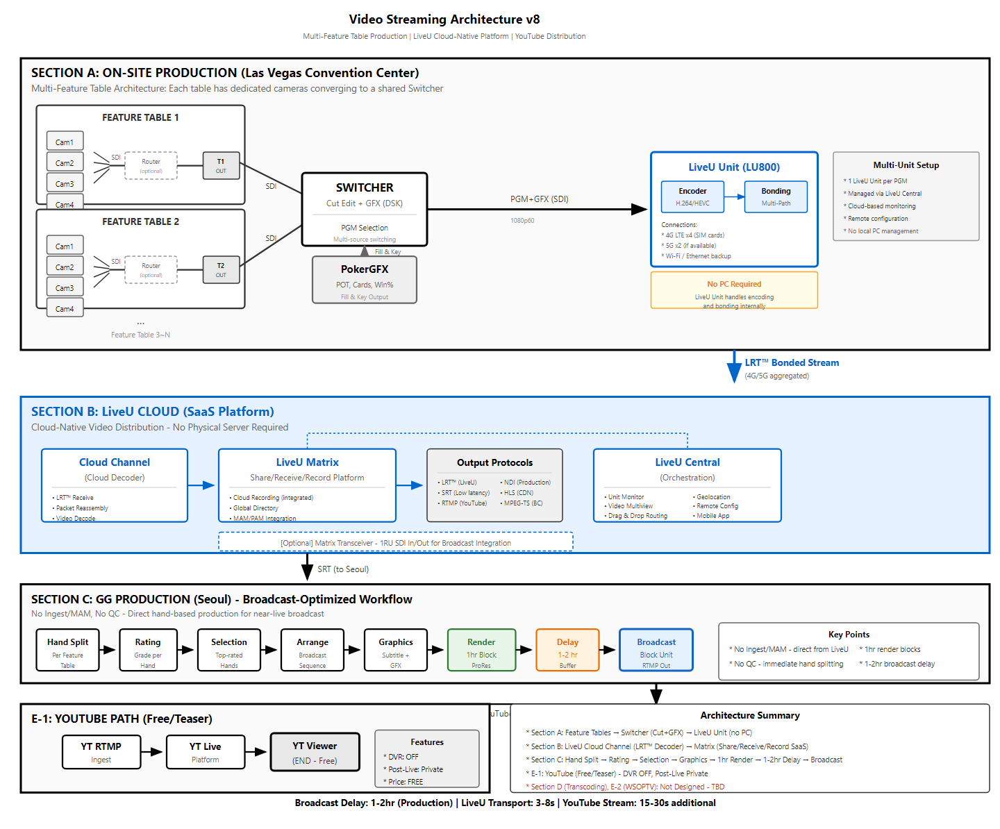

# REPORT: Production vs WSOPTV Station Architecture

**Date**: 2026-01-30 | **Version**: 2.0

---

## 1. 기존 프로덕션 워크플로우

**현재 워크플로우 요약:**
- **현장(Las Vegas)**: Feature Table → Switcher → LiveU Unit → 클라우드 전송
- **클라우드(LiveU)**: 디코딩 → 라우팅 → YouTube/서울 전송
- **서울(GG Production)**: 핸드 분할 → 편집 → 1-2hr 딜레이 → YouTube 방송

---

## 2. WSOPTV Station 추가 워크플로우

**Multi-view와 Player 직캠 구현을 위해 추가되는 설계입니다.**

### 비용 추산 전제조건

정확한 비용 추산은 다음 피드백 이후 가능합니다:

| 담당 | 피드백 필요 사항 |
|------|-----------------|
| **외주사** | 카메라 증설 및 관리 비용 |
| **GG Production** | 현장 Feature Table 1차 가편 분리 전송 비용 |
| **OTT 업체** | 최종 소스 시간대 동기화 작업 비용 |

### 순수 추가 작업 요약

OTT 솔루션 기본 제공 범위 외, 순수하게 추가되는 작업:

| # | 추가 작업 | 설명 |
|---|----------|------|
| 1 | **현장 네트워크 망 증설** | 10G 네트워크 인프라 확장 |
| 2 | **Feature Table별 Player 카메라 1:1 매칭** | P1-P8 개별 카메라 피드 (Phase 4) |
| 3 | **Feature Table PGM → OTT 서버 추가 전송** | 실시간 PGM 스트림 분기 |
| 4 | **OTT에서 모든 소스 시간 동기화** | LTC Timecode 기반 Frame-accurate Sync |

---

*Document generated: 2026-01-30*
