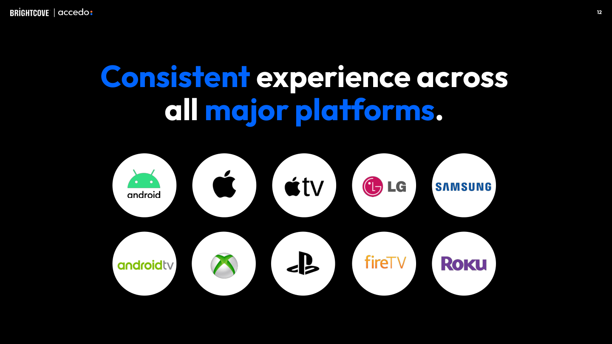
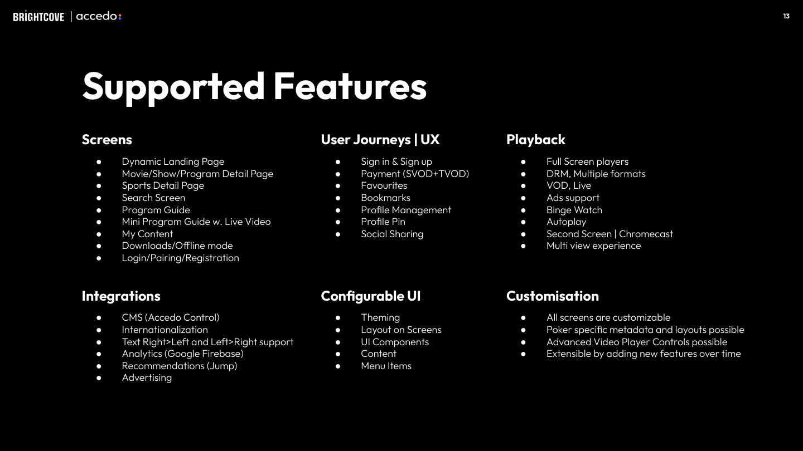

# Brightcove + Accedo 제안서 요약

> 원본: `20260205_GG Production Proposal.pdf` (38p)

---

## 1. 비용 구조

| 구분 | 항목 | 금액 |
|:----:|------|-----:|
| **일회성** | Phase 1 개발 | $650,000 |
| | Phase 2 개발 | $450,000 |
| | PM | $50,000 |
| | **소계** | **$1,150,000** |
| **연간** | Streaming Infra | $305,949 |
| | 유지보수 | $280,000 |
| | **소계** | **$585,949/년** |
| | **첫해 합계** | **$1,735,949** |

---

## 2. 지원 플랫폼

**전 플랫폼 지원**: Web, iOS, Android, Apple TV, Android TV, Roku, Fire TV, Samsung TV, LG TV, Xbox

---

## 3. 제공 기능 (Phase 1)

### Screens
- Dynamic Landing Page
- Movie/Show/Program Detail
- Sports Detail Page
- Search Screen
- Program Guide (EPG)
- My Content

### User Journeys
- Sign In / Sign Up
- Payment (SVOD + TVOD)
- Favourites / Bookmarks
- Profile Management
- Social Sharing

### Playback
- Full Screen DRM Players
- VOD / Live
- Binge Watch / Autoplay
- Chromecast
- **Multiview Experience**

---

## 4. 스포츠 특화 기능

### Sports Schedule Page

- 이벤트 일정 표시
- 이미지 리치 콘텐츠
- 필터링 기능

### Advanced Video Player (Phase 2)

| 기능 | 설명 |
|------|------|
| **Match Card Overlays** | 경기 정보 오버레이 |
| **Statistic Overlays** | 통계 HUD |
| **Timeline Events** | 하이라이트 마커 |
| **Highlight Captures** | 클립 저장 |
| **Multi-camera Angles** | 멀티 카메라 전환 |
| **Multi-commentary** | 다중 해설 선택 |

---

## 5. 소셜 인터랙션

- **Polls**: 시청자 투표
- **Live Chats**: 실시간 채팅
- **Emoji/React**: 이모지 반응
- **Clip & Share**: 하이라이트 공유

---

## 6. Phase 2 전용 (WSOPTV 핵심)

| 기능 | 설명 | 비용 |
|------|------|-----:|
| **Multiview** | 복수 영상 동시 시청 | Phase 2 |
| **Player Centric View** | 특정 플레이어 추적 | $450K |
| **Hand Markers** | 포커 핸드 표시 | 포함 |

---

## 7. Vimeo 대비 차별점

| 기능 | Vimeo | Brightcove |
|------|:-----:|:----------:|
| Samsung/LG TV | X | O |
| Xbox | X | O |
| Multiview | X | O |
| Stats Overlay | X | O |
| Hand Markers | X | O |
| Live Chat | X | O |
| EPG | X | O |

---

## 8. 레퍼런스

- **Kayo Sports** (호주) - 스포츠 OTT
- **CBC Olympics** (캐나다) - 올림픽 중계
- **NBC Sports** (미국) - 스포츠 통합
- **SPOTV NOW** (한국) - 국내 사례
- **WWE** (글로벌) - 레슬링 OTT
