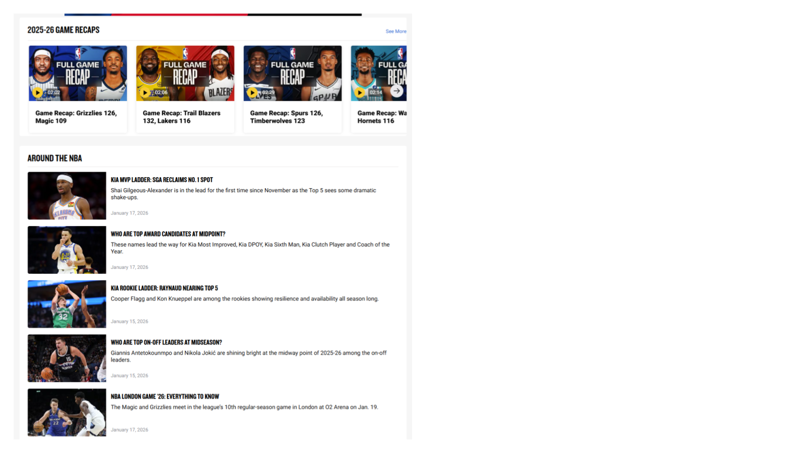
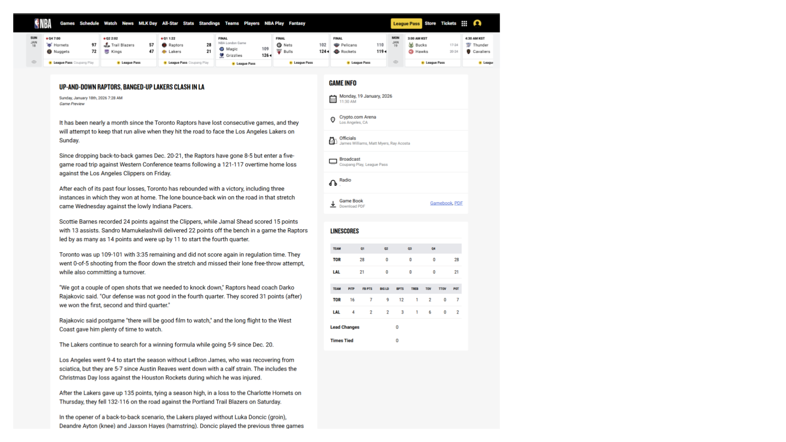
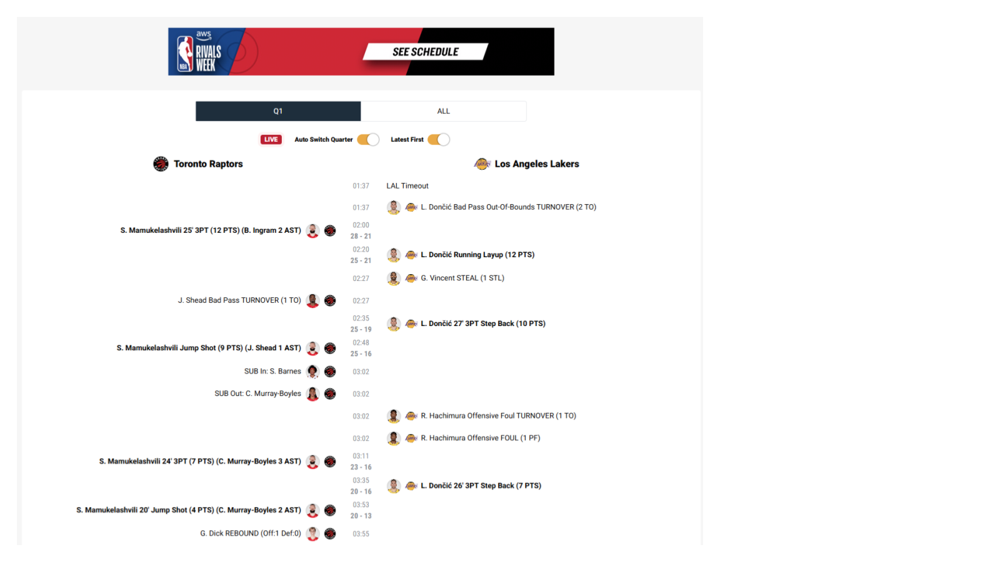
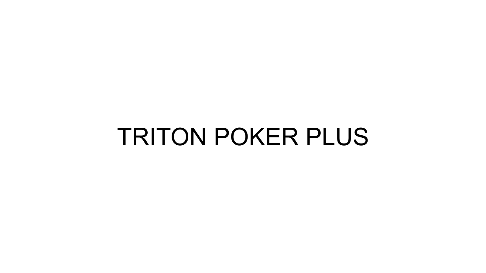
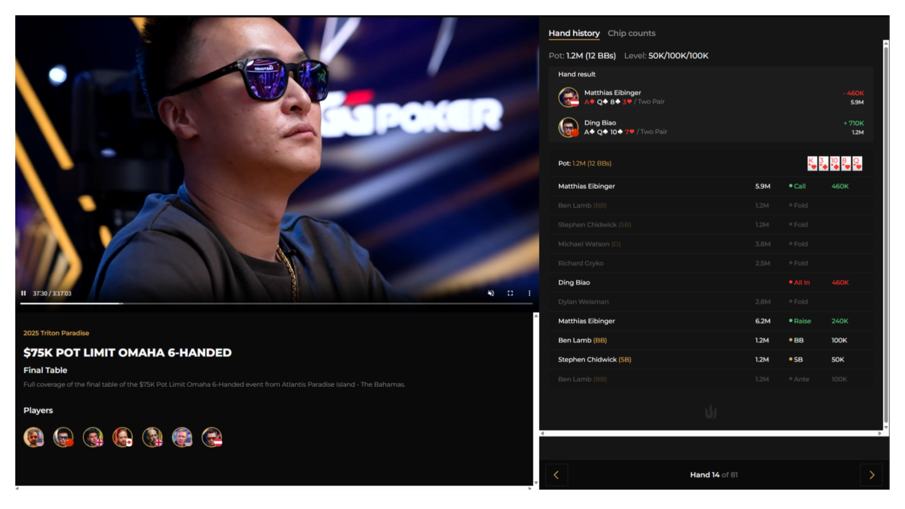
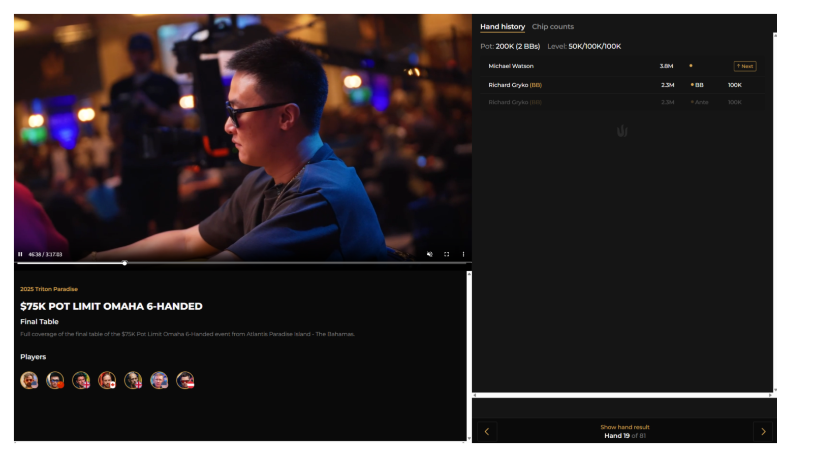

# PRD-0010: NBA TV & Triton Poker Plus UX 솔루션 적용

| 항목 | 값 |
|------|---|
| **Version** | 1.2 |
| **Status** | Draft |
| **Priority** | P1 |
| **Created** | 2026-01-20 |
| **Updated** | 2026-01-20 |
| **Author** | Claude Code |
| **Source** | [NBA TV & Triton Poker Plus 분석 리포트](../reports/REPORT-2026-01-20-nbatv-analysis.md), [PRD-0006](PRD-0006-advanced-mode.md) |
| **원본 자료** | [Google Slides - NBA TV 분석 자료](https://docs.google.com/presentation/d/12czNJ9OmJjzu-Nii1ZefIjNgov94I8gNIyXNVdBv9I4/edit?usp=sharing) |

---

## Executive Summary

NBA TV 및 Triton Poker Plus 분석 자료 (19개 슬라이드)에서 발견된 **기존 PRD에 미반영된 5가지 신규 UX 솔루션**을 정의합니다.

### 배경

- **원본 자료**: [Google Slides](https://docs.google.com/presentation/d/12czNJ9OmJjzu-Nii1ZefIjNgov94I8gNIyXNVdBv9I4/edit?usp=sharing) (GG PRODUCTION 작성)
- **분석 완료**: `docs/images/nbatv-reference/` - 19개 슬라이드 이미지 보유
  - 슬라이드 1-16: NBA TV
  - 슬라이드 17-19: Triton Poker Plus
- **기존 반영**: PRD-0006에 MultiView, Key Hands, Box Score 등 핵심 기능 매핑 완료
- **본 문서 범위**: PRD-0006에서 **상세 스펙이 부족하거나 미반영**된 솔루션

### 신규 솔루션 요약

| ID | 솔루션 | 참조 슬라이드 | 우선순위 |
|----|--------|:---------------:|:--------:|
| SOL-1 | Content Curation System | NBA TV 3-4 | P1 |
| SOL-2 | Preview/Recap Content | NBA TV 13 | P2 |
| SOL-3 | Performance Analytics (Position Analysis 확장) | NBA TV 14-16 | P2 |
| SOL-4 | Tournament Tracker | NBA TV 13-16 | P2 |
| SOL-5 | Hand History Panel (Triton 참조) | Triton 17-19 | P1 |

---

## SOL-1: Content Curation System

> **참조**: 슬라이드 3-4 (Stories, Trending Now, Around the NBA)

### 1.1 개념 정의

NBA TV의 홈페이지 콘텐츠 큐레이션 패턴을 WSOPTV에 적용하여 사용자 참여도를 높이는 동적 콘텐츠 영역을 제공합니다.

**슬라이드 3: Stories, Trending Now, 50-Point Games, Game Recaps**


**슬라이드 4: Around the NBA (MVP Ladder, Award Candidates, Rookie Ladder)**


### 1.2 NBA TV → WSOPTV 매핑

| NBA TV 요소 | 설명 | WSOPTV 적용 | 변환 전략 |
|------------|------|-------------|----------|
| **STORIES** | 라이브 하이라이트 스토리 | **Live Tables** | 진행 중 테이블 썸네일 카드 |
| **TRENDING NOW** | 실시간 인기 동영상 | **Hot Hands** | 최근 빅팟/블러프 핸드 |
| **50-Point Games** | 고득점 경기 하이라이트 | **Million Dollar Pots** | $1M+ 팟 핸드 모음 |
| **Game Recaps** | 경기 요약 영상 | **Tournament Day Recaps** | 일별 대회 요약 |
| **Around the NBA** | MVP Ladder, 통계 랭킹 | **Player Rankings** | POY Ladder, 수익 랭킹 |

### 1.3 UI 설계

#### Stories 섹션 (가로 스크롤)

```
┌─────────────────────────────────────────────────────────────────────────────┐
│  LIVE NOW                                                      See All →    │
├─────────────────────────────────────────────────────────────────────────────┤
│  ┌─────────────┐  ┌─────────────┐  ┌─────────────┐  ┌─────────────┐        │
│  │ 🔴 WSOP ME  │  │ 🔴 $100K HR │  │ 🔴 Circuit  │  │ 🔴 Online   │        │
│  │ Final Table │  │ Day 2       │  │ #12 FT      │  │ Main Event  │        │
│  │             │  │             │  │             │  │             │        │
│  │ 9 players   │  │ 47 left     │  │ 6 left      │  │ 1,204 left  │        │
│  │ POT: $2.4M  │  │ POT: $890K  │  │ POT: $420K  │  │ POT: $1.1M  │        │
│  └─────────────┘  └─────────────┘  └─────────────┘  └─────────────┘        │
└─────────────────────────────────────────────────────────────────────────────┘
```

#### Trending Section (Hot Hands)

```
┌─────────────────────────────────────────────────────────────────────────────┐
│  🔥 HOT HANDS                                                  See All →    │
├─────────────────────────────────────────────────────────────────────────────┤
│  ┌─────────────────────────────┐  ┌─────────────────────────────┐          │
│  │ [썸네일]  Phil Ivey 4-bet   │  │ [썸네일]  AA vs KK All-in   │          │
│  │           bluff $1.2M       │  │           Cooler $2.1M      │          │
│  │ Main Event • 2h ago         │  │ High Roller • 4h ago        │          │
│  │ 👁 12.4K views  ❤️ 2.1K     │  │ 👁 8.9K views   ❤️ 1.8K     │          │
│  └─────────────────────────────┘  └─────────────────────────────┘          │
│  ┌─────────────────────────────┐  ┌─────────────────────────────┐          │
│  │ [썸네일]  Runner-runner     │  │ [썸네일]  Hero call with    │          │
│  │           flush $890K       │  │           K-high $650K      │          │
│  │ Circuit #12 • 6h ago        │  │ Online ME • 8h ago          │          │
│  │ 👁 6.2K views   ❤️ 987      │  │ 👁 4.5K views   ❤️ 756      │          │
│  └─────────────────────────────┘  └─────────────────────────────┘          │
└─────────────────────────────────────────────────────────────────────────────┘
```

#### Player Rankings (Around the Poker World)

```
┌─────────────────────────────────────────────────────────────────────────────┐
│  🏆 AROUND THE POKER WORLD                                     See All →    │
├─────────────────────────────────────────────────────────────────────────────┤
│                                                                              │
│   POY LADDER          MONEY LEADERS         BRACELET RACE                   │
│  ┌────────────┐      ┌────────────┐       ┌────────────┐                   │
│  │ 1. Ivey    │      │ 1. Negreanu│       │ 1. Hellmuth│                   │
│  │ 2. Negreanu│      │ 2. Ivey    │       │ 2. Chan    │                   │
│  │ 3. Polk    │      │ 3. Dwan    │       │ 3. Brunson │                   │
│  │ 4. Dwan    │      │ 4. Polk    │       │ 4. Ivey    │                   │
│  │ 5. Hellmuth│      │ 5. Hellmuth│       │ 5. Negreanu│                   │
│  └────────────┘      └────────────┘       └────────────┘                   │
│                                                                              │
└─────────────────────────────────────────────────────────────────────────────┘
```

### 1.4 기능 요구사항

| ID | 요구사항 | 설명 | 우선순위 |
|----|---------|------|:--------:|
| CC-1.1 | Live Tables 카드 | 진행 중 테이블 썸네일 + 메타데이터 | P0 |
| CC-1.2 | Hot Hands 피드 | 최근 24시간 인기 핸드 자동 큐레이션 | P1 |
| CC-1.3 | Million Dollar Pots | $1M+ 팟 핸드 별도 섹션 | P1 |
| CC-1.4 | Tournament Day Recaps | 일별 대회 요약 자동 생성 | P1 |
| CC-1.5 | POY Ladder | 시즌 포인트 순위 실시간 업데이트 | P2 |
| CC-1.6 | Money Leaders | 상금 누적 랭킹 | P2 |
| CC-1.7 | Bracelet Race | 브레이슬릿 획득 현황 | P2 |
| CC-1.8 | 개인화 추천 | 시청 이력 기반 추천 | P3 |

### 1.5 데이터 요구사항

| 데이터 | 소스 | 갱신 주기 |
|--------|------|----------|
| Live Tables 상태 | RFID/스트림 메타데이터 | 실시간 |
| Hot Hands 선정 | 조회수 + 참여율 알고리즘 | 5분 |
| POY 포인트 | WSOP 공식 API | 일 1회 |
| Money Leaders | 대회 결과 DB | 대회 종료 시 |

---

## SOL-2: Preview/Recap Content

> **참조**: 슬라이드 13 (경기 프리뷰/리캡 페이지)

### 2.1 개념 정의

토너먼트 시작 전 **프리뷰**와 종료 후 **리캡** 콘텐츠를 제공하여 시청 전후의 사용자 경험을 완성합니다.

**슬라이드 13: 경기 프리뷰/리캡 페이지 (좌측 기사 + 우측 GAME INFO + LINESCORES)**


> 슬라이드 13은 경기 Preview 기사와 GAME INFO(날짜, 장소, Officials, Broadcast), LINESCORES(쿼터별 점수, 상세 통계)를 표시합니다.

### 2.2 Preview 콘텐츠 구성

#### 프리뷰 탭 구조

```
┌─────────────────────────────────────────────────────────────────────────────┐
│  WSOP MAIN EVENT - FINAL TABLE                              📅 Jan 20, 2026 │
├─────────────────────────────────────────────────────────────────────────────┤
│  [PREVIEW]  [RECAP]  [STATS]  [HAND HISTORY]                               │
├─────────────────────────────────────────────────────────────────────────────┤
│                                                                              │
│  📊 TOURNAMENT PREVIEW                                                       │
│  ┌─────────────────────────────────────────────────────────────────────────┐│
│  │ Starting Chips    │ Average Stack    │ Blinds Start   │ Players         ││
│  │ 10,000,000        │ 55,555,556       │ 300K/600K      │ 9               ││
│  └─────────────────────────────────────────────────────────────────────────┘│
│                                                                              │
│  🎯 KEY PLAYERS TO WATCH                                                     │
│  ┌────────────────────────────────────────────────────────────────────────┐ │
│  │ [Ivey]           [Negreanu]        [Hellmuth]                          │ │
│  │ Chips: $112M     Chips: $67M       Chips: $45M                         │ │
│  │ 17 bracelets     6 bracelets       16 bracelets                        │ │
│  │ "Aggressive,     "Table talker,    "Reads well,                        │ │
│  │  balanced range"  loose-passive"    tight-aggressive"                  │ │
│  └────────────────────────────────────────────────────────────────────────┘ │
│                                                                              │
│  ⚔️ HEAD-TO-HEAD HISTORY                                                     │
│  ┌────────────────────────────────────────────────────────────────────────┐ │
│  │ Ivey vs Negreanu:     12 confrontations │ Ivey leads 7-5               │ │
│  │ Hellmuth vs Ivey:     8 confrontations  │ Tied 4-4                     │ │
│  │ Negreanu vs Hellmuth: 15 confrontations │ Negreanu leads 9-6           │ │
│  └────────────────────────────────────────────────────────────────────────┘ │
│                                                                              │
│  💬 EXPERT PREDICTIONS                                                       │
│  ┌────────────────────────────────────────────────────────────────────────┐ │
│  │ "Ivey's chip lead and aggressive style make him the favorite.          │ │
│  │  Watch for Negreanu to pick spots against shorter stacks."             │ │
│  │                                           — Joe Stapleton, Commentator │ │
│  └────────────────────────────────────────────────────────────────────────┘ │
│                                                                              │
└─────────────────────────────────────────────────────────────────────────────┘
```

### 2.3 Recap 콘텐츠 구성

#### 리캡 탭 구조

```
┌─────────────────────────────────────────────────────────────────────────────┐
│  WSOP MAIN EVENT - DAY 5 RECAP                              📅 Jan 19, 2026 │
├─────────────────────────────────────────────────────────────────────────────┤
│  [PREVIEW]  [RECAP]  [STATS]  [HAND HISTORY]                               │
├─────────────────────────────────────────────────────────────────────────────┤
│                                                                              │
│  📰 DAY SUMMARY                                                              │
│  ┌─────────────────────────────────────────────────────────────────────────┐│
│  │ "Phil Ivey dominated Day 5 with aggressive play, eliminating 3         ││
│  │  players and building a commanding chip lead heading into the          ││
│  │  final table. Daniel Negreanu survived a crucial all-in situation      ││
│  │  to secure his seat at tomorrow's finale."                             ││
│  └─────────────────────────────────────────────────────────────────────────┘│
│                                                                              │
│  📈 CHIP LEADER MOVEMENT                                                     │
│  ┌─────────────────────────────────────────────────────────────────────────┐│
│  │         │                                                    ● Ivey    ││
│  │  $120M  │                                              ●────●          ││
│  │         │                                         ●────●               ││
│  │  $80M   │                    ●────●────●────●────●                     ││
│  │         │         ●────●────●                                          ││
│  │  $40M   │    ●────●                                                    ││
│  │         │────●───────────────────────────────────────────────────────  ││
│  │         │  Hand 1   50       100      150      200      250      300   ││
│  └─────────────────────────────────────────────────────────────────────────┘│
│                                                                              │
│  💀 KEY ELIMINATIONS                                                         │
│  ┌─────────────────────────────────────────────────────────────────────────┐│
│  │ Hand #156 │ Mike Sexton (10th) │ AA < KK (runner-runner flush)         ││
│  │ Hand #203 │ Jennifer Tilly (11th) │ AKs < QQ (set on flop)             ││
│  │ Hand #267 │ Tom Dwan (12th) │ JJ < AKo (ace on river)                  ││
│  └─────────────────────────────────────────────────────────────────────────┘│
│                                                                              │
│  🎬 TOP 5 HANDS OF THE DAY                                                   │
│  ┌────────────────────────────────────────────────────────────────────────┐ │
│  │ 1. [▶] Ivey's monster bluff vs Negreanu ($4.2M pot)                    │ │
│  │ 2. [▶] Hellmuth's hero call with second pair                           │ │
│  │ 3. [▶] Sexton's heartbreaking elimination (AA < KK)                    │ │
│  │ 4. [▶] Dwan's triple-barrel bluff gone wrong                           │ │
│  │ 5. [▶] Negreanu survives all-in with 6 outs                            │ │
│  └────────────────────────────────────────────────────────────────────────┘ │
│                                                                              │
└─────────────────────────────────────────────────────────────────────────────┘
```

### 2.4 기능 요구사항

| ID | 요구사항 | 설명 | 우선순위 |
|----|---------|------|:--------:|
| PR-1.1 | Tournament Info | 시작 칩/블라인드/참가자 수 표시 | P0 |
| PR-1.2 | Key Players 프로필 | 주요 선수 사진 + 칩 카운트 + 특징 | P1 |
| PR-1.3 | Head-to-Head 전적 | 선수 간 과거 대결 기록 | P2 |
| PR-1.4 | Expert Predictions | 전문가 예측 코멘트 | P2 |
| PR-2.1 | Day Summary | AI 생성 일간 요약 | P1 |
| PR-2.2 | Chip Movement Chart | 칩 리더 추이 그래프 | P1 |
| PR-2.3 | Key Eliminations | 주요 탈락 순간 목록 | P1 |
| PR-2.4 | Top Hands of Day | 일간 베스트 핸드 5개 | P1 |
| PR-2.5 | Auto-generated Recap | 대회 종료 후 자동 생성 | P2 |

### 2.5 자동 생성 요구사항

| 콘텐츠 | 생성 방식 | 트리거 |
|--------|----------|--------|
| Day Summary | LLM 기반 요약 | 데이 종료 후 30분 |
| Top Hands | 클릭률 + 리액션 기반 | 실시간 갱신 |
| Chip Chart | 핸드 히스토리 데이터 | 실시간 |
| Key Eliminations | 이벤트 트리거 자동 감지 | 탈락 발생 시 즉시 |

---

## SOL-3: Performance Analytics (Position Analysis 확장)

> **참조**: 슬라이드 14-16 (Box Score, Shot Charts, Play-by-Play)

### 3.1 개념 정의

NBA TV의 **Box Score**, **Shot Charts**, **Play-by-Play**를 포커에 맞게 변환하여 선수별/포지션별 성과를 시각화합니다. PRD-0006의 Position Analysis를 확장합니다.

**슬라이드 14: Box Score (선수별 상세 통계 - MIN, FGM, FGA, FG%, 3PM 등)**


**슬라이드 15: Shot Charts - Shot Plot (Made ○ / Miss ✕, 선수별 필터, FG% 표시)**


**슬라이드 16: Play-by-Play (양팀 플레이 타임라인, Q1/ALL 탭, Auto Switch Quarter)**


### 3.2 NBA Shot Charts → WSOPTV Position Analysis 매핑

| NBA 요소 | WSOPTV 대응 | 변환 설명 |
|----------|-------------|----------|
| **Shot Plot** | **Action Plot** | 코트 위치 → 테이블 포지션 |
| Made Shot ○ | Win ● | 성공/수익 |
| Missed Shot ✕ | Fold/Loss ○ | 실패/손실 |
| FG%: 57.1% (12/21) | Win Rate: 45% (9/20) | 성공률 |
| **Shot Zone (히트맵)** | **Position Heatmap** | 영역별 색상 |
| 영역 성공률 vs 리그 평균 | 포지션 수익률 vs 평균 | 비교 기준 |
| 🟢 +10%p 이상 | 🟢 +10%p 이상 | 동일 |
| 🟡 ±10%p 이내 | 🟡 ±10%p 이내 | 동일 |
| 🔴 -10%p 이하 | 🔴 -10%p 이하 | 동일 |
| 쿼터별 필터 | 스테이지별 필터 | Early/Middle/Late |
| 선수별 체크박스 | 선수별 체크박스 | 동일 |

### 3.3 Action Plot UI

```
┌─────────────────────────────────────────────────────────────────────────────┐
│  ACTION PLOT - Phil Ivey                                    [📥 Download]   │
├─────────────────────────────────────────────────────────────────────────────┤
│                                                                              │
│                          ┌─────────────────────┐                            │
│                          │                     │                            │
│                      SB  │   ● ○ ●            │  BB                        │
│                   ● ○ ●  │                     │  ● ● ○ ●                   │
│                          │     [DEALER]        │                            │
│               BTN        │                     │        UTG                 │
│            ● ● ● ○       │                     │     ○ ● ○ ●               │
│                          │                     │                            │
│                   CO     └─────────────────────┘     UTG+1                  │
│                ● ○ ● ●                             ○ ● ○                    │
│                                     MP                                      │
│                                  ● ○ ○ ●                                   │
│                                                                              │
│   ● Win (Showdown)   ○ Fold   ◐ Win (No Showdown)                          │
│                                                                              │
├─────────────────────────────────────────────────────────────────────────────┤
│  POSITION STATS                                                              │
│  ┌───────────┬──────────┬──────────┬──────────┬──────────┬──────────┐      │
│  │ Position  │ Hands    │ Win Rate │ VPIP     │ PFR      │ Net +/-  │      │
│  ├───────────┼──────────┼──────────┼──────────┼──────────┼──────────┤      │
│  │ BTN       │ 24       │ 58%      │ 45%      │ 38%      │ +$1.2M   │      │
│  │ CO        │ 22       │ 41%      │ 35%      │ 28%      │ +$420K   │      │
│  │ MP        │ 20       │ 25%      │ 22%      │ 18%      │ -$180K   │      │
│  │ UTG       │ 18       │ 22%      │ 15%      │ 12%      │ -$90K    │      │
│  │ BB        │ 26       │ 35%      │ 28%      │ 15%      │ +$340K   │      │
│  │ SB        │ 25       │ 28%      │ 25%      │ 12%      │ -$220K   │      │
│  └───────────┴──────────┴──────────┴──────────┴──────────┴──────────┘      │
│                                                                              │
│  Filter: [All Stages ▼]  Range: [All Hands ▼]  Compare: [League Avg ▼]     │
└─────────────────────────────────────────────────────────────────────────────┘
```

### 3.4 Position Heatmap UI

```
┌─────────────────────────────────────────────────────────────────────────────┐
│  POSITION HEATMAP - Phil Ivey vs League Average            [📥 Download]    │
├─────────────────────────────────────────────────────────────────────────────┤
│                                                                              │
│                          ┌─────────────────────┐                            │
│                          │                     │                            │
│                      SB  │                     │  BB                        │
│                   🟡     │                     │  🟢                        │
│                  +2%     │     [DEALER]        │  +15%                      │
│               BTN        │                     │        UTG                 │
│            🟢            │                     │     🟡                     │
│            +22%          │                     │     -5%                    │
│                          │                     │                            │
│                   CO     └─────────────────────┘     UTG+1                  │
│                🟢                                    🔴                      │
│                +18%                                  -12%                    │
│                                     MP                                      │
│                                  🟡                                         │
│                                  +3%                                        │
│                                                                              │
│   🟢 +10%p vs avg   🟡 ±10%p vs avg   🔴 -10%p vs avg                       │
│                                                                              │
├─────────────────────────────────────────────────────────────────────────────┤
│  Stage Filter: [Early 🔲] [Middle ☑️] [Late ☑️] [Final Table ☑️]            │
│  Player Filter: [☑️ Ivey] [🔲 Negreanu] [🔲 Hellmuth] [🔲 All Players]      │
└─────────────────────────────────────────────────────────────────────────────┘
```

### 3.5 기능 요구사항

| ID | 요구사항 | 설명 | 우선순위 |
|----|---------|------|:--------:|
| PA-2.1 | Action Plot | 포지션별 Win/Fold 마커 시각화 | P1 |
| PA-2.2 | Position Stats 테이블 | 포지션별 핸드/승률/VPIP/PFR/수익 | P1 |
| PA-2.3 | Position Heatmap | 포지션별 수익률 vs 평균 히트맵 | P2 |
| PA-2.4 | Stage Filter | Early/Middle/Late/Final Table 필터 | P2 |
| PA-2.5 | Player Compare | 선수 간 포지션별 성과 비교 | P2 |
| PA-2.6 | Download CSV/PNG | 데이터 및 이미지 다운로드 | P2 |
| PA-2.7 | League Average 비교 | 전체 평균 대비 색상 표시 | P2 |

### 3.6 데이터 요구사항

| 데이터 | 계산 방식 | 갱신 주기 |
|--------|----------|----------|
| Position Win Rate | (해당 포지션 승리 핸드 / 참여 핸드) × 100 | 핸드 종료 시 |
| League Average | 전체 선수 해당 포지션 평균 | 일 1회 배치 |
| Net +/- | 해당 포지션 총 수익 - 총 손실 | 핸드 종료 시 |
| Stage 분류 | 블라인드 레벨 기반 자동 분류 | 레벨 변경 시 |

---

## SOL-4: Tournament Tracker

> **참조**: 슬라이드 13-16 (LINESCORES, Box Score, Play-by-Play 종합)

### 4.1 개념 정의

NBA TV의 **LINESCORES** (쿼터별 점수), **Box Score** (선수별 통계), **Play-by-Play** (실시간 타임라인)를 종합하여 포커 토너먼트 추적 기능을 구현합니다.

**슬라이드 13: LINESCORES (쿼터별 점수, Lead Changes, Times Tied)**


**슬라이드 14: Box Score (선수별 상세 통계)**


> Tournament Tracker는 다음 기능을 종합합니다:
> - **Chip Tracker**: 핸드별 칩 추이 그래프 (LINESCORES 기반)
> - **Player Comparison**: 선수 간 스탯 비교 (Box Score 기반)
> - **Key Stats**: Biggest Stack, Lead Changes, Eliminations (종합)

### 4.2 NBA → WSOPTV 매핑

| NBA TV 요소 | WSOPTV 대응 | 변환 설명 |
|------------|-------------|----------|
| **Lead Tracker** | **Chip Tracker** | 점수 추이 → 칩 카운트 추이 |
| Biggest Lead | Biggest Stack | 최대 점수차 → 최대 칩 리드 |
| Times Tied | Chip Lead Changes | 동점 횟수 → 칩 리더 변경 횟수 |
| Lead Changes | Lead Changes | 동일 |
| **Leading Players Network** | **Table Dynamics** | 어시스트 관계 → 핸드 참여 관계 |
| **Team Comparison** | **Player Comparison** | 팀 스탯 → 선수 스탯 |
| PTS | Chips Won | 득점 → 획득 칩 |
| REB | Pots Won | 리바운드 → 획득 팟 수 |
| AST | Bluffs | 어시스트 → 성공 블러프 |

### 4.3 Chip Tracker UI

```
┌─────────────────────────────────────────────────────────────────────────────┐
│  CHIP TRACKER - FINAL TABLE                                                  │
├─────────────────────────────────────────────────────────────────────────────┤
│                                                                              │
│  $120M │                                                      ━━ Ivey       │
│        │                                                ●━━━━●              │
│  $100M │                                          ●━━━━●                    │
│        │                                    ●━━━━●                          │
│  $80M  │                              ━━━━━━                   ── Negreanu  │
│        │                        ●━━━━━                                      │
│  $60M  │                  ━━━━━━    ────────────────                        │
│        │            ━━━━━━    ─────●                                        │
│  $40M  │      ━━━━━━    ─────●                              ·· Hellmuth     │
│        │ ━━━━━━    ─────●                                                   │
│  $20M  │ ─────●....●....●....●....●....●....●....●                         │
│        │──────────────────────────────────────────────────────────────────  │
│        │ Hand 1    50       100      150      200      250      300         │
│                                                                              │
├─────────────────────────────────────────────────────────────────────────────┤
│  KEY STATS                                                                   │
│  ┌──────────────────┬──────────────────┬──────────────────┐                 │
│  │ Biggest Stack    │ Chip Lead Changes│ Eliminations     │                 │
│  │ Ivey: $118M      │ 12               │ 4                │                 │
│  │ (Hand #267)      │                  │                  │                 │
│  └──────────────────┴──────────────────┴──────────────────┘                 │
│                                                                              │
│  Filter: [All Players ▼]  Stage: [Final Table ▼]                            │
└─────────────────────────────────────────────────────────────────────────────┘
```

### 4.4 Player Comparison UI

```
┌─────────────────────────────────────────────────────────────────────────────┐
│  PLAYER COMPARISON                                                           │
├─────────────────────────────────────────────────────────────────────────────┤
│                                                                              │
│      PHIL IVEY                                    DANIEL NEGREANU           │
│      ┌────────┐                                   ┌────────┐                │
│      │  [📷]  │                                   │  [📷]  │                │
│      └────────┘                                   └────────┘                │
│                                                                              │
│  ────────────────────────────────────────────────────────────────────────── │
│                                                                              │
│     $112M                CHIPS                           $67M               │
│  ██████████████████████░░░░░░░░░░░░░░░░░░░░░░░░░░█████████████             │
│                                                                              │
│        47                HANDS PLAYED                      52               │
│  ████████████████████░░░░░░░░░░░░░░░░░░░░░░░░░░░░██████████████████████    │
│                                                                              │
│        28%                  VPIP                          35%               │
│  ████████████████░░░░░░░░░░░░░░░░░░░░░░░░░░░░░░████████████████████████    │
│                                                                              │
│        22%                  PFR                           18%               │
│  ████████████████████░░░░░░░░░░░░░░░░░░░░░░░░░░░░░░░██████████████         │
│                                                                              │
│        12                POTS WON                          8                │
│  █████████████████████████░░░░░░░░░░░░░░░░░░░░░░░░░░░██████████████        │
│                                                                              │
│      +$2.4M              CHIPS +/-                      -$890K              │
│  ██████████████████████████████░░░░░░░░░░░░░░░░░░░░░░░░░░████████          │
│                                                                              │
│  ────────────────────────────────────────────────────────────────────────── │
│                                                                              │
│  Select Players: [Ivey ▼] vs [Negreanu ▼]                                   │
└─────────────────────────────────────────────────────────────────────────────┘
```

### 4.5 Table Dynamics (Interaction Network)

```
┌─────────────────────────────────────────────────────────────────────────────┐
│  TABLE DYNAMICS - Hand Participation Network                                 │
├─────────────────────────────────────────────────────────────────────────────┤
│                                                                              │
│                              [Ivey]                                          │
│                            ↗   │   ↖                                        │
│                     12 hands   │   8 hands                                  │
│                       ↗        │        ↖                                   │
│                [Negreanu]───15 hands───[Hellmuth]                           │
│                     ↘                       ↗                               │
│                       6 hands         4 hands                               │
│                          ↘           ↗                                      │
│                           [Dwan]                                            │
│                                                                              │
│  Node Size: Chip Count                                                       │
│  Line Thickness: # of Hands Together                                         │
│  Color: Win Rate in Confrontations                                           │
│         🟢 >60%  🟡 40-60%  🔴 <40%                                          │
│                                                                              │
└─────────────────────────────────────────────────────────────────────────────┘
```

### 4.6 기능 요구사항

| ID | 요구사항 | 설명 | 우선순위 |
|----|---------|------|:--------:|
| TT-1.1 | Chip Tracker 그래프 | 시간/핸드별 칩 추이 선 그래프 | P1 |
| TT-1.2 | Key Stats 요약 | Biggest Stack, Lead Changes, Eliminations | P1 |
| TT-1.3 | Player Comparison | 2인 선수 스탯 비교 바 차트 | P2 |
| TT-1.4 | Table Dynamics | 선수 간 핸드 참여 관계 네트워크 | P3 |
| TT-1.5 | Stage Filter | 스테이지별 차트 필터링 | P2 |
| TT-1.6 | Player Filter | 특정 선수만 표시/비교 | P2 |
| TT-1.7 | Export Chart | PNG/PDF 차트 내보내기 | P2 |

### 4.7 데이터 요구사항

| 데이터 | 소스 | 갱신 주기 |
|--------|------|----------|
| Chip Count History | RFID/핸드 히스토리 | 핸드 종료 시 |
| Confrontation Count | 핸드 히스토리 분석 | 핸드 종료 시 |
| Win Rate in Confrontations | (A vs B 승리 / 대결 핸드) × 100 | 핸드 종료 시 |

---

## Functional Requirements Summary

### 전체 요구사항 목록

| ID | 기능 | 설명 | 우선순위 | Phase |
|----|------|------|:--------:|:-----:|
| **Content Curation** |
| CC-1.1 | Live Tables 카드 | 진행 중 테이블 썸네일 | P0 | 1 |
| CC-1.2 | Hot Hands 피드 | 인기 핸드 큐레이션 | P1 | 2 |
| CC-1.3 | Million Dollar Pots | $1M+ 팟 섹션 | P1 | 2 |
| CC-1.4 | Tournament Day Recaps | 일별 요약 | P1 | 2 |
| CC-1.5 | POY Ladder | 시즌 포인트 순위 | P2 | 3 |
| CC-1.6 | Money Leaders | 상금 랭킹 | P2 | 3 |
| CC-1.7 | Bracelet Race | 브레이슬릿 현황 | P2 | 3 |
| CC-1.8 | 개인화 추천 | 시청 기반 추천 | P3 | 4 |
| **Preview/Recap** |
| PR-1.1 | Tournament Info | 대회 기본 정보 | P0 | 1 |
| PR-1.2 | Key Players 프로필 | 주요 선수 정보 | P1 | 2 |
| PR-1.3 | Head-to-Head 전적 | 과거 대결 기록 | P2 | 2 |
| PR-1.4 | Expert Predictions | 전문가 예측 | P2 | 3 |
| PR-2.1 | Day Summary | AI 일간 요약 | P1 | 2 |
| PR-2.2 | Chip Movement Chart | 칩 추이 그래프 | P1 | 2 |
| PR-2.3 | Key Eliminations | 주요 탈락 목록 | P1 | 2 |
| PR-2.4 | Top Hands of Day | 베스트 핸드 5개 | P1 | 2 |
| PR-2.5 | Auto-generated Recap | 자동 생성 리캡 | P2 | 3 |
| **Performance Analytics** |
| PA-2.1 | Action Plot | Win/Fold 마커 시각화 | P1 | 2 |
| PA-2.2 | Position Stats 테이블 | 포지션별 스탯 | P1 | 2 |
| PA-2.3 | Position Heatmap | 수익률 히트맵 | P2 | 3 |
| PA-2.4 | Stage Filter | 스테이지별 필터 | P2 | 3 |
| PA-2.5 | Player Compare | 선수 비교 | P2 | 3 |
| PA-2.6 | Download CSV/PNG | 다운로드 기능 | P2 | 3 |
| PA-2.7 | League Average 비교 | 평균 대비 비교 | P2 | 3 |
| **Tournament Tracker** |
| TT-1.1 | Chip Tracker 그래프 | 칩 추이 선 그래프 | P1 | 2 |
| TT-1.2 | Key Stats 요약 | 핵심 통계 요약 | P1 | 2 |
| TT-1.3 | Player Comparison | 2인 비교 차트 | P2 | 3 |
| TT-1.4 | Table Dynamics | 참여 관계 네트워크 | P3 | 4 |
| TT-1.5 | Stage Filter | 스테이지 필터 | P2 | 3 |
| TT-1.6 | Player Filter | 선수 필터 | P2 | 3 |
| TT-1.7 | Export Chart | 차트 내보내기 | P2 | 3 |
| **Hand History Panel (Triton)** |
| HH-1.1 | Hand History 패널 | 비디오 우측 고정 패널 | P0 | 1 |
| HH-1.2 | Pot/Level 표시 | 팟/블라인드 실시간 | P0 | 1 |
| HH-1.3 | Hand result | 핸드 결과 + 카드 | P1 | 2 |
| HH-1.4 | Action History | 플레이어별 액션 로그 | P1 | 2 |
| HH-1.5 | Chip counts 탭 | 전체 칩 현황 | P1 | 2 |
| HH-1.6 | Hand Navigation | 이전/다음 핸드 | P1 | 2 |
| HH-1.7 | Show hand result | 결과 표시 토글 | P1 | 2 |
| HH-1.8 | Players 섹션 | 참가자 아바타 | P2 | 3 |

---

## Non-Functional Requirements

### 성능 요구사항

| 항목 | 요구사항 |
|------|---------|
| Hot Hands 갱신 | < 5분 지연 |
| Chip Tracker 갱신 | 핸드 종료 후 < 10초 |
| Position Analytics 계산 | < 3초 |
| Chart 렌더링 | < 1초 (FCP) |

### 확장성 요구사항

| 항목 | 요구사항 |
|------|---------|
| 동시 접속자 | 10,000+ 대시보드 조회 |
| 데이터 보관 | 핸드 히스토리 5년 이상 |
| 선수 프로필 | 50,000+ 선수 정보 |

### 접근성 요구사항

| 항목 | 요구사항 |
|------|---------|
| 색맹 대응 | 히트맵 패턴 옵션 제공 |
| 스크린 리더 | 차트 대체 텍스트 제공 |
| 키보드 네비게이션 | 전체 기능 지원 |

---

## Scope

### In Scope

- SOL-1~4 신규 솔루션 상세 스펙 정의
- 기존 PRD-0006 Position Analysis 확장
- NBA TV 슬라이드 3-4, 14, 16-19 대응 기능

### Out of Scope

- PRD-0006에 이미 상세 정의된 기능 (MultiView, Key Hands, Box Score 등)
- PRD-0009에 정의된 Hand Tagging 검색 기능
- 기술 아키텍처 상세 (별도 ADR로 분리)

---

## Platform Support

| 기능 | Web | iOS | Android | TV |
|------|:---:|:---:|:-------:|:--:|
| Content Curation | O | O | O | △ |
| Preview/Recap | O | O | O | O |
| Performance Analytics | O | O | O | X |
| Tournament Tracker | O | O | O | △ |

- O: 전체 지원
- △: 제한적 지원 (단순화된 UI)
- X: 미지원

---

## Dependencies

### 내부 의존성

| 의존성 | 설명 | 영향 솔루션 |
|--------|------|------------|
| 핸드 히스토리 DB | 모든 통계 계산 기반 | 전체 |
| RFID 칩 카운트 | 실시간 칩 추적 | TT-1.1 |
| 콘텐츠 태깅 시스템 | Hot Hands 선정 | CC-1.2 |
| LLM API | 자동 요약 생성 | PR-2.1, PR-2.5 |

### 외부 의존성

| 의존성 | 설명 | 영향 솔루션 |
|--------|------|------------|
| WSOP 공식 API | POY, 상금 데이터 | CC-1.5, CC-1.6 |
| 차트 라이브러리 | D3.js / Chart.js | 전체 차트 |

---

## Success Metrics

| 지표 | 목표 | 솔루션 |
|------|------|--------|
| Hot Hands 클릭률 | > 15% | SOL-1 |
| Preview 페이지 조회율 | 대회 시청자의 40% | SOL-2 |
| Recap 완독률 | > 60% | SOL-2 |
| Position Analytics 사용률 | Plus+ 사용자의 30% | SOL-3 |
| Chip Tracker 세션 시간 | 평균 5분+ | SOL-4 |

---

## Timeline

| Phase | 솔루션 | 주요 기능 | 목표 |
|-------|--------|----------|------|
| **Phase 1** | SOL-5 | Hand History 패널, Pot/Level 표시 | Q3 2026 |
| **Phase 2** | SOL-1 | Live Tables, Hot Hands, Day Recaps | Q4 2026 |
| **Phase 2** | SOL-2 | Tournament Info, Day Summary, Key Eliminations | Q4 2026 |
| **Phase 2** | SOL-3 | Action Plot, Position Stats | Q4 2026 |
| **Phase 2** | SOL-4 | Chip Tracker, Key Stats | Q4 2026 |
| **Phase 2** | SOL-5 | Hand result, Action History, Chip counts | Q4 2026 |
| **Phase 3** | SOL-1 | POY Ladder, Money Leaders | Q1 2027 |
| **Phase 3** | SOL-2 | Expert Predictions, Auto Recap | Q1 2027 |
| **Phase 3** | SOL-3 | Position Heatmap, Player Compare | Q1 2027 |
| **Phase 3** | SOL-4 | Player Comparison, Stage Filter | Q1 2027 |
| **Phase 3** | SOL-5 | Players 섹션, Hand Navigation 고급 | Q1 2027 |

---

## SOL-5: Hand History Panel (Triton Poker Plus 참조)

> **참조**: 슬라이드 17-19 (Triton Poker Plus)

### 5.1 개념 정의

Triton Poker Plus의 **Hand History 패널**은 비디오 옆에 실시간 핸드 정보를 표시하는 포커 OTT 특화 UI입니다. WSOPTV의 StatsView 레이어로 구현합니다.

**슬라이드 17: Triton Poker Plus 표지**


**슬라이드 18: Hand History 상세 화면 (비디오 + 우측 패널)**


**슬라이드 19: Hand Navigation 화면 (Hand N of M, Show hand result)**


### 5.2 Triton Poker Plus UI 분석

#### Hand History 패널 구조

| 요소 | 설명 | WSOPTV 적용 |
|------|------|-------------|
| **Pot / Level** | 1.2M (12 BBs) / 50K/100K/100K | 동일 |
| **Hand result** | 플레이어별 핸드 카드 + 결과 | 핸드 결과 오버레이 |
| **Action History** | Call, Fold, Raise, All In, BB, SB, Ante | 베팅 액션 로그 |
| **Chip counts** | 플레이어별 칩 현황 | 칩 리더보드 |
| **Hand Navigation** | ◀ Hand N of M ▶ | 핸드 네비게이션 |
| **Show hand result** | 결과 표시 버튼 | 동일 |
| **Players 섹션** | 참가자 아바타 목록 | 플레이어 썸네일 |

### 5.3 Hand History Panel UI

```
┌─────────────────────────────────────────────────────────────────────────────┐
│  [비디오 플레이어 - 2/3 너비]         │ HAND HISTORY            Chip counts│
│                                       ├─────────────────────────────────────┤
│  2025 WSOP Main Event                 │ Pot: $2.4M (24 BBs)                │
│  $10K NLH Main Event                  │ Level: 50K/100K/100K               │
│  Final Table                          ├─────────────────────────────────────┤
│                                       │ Hand result                         │
│  [영상 재생 영역]                      │ ┌─────────────────────────────────┐│
│                                       │ │ Phil Ivey       A♠ K♦          ││
│                                       │ │ Top Pair        +$1.2M   $45M  ││
│                                       │ ├─────────────────────────────────┤│
│                                       │ │ Daniel Negreanu Q♣ Q♦          ││
│                                       │ │ Pair of Queens  -$1.2M   $23M  ││
│  37:30 / 3:17:03                      │ └─────────────────────────────────┘│
│                                       ├─────────────────────────────────────┤
│  Players                              │ Phil Ivey        $45M   ● Raise 400K│
│  [🖼][🖼][🖼][🖼][🖼][🖼][🖼]          │ Daniel Negreanu  $23M   ● Call  400K│
│                                       │ Phil Hellmuth    $18M     Fold     │
├───────────────────────────────────────│ Tom Dwan         $12M     Fold     │
│                                       │ ...                                 │
│                                       ├─────────────────────────────────────┤
│                                       │ ◀  Hand 14 of 81  ▶                │
└───────────────────────────────────────┴─────────────────────────────────────┘
```

### 5.4 기능 요구사항

| ID | 요구사항 | 설명 | 우선순위 |
|----|---------|------|:--------:|
| HH-1.1 | Hand History 패널 | 비디오 우측 고정 패널 | P0 |
| HH-1.2 | Pot/Level 표시 | 현재 팟/블라인드 레벨 실시간 | P0 |
| HH-1.3 | Hand result | 핸드 결과 + 카드 표시 | P1 |
| HH-1.4 | Action History | 플레이어별 액션 로그 | P1 |
| HH-1.5 | Chip counts 탭 | 전체 플레이어 칩 현황 | P1 |
| HH-1.6 | Hand Navigation | 이전/다음 핸드 이동 | P1 |
| HH-1.7 | Show hand result | 결과 표시 토글 버튼 | P1 |
| HH-1.8 | Players 섹션 | 참가자 아바타 클릭 시 프로필 | P2 |

### 5.5 Triton vs WSOPTV 차이점

| 항목 | Triton Poker Plus | WSOPTV |
|------|-------------------|--------|
| **레이아웃** | 비디오 + 우측 패널 | 3-Layer Multi-view (Main + Secondary + Stats) |
| **패널 위치** | 우측 고정 | StatsView 레이어로 오버레이 또는 분리 |
| **Hand Navigation** | 비디오 하단 | 패널 내 또는 별도 컨트롤 |
| **게임 종류** | PLO, NLH 등 | WSOP 공식 이벤트 중심 |

---

## References

- **원본 자료**: [Google Slides - NBA TV 분석 자료](https://docs.google.com/presentation/d/12czNJ9OmJjzu-Nii1ZefIjNgov94I8gNIyXNVdBv9I4/edit?usp=sharing) (GG PRODUCTION)
- [PRD-0002 WSOPTV OTT Platform MVP](PRD-0002-wsoptv-ott-platform-mvp.md)
- [PRD-0006 WSOPTV Advanced Mode](PRD-0006-advanced-mode.md) - NBA TV 1:1 매핑 기본 테이블
- [REPORT-2026-01-20 NBA TV & Triton Poker Plus 분석](../reports/REPORT-2026-01-20-nbatv-analysis.md)
- 슬라이드 이미지: `docs/images/nbatv-reference/`
  - 슬라이드 3-4: SOL-1 Content Curation
  - 슬라이드 13: SOL-2 Preview/Recap
  - 슬라이드 14-16: SOL-3 Performance Analytics
  - 슬라이드 13-16: SOL-4 Tournament Tracker
  - 슬라이드 17-19: SOL-5 Hand History Panel (Triton Poker Plus)

---

## Revision History

| 버전 | 날짜 | 작성자 | 내용 |
|------|------|--------|------|
| 1.0 | 2026-01-20 | Claude Code | 최초 작성 - NBA TV 분석 기반 4개 신규 솔루션 정의 |
| 1.1 | 2026-01-20 | Claude Code | Google Slides 원본 링크 추가, 슬라이드별 이미지 설명 보강, References 섹션 상세화 |
| 1.2 | 2026-01-20 | Claude Code | Triton Poker Plus 분석 추가 (SOL-5 Hand History Panel), 슬라이드 번호 업데이트 (21→19개), 슬라이드 매핑 수정 |
