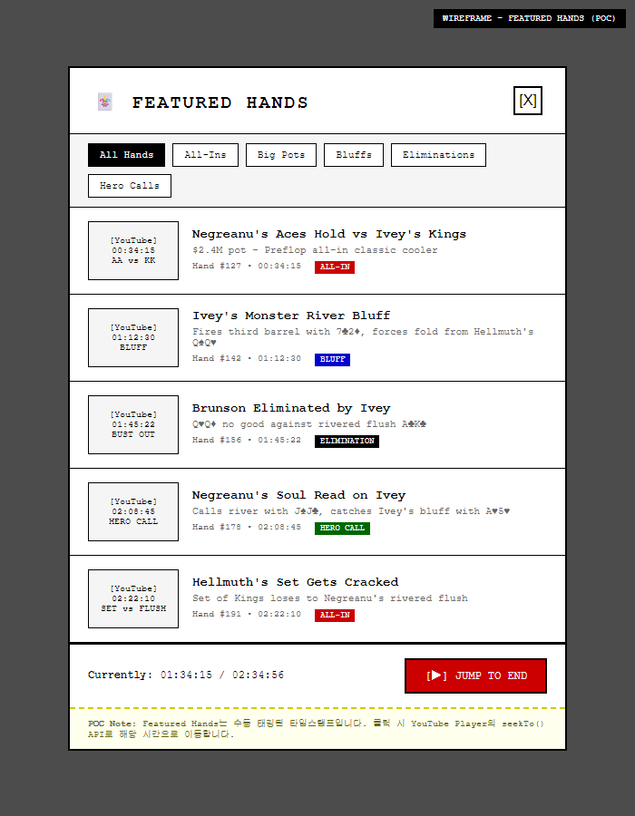

# WSOP TV: Executive Summary

| Version | 3.3 | 기준 문서 | PRD-0002 v8.9 |
|---------|-----|----------|---------------|
| 작성일 | 2026-01-28 | 보고 대상 | C-Level |

---

## 1. WSOP TV = YouTube 무료 → 유료 전환

| YouTube (무료) | WSOP TV (유료) |
|:---:|:---:|
| 마케팅 채널 | 프리미엄 플랫폼 |
| 하이라이트, 티저 | Full Live, VOD, Multiview |
| 광고 수익 공유 | **직접 수익** $10/$50 |

---

## 2. 구독 플랜

---

## 3. 싱글 뷰 (Single View)

**MVP 기본 모드**: 1개 테이블 전체 화면

| 영역 | 설명 |
|------|------|
| **상단** | Tournament Ticker (실시간 진행 상황) |
| **중앙** | 비디오 플레이어 + HUD 오버레이 |
| **하단** | Info Tabs (Summary, Hand History, Charts, Live Feed) |

- Timeshift 지원 (되감기/일시정지)
- Featured Hands 버튼으로 주요 핸드 탐색

---

## 4. 멀티뷰 (Multi-view)

**Phase 2 기능**: 여러 테이블 동시 시청

| 레이아웃 | 설명 |
|:--------:|------|
| 1+1 | 메인 1개 + 서브 1개 |
| 2×2 | 4개 균등 분할 |
| 1+3 | 메인 1개 + 서브 3개 |

TEMPLE 협의 필수 - 현장 프로덕션 연동 필요

---

## 5. Featured Hands 모달

**핸드 유형 태그**: All-In, Bluff, Elimination, Hero Call

클릭 시 해당 타임스탬프로 즉시 이동

---

## 6. 정보 화면 (Info Tabs)

| 탭 | 내용 | Phase |
|-----|------|:-----:|
| **Summary** | 이벤트 개요, 칩 카운트 | MVP |
| **Player Stats** | 플레이어 통계 | P3 |
| **Hand Charts** | 핸드 차트 | P3 |
| **Hand History** | 핸드 이력 | P3 |

---

## 7. 개발 로드맵

| Phase | 핵심 | 타임라인 |
|:-----:|------|:--------:|
| **MVP** | Live, VOD, Timeshift | **2027 Q2** |
| **P2** | Multiview, Hand Search | 2028 Q2 |
| **P3** | Player Stats | 2029 Q2 |
| **P4** | Player Cam, AI | 2030 Q2 |

---

## 8. 의사결정 요청

| 항목 | 담당 | 상태 |
|------|------|:----:|
| **TEMPLE 협의** | COO | **□ 즉시** |
| MVP 개발 착수 | CTO | □ |
| 예산 배정 | CFO | □ |

**Critical Path**: TEMPLE → MVP 개발 → 런칭

---

## 한 줄 요약

> **"WSOP TV는 YouTube 무료 콘텐츠를 유료 구독($10/$50)으로 전환하여 직접 수익을 창출하는 OTT 플랫폼"**

---

*v3.3 - 실제 UI 이미지로 교체 (싱글 뷰/멀티뷰), 섹션 구조 간소화 (2026-01-28)*
