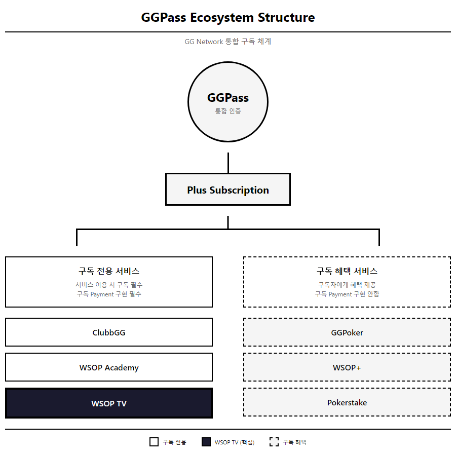
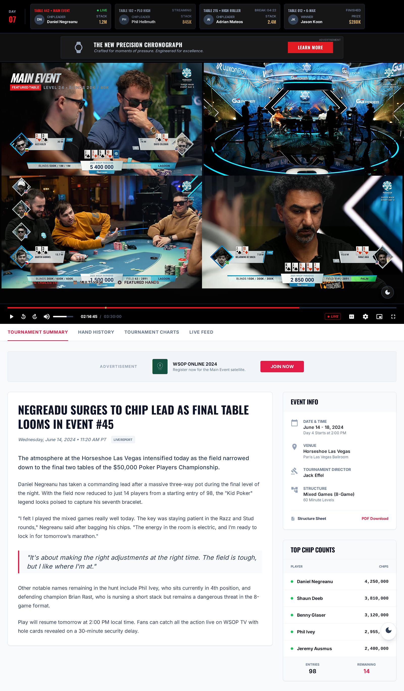
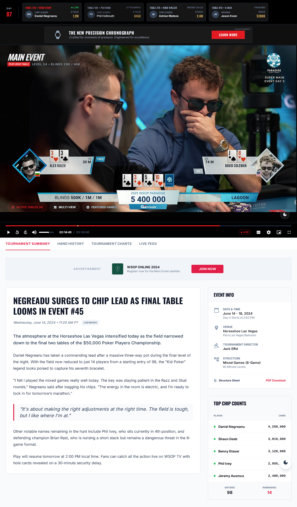

# WSOP TV: Executive Summary

| Version | 7.0 | 기준 문서 | PRD-0002 v10.0 |
|---------|-----|----------|----------------|
| 작성일 | 2026-02-02 | 보고 대상 | C-Level |

---

## 0. GG 생태계 내 WSOPTV 역할

### GGPass 구독 구조



[HTML 원본](../mockups/PRD-0002/57-ggpass-ecosystem.html)

| 구분 | 서비스 | WSOPTV 위치 |
|:----:|--------|:----------:|
| **구독 전용** | ClubbGG, WSOP Academy, **WSOP TV** | ✅ |
| 구독 혜택 | GGPoker, WSOP+, Pokerstake | |

> **핵심 포지셔닝**: WSOPTV는 독립 OTT가 아니라 **GG 생태계의 구독 혜택**으로서 GG POKER 가치를 부각시키는 역할

### 쿠팡플레이 비교 (역순 구조)

| 구분 | 쿠팡플레이 | WSOPTV |
|:----:|-----------|--------|
| **구독 중심** | 쿠팡 로켓와우 | **WSOPTV** |
| **혜택 방향** | 로켓와우 → 쿠팡플레이 무료 | WSOPTV → ClubbGG, Academy, GGPoker 혜택 |
| **수수료** | 앱스토어 수수료 부담 | **Reader App 판정 → 수수료 면제 가능** |

> **Reader App 전략**: WSOPTV는 동영상 시청 위주 비즈니스 모델로, Apple/Google 앱스토어 수수료를 면제받는 Reader App 판정이 용이

### Dual Flywheel: 이중 선순환


[HTML 원본](../mockups/PRD-0002/58-dual-flywheel.html)

```
GG POKER 플레이 → WSOPTV 시청 → 플레이어 팬심 → 체류시간↑ → GG POKER 플레이시간↑
```

**포커 대회 시청 특성**:
- 긴 시간 (수 시간~수십 시간)
- 느슨한 구조 (핸드 간 대기 시간)
- 영상 자체 몰입보다 **"탐색/검색/비교"**가 자연스러운 패턴

> **WSOPTV = 콘텐츠 놀이터**: 포커 플레이어들이 게임 외 시간에 머무르며 플레이어를 발견하고, 명장면을 탐색하고, 다시 게임으로 돌아가는 선순환 구조

### 고급 기능의 생태계적 의미 (Phase 2+)

> **MVP 전략**: Vimeo 기본 템플릿으로 빠른 론칭 → 사용자 피드백 기반 고급 기능 검토

| 기능 | MVP | Phase 2+ | GG 생태계 관점 |
|------|:---:|:--------:|---------------|
| **Single View** | ✅ | - | 기본 시청 경험 |
| **Table Multi-view** | ❌ | ⚠️ 검토 | 구현 난이도 높음, ROI 불확실 |
| **Player Cam** | ❌ | ⚠️ 검토 | 아이돌 팬덤 효과, 추가 인프라 필요 |
| **Hand Search** | ⚠️ | ✅ | 메타데이터 태깅으로 부분 구현 |
| **StatsView** | ❌ | ⚠️ 검토 | 커스텀 오버레이 개발 필요 |

---

## 1. WSOP TV란?

> **GG 생태계 내에서 포커 플레이어들이 게임 외 시간에 머무를 수 있는 "콘텐츠 놀이터"로서, GG POKER 구독의 핵심 혜택 역할을 수행하는 스트리밍 플랫폼**

---

## 2. 왜 WSOP TV인가? (Why)

| 목적 | 설명 |
|------|------|
| **생태계 Lock-in** | GG POKER ↔ WSOPTV 선순환으로 플레이어 이탈 방지 |
| **구독 혜택 강화** | Plus Subscription의 핵심 가치 제안 |
| **데이터 자산화** | 시청자 행동 데이터 수집 → GG POKER 마케팅 활용 |

> **GG Network 시너지**: GG POKER ↔ WSOPTV 크로스 프로모션 ($9.99 칩 ↔ $9.99 구독권)

---

## 2. 타깃 사용자 (Who)

| Segment | 니즈 | WSOP TV 가치 | 예상 구독 |
|---------|------|-------------|----------|
| **캐주얼 팬** | 주요 경기 시청 | Live + VOD | Plus ($9.99) |
| **포커 플레이어** | 전략 분석 | Stats, Hand History | Plus+ ($49.99) |
| **하드코어 팬** | 멀티 모니터링 | Multi-view, Player Cam | Plus+ ($49.99) |

---

## 3. YouTube 전략적 재배치 (How)


| YouTube (무료) | WSOP TV (유료) |
|:---:|:---:|
| 마케팅 채널 | 프리미엄 플랫폼 |
| 하이라이트, 티저 | Full Live, VOD, Multiview |
| 광고 수익 공유 | **직접 수익** $9.99/$49.99 |

#### YouTube vs WSOP TV 핵심 차별점

| 기능 | WSOP TV | YouTube |
|------|:-------:|:-------:|
| **Timeshift** | ✅ 라이브 중 되감기 | ❌ 불가 |
| **영구 아카이브** | ✅ 20년 영상 보존 | ❌ 비공개 전환 |

---

## 4. 구독 플랜 (When)


| 티어 | 가격 | 핵심 차별점 |
|:----:|:----:|------------|
| **WSOP Plus** | **$9.99/월** | 1기기, 광고 포함, 캐주얼 팬 |
| **WSOP Plus+** | **$49.99/월** | 3기기, 광고 없음, 오프라인 시청 |

---

## 5. 핵심 기능

### 5.0 레이아웃 구조


#### 시청 모드 (View Modes)

| 모드 | 단계 | 설명 | 출처 |
|:----:|:----:|------|:----:|
| **Single View** | MVP | 1개 테이블 전체 화면, Timeshift 지원 | 일반 OTT |
| **Table Multi-view** | Phase 2 | 최대 4개 테이블 동시 시청, 클릭으로 오디오 전환 | 📋 MOSES (⬜ 확인 필요) |
| **Player Cam** | Phase 4 | 아이돌 직캠 방식, 특정 플레이어 클로즈업 | 📜 VIBLE (✅ 확정) |

#### 3계층 레이아웃 구조

| 계층 | 구성 | 목적 |
|:----:|------|------|
| **① 상단** | Tournament Ticker | 진행 중 테이블 한눈에 파악 → **즉시 시청 진입** |
| **② 중앙** | Video Player | 핵심 시청 경험, Timeshift + Multi-view |
| **③ 하단** | Info Tabs | 시청 방해 없이 상세 통계 (스크롤 시 표시) |

#### Tournament Ticker 상세

| 컬럼 | 예시 | 설명 |
|------|------|------|
| **테이블 번호** | TABLE 442 | 피처 테이블 식별자 |
| **이벤트명** | MAIN EVENT | 토너먼트 종류 |
| **상태** | 🔴 LIVE / STREAMING / BREAK | 진행 상태 |
| **칩 리더** | D. Negreanu | 해당 테이블 키 플레이어 |
| **스택** | 1.2M | 현재 칩 카운트 |

> **NBA League Pass 1:1 매핑**: 동일한 3계층 구조로 사용자 학습 비용 최소화

### 5.1 싱글 뷰 (Single View) - MVP



### 5.2 테이블 멀티뷰 (Table Multi-view) - Phase 2

> **출처**: 📋 MOSES 확장 제안 (VIBLE 직접 요청 아님, 필요 여부 확인 필요)



### 5.3 플레이어 캠 (Player Cam) - Phase 4

> **출처**: 📜 VIBLE 원문 - "메인화면이 중앙에 있고, 각 유저들의 얼굴을 잡고 있는 화면이 옆에 또 있는 방식 (아이돌 직캠 카메라)"
>
> ⚠️ VIBLE 원문에서 "Multi-view"라고 표현한 것이 바로 이 기능입니다.


**특정 플레이어 클로즈업 시청** (아이돌 직캠 방식)

| 특징 | 설명 |
|------|------|
| **1인 포커스** | 선택한 플레이어 집중 화면 |
| **칩 카운트** | 실시간 스택 오버레이 |
| **표정/리액션** | 플레이어 심리 관찰 |

### 5.4 통계 화면 (Info Tabs) - Phase 3

> **설계 선택**: NBA TV 방식 (영상 하단 Info Tabs) - 시청 방해 없이 통계 제공

#### Box Score 탭


| 요소 | 설명 |
|------|------|
| **Final Table Chip Counts** | 실시간 칩 순위 |
| **VPIP% / PFR% / AF** | 플레이어 성향 지표 |
| **Aggression Radar** | 공격성 시각화 |
| **Table Comparison** | 테이블 전체 통계 |

#### Game Charts 탭


| 요소 | 설명 |
|------|------|
| **Chip Lead Tracker** | 칩 리더 변화 그래프 |
| **Player Comparison** | 1:1 비교 레이더 차트 |
| **Active Hand Tendencies** | 플레이 스타일 분류 |

#### Play-By-Play 탭


| 요소 | 설명 |
|------|------|
| **Hand History** | 핸드별 상세 기록 |
| **Action Timeline** | Pre-Flop → River 액션 흐름 |
| **All-In 표시** | 주요 올인 상황 강조 |

---

## 6. 구축 현황

> **기준일**: 2026-02-02 | **상태**: Vimeo 기본 템플릿 기반 진행 결정

### 전략 변경 배경

| 항목 | 기존 방향 | 변경 방향 |
|------|----------|----------|
| **솔루션** | 메가존 커스텀 (50억+) | **Vimeo 기본 템플릿** |
| **접근법** | Full-Custom 개발 | SaaS 활용 + 점진적 확장 |
| **리스크** | 높은 초기 투자 | **빠른 론칭, 낮은 리스크** |

### 선정 솔루션: Vimeo OTT

| 항목 | 내용 |
|------|------|
| **솔루션** | Vimeo OTT (기본 템플릿) |
| **장점** | 빠른 론칭, 검증된 플랫폼, 낮은 초기비용 |
| **제약** | Multi-view 미지원, 커스텀 UI 제한 |
| **대응** | MVP는 Single View로 시작, 추후 확장 검토 |

### 핵심 요구사항 충족도 (재평가)

| 요구사항 | 중요도 | Vimeo 기본 | 비고 |
|:---------|:------:|:----------:|------|
| 라이브/VOD/DRM | P0 | ✅ | 기본 제공 |
| Timeshift/DVR | P0 | ✅ | 기본 제공 |
| 구독 결제 | P0 | ✅ | Stripe 연동 |
| 앱 배포 (iOS/Android/TV) | P0 | ✅ | 기본 제공 |
| **Multi-view (2x2)** | ~~P1~~ **P3** | ❌ | **MVP 제외, 추후 검토** |
| **Featured Hands** | P1 | ⚠️ | 메타데이터 태깅으로 대응 |
| **Player Cam Mode** | P2 | ❌ | Phase 2+ 검토 |

> **전략 변경**: Multi-view는 구현 난이도 대비 ROI 불확실 → MVP 필수 요건에서 제외

### 비용 현황 (예상)

| 항목 | Vimeo 기본 | 메가존 (참고) |
|:-----|----------:|-------------:|
| **초기 구축** | ~1억 | 50억 |
| **연간 운영** | 2~3억 | 10~15억 |
| **3년 TCO** | **7~10억** | 80~100억 |

> **비용 절감 효과**: 약 70~90억 절감, 빠른 시장 진입 가능

---

## 7. 기술 구현 로드맵

### 7.1 Vimeo 기반 MVP 아키텍처

```
┌─────────────────────────────────────────────────────────────────┐
│                    WSOPTV MVP (Vimeo 기반)                       │
├─────────────────────────────────────────────────────────────────┤
│                                                                 │
│  [현장]              [Vimeo]              [사용자]              │
│                                                                 │
│  LiveU ──────────▶ Vimeo Live ──────────▶ iOS/Android App     │
│  (기존 장비)        (RTMP 수신)            (기본 템플릿)         │
│                          │                      │              │
│                          ▼                      ▼              │
│                     VOD Storage           TV App (Apple/Roku)  │
│                          │                      │              │
│                          ▼                      ▼              │
│                     DRM + CDN              Web Player          │
│                                                                 │
└─────────────────────────────────────────────────────────────────┘
```

### 7.2 MVP 기능 범위

| 기능 | MVP | Phase 2+ | 비고 |
|------|:---:|:--------:|------|
| **Single View 라이브** | ✅ | - | Vimeo 기본 |
| **VOD 아카이브** | ✅ | - | Vimeo 기본 |
| **Timeshift/DVR** | ✅ | - | Vimeo 기본 |
| **구독 결제** | ✅ | - | Stripe 연동 |
| **앱 배포** | ✅ | - | iOS/Android/TV |
| Multi-view | ❌ | ⚠️ 검토 | 구현 난이도 높음 |
| Player Cam | ❌ | ⚠️ 검토 | 추가 인프라 필요 |
| StatsView Overlay | ❌ | ⚠️ 검토 | 커스텀 개발 필요 |

### 7.3 Phase 2+ 확장 옵션 (Multi-view가 필요한 경우)

> **전제**: MVP 론칭 후 사용자 피드백 기반 결정

| 옵션 | 접근법 | 예상 비용 | 리스크 |
|------|--------|----------|--------|
| A | Vimeo Enterprise + 커스텀 Player | 5~10억 | 중 |
| B | 별도 Custom OTT 구축 | 20~30억 | 높음 |
| C | **Multi-view 포기, 대안 혜택** | 0 | 낮음 |

> **권장**: MVP 데이터 수집 후 결정. 대안 혜택(편집 콘텐츠, 독점 인터뷰)으로 Plus+ 가치 제안 가능

---

## 한 줄 요약

> **"WSOP TV는 GG 생태계 내 '콘텐츠 놀이터'로서, 포커 플레이어들이 게임 외 시간에 머무르며 GG POKER 플레이시간을 증가시키는 핵심 혜택 플랫폼"**

---

*v7.0 - Vimeo 기본 템플릿 기반 전략 변경: Multi-view MVP 제외, 비용 현실화 (2026-02-02)*
