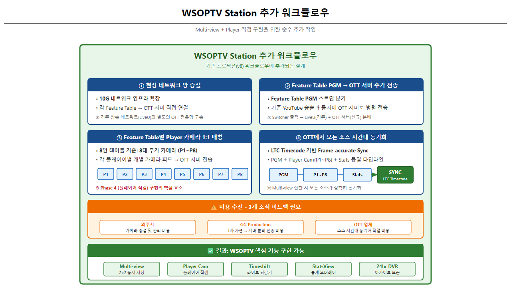

# WSOP TV: Executive Summary

| Version | 6.4 | 기준 문서 | PRD-0002 v10.0 |
|---------|-----|----------|----------------|
| 작성일 | 2026-01-30 | 보고 대상 | C-Level |

---

## 0. GG 생태계 내 WSOPTV 역할

### GGPass 구독 구조


[HTML 원본](../mockups/PRD-0002/57-ggpass-ecosystem.html)

| 구분 | 서비스 | WSOPTV 위치 |
|:----:|--------|:----------:|
| **구독 전용** | ClubbGG, WSOP Academy, **WSOP TV** | ✅ |
| 구독 혜택 | GGPoker, WSOP+, Pokerstake | |

> **핵심 포지셔닝**: WSOPTV는 독립 OTT가 아니라 **GG 생태계의 구독 혜택**으로서 GG POKER 가치를 부각시키는 역할

### 쿠팡플레이 비교 (역순 구조)

| 구분 | 쿠팡플레이 | WSOPTV |
|:----:|-----------|--------|
| **구독 중심** | 쿠팡 로켓와우 | **WSOPTV** |
| **혜택 방향** | 로켓와우 → 쿠팡플레이 무료 | WSOPTV → ClubbGG, Academy, GGPoker 혜택 |
| **수수료** | 앱스토어 수수료 부담 | **Reader App 판정 → 수수료 면제 가능** |

> **Reader App 전략**: WSOPTV는 동영상 시청 위주 비즈니스 모델로, Apple/Google 앱스토어 수수료를 면제받는 Reader App 판정이 용이

### Dual Flywheel: 이중 선순환


[HTML 원본](../mockups/PRD-0002/58-dual-flywheel.html)

```
GG POKER 플레이 → WSOPTV 시청 → 플레이어 팬심 → 체류시간↑ → GG POKER 플레이시간↑
```

**포커 대회 시청 특성**:
- 긴 시간 (수 시간~수십 시간)
- 느슨한 구조 (핸드 간 대기 시간)
- 영상 자체 몰입보다 **"탐색/검색/비교"**가 자연스러운 패턴

> **WSOPTV = 콘텐츠 놀이터**: 포커 플레이어들이 게임 외 시간에 머무르며 플레이어를 발견하고, 명장면을 탐색하고, 다시 게임으로 돌아가는 선순환 구조

### Table Multi-view/Player Cam의 생태계적 의미

> **용어 정리**: VIBLE 원문의 "Multi-view" = Player Cam (아이돌 직캠). 아래 "Table Multi-view"는 MOSES 확장 제안.

| 기능 | 출처 | 독립 OTT 관점 | GG 생태계 관점 | 상태 |
|------|:----:|-------------|---------------|:----:|
| **Table Multi-view** | MOSES | 제작 비용 대비 불명확 | **포커 관전 놀이터** - 관심 선수 발견 | ⬜ 확인 필요 |
| **Player Cam** | VIBLE | 비효율적, 쓸모없음 | **아이돌 팬덤** - 선수 감정 연결, 충성도 | ✅ 확정 |
| **Hand Search** | MOSES | 단순 편의 기능 | **명장면 컬렉션** - SNS 공유, 바이럴 | ✅ 확정 |
| **StatsView** | VIBLE | 부가 정보 | **학습/분석** - GG POKER 스킬 향상 욕구 | ✅ 확정 |

---

## 1. WSOP TV란?

> **GG 생태계 내에서 포커 플레이어들이 게임 외 시간에 머무를 수 있는 "콘텐츠 놀이터"로서, GG POKER 구독의 핵심 혜택 역할을 수행하는 스트리밍 플랫폼**

---

## 2. 왜 WSOP TV인가? (Why)

| 목적 | 설명 |
|------|------|
| **생태계 Lock-in** | GG POKER ↔ WSOPTV 선순환으로 플레이어 이탈 방지 |
| **구독 혜택 강화** | Plus Subscription의 핵심 가치 제안 |
| **데이터 자산화** | 시청자 행동 데이터 수집 → GG POKER 마케팅 활용 |

> **GG Network 시너지**: GG POKER ↔ WSOPTV 크로스 프로모션 ($9.99 칩 ↔ $9.99 구독권)

---

## 2. 타깃 사용자 (Who)

| Segment | 니즈 | WSOP TV 가치 | 예상 구독 |
|---------|------|-------------|----------|
| **캐주얼 팬** | 주요 경기 시청 | Live + VOD | Plus ($9.99) |
| **포커 플레이어** | 전략 분석 | Stats, Hand History | Plus+ ($49.99) |
| **하드코어 팬** | 멀티 모니터링 | Multi-view, Player Cam | Plus+ ($49.99) |

---

## 3. YouTube 전략적 재배치 (How)


| YouTube (무료) | WSOP TV (유료) |
|:---:|:---:|
| 마케팅 채널 | 프리미엄 플랫폼 |
| 하이라이트, 티저 | Full Live, VOD, Multiview |
| 광고 수익 공유 | **직접 수익** $9.99/$49.99 |

#### YouTube vs WSOP TV 핵심 차별점

| 기능 | WSOP TV | YouTube |
|------|:-------:|:-------:|
| **Timeshift** | ✅ 라이브 중 되감기 | ❌ 불가 |
| **영구 아카이브** | ✅ 20년 영상 보존 | ❌ 비공개 전환 |

---

## 4. 구독 플랜 (When)


| 티어 | 가격 | 핵심 차별점 |
|:----:|:----:|------------|
| **WSOP Plus** | **$9.99/월** | 1기기, 광고 포함, 캐주얼 팬 |
| **WSOP Plus+** | **$49.99/월** | 3기기, 광고 없음, 오프라인 시청 |

---

## 5. 핵심 기능

### 5.0 레이아웃 구조


#### 시청 모드 (View Modes)

| 모드 | 단계 | 설명 | 출처 |
|:----:|:----:|------|:----:|
| **Single View** | MVP | 1개 테이블 전체 화면, Timeshift 지원 | 일반 OTT |
| **Table Multi-view** | Phase 2 | 최대 4개 테이블 동시 시청, 클릭으로 오디오 전환 | 📋 MOSES (⬜ 확인 필요) |
| **Player Cam** | Phase 4 | 아이돌 직캠 방식, 특정 플레이어 클로즈업 | 📜 VIBLE (✅ 확정) |

#### 3계층 레이아웃 구조

| 계층 | 구성 | 목적 |
|:----:|------|------|
| **① 상단** | Tournament Ticker | 진행 중 테이블 한눈에 파악 → **즉시 시청 진입** |
| **② 중앙** | Video Player | 핵심 시청 경험, Timeshift + Multi-view |
| **③ 하단** | Info Tabs | 시청 방해 없이 상세 통계 (스크롤 시 표시) |

#### Tournament Ticker 상세

| 컬럼 | 예시 | 설명 |
|------|------|------|
| **테이블 번호** | TABLE 442 | 피처 테이블 식별자 |
| **이벤트명** | MAIN EVENT | 토너먼트 종류 |
| **상태** | 🔴 LIVE / STREAMING / BREAK | 진행 상태 |
| **칩 리더** | D. Negreanu | 해당 테이블 키 플레이어 |
| **스택** | 1.2M | 현재 칩 카운트 |

> **NBA League Pass 1:1 매핑**: 동일한 3계층 구조로 사용자 학습 비용 최소화

### 5.1 싱글 뷰 (Single View) - MVP


### 5.2 테이블 멀티뷰 (Table Multi-view) - Phase 2

> **출처**: 📋 MOSES 확장 제안 (VIBLE 직접 요청 아님, 필요 여부 확인 필요)


### 5.3 플레이어 캠 (Player Cam) - Phase 4

> **출처**: 📜 VIBLE 원문 - "메인화면이 중앙에 있고, 각 유저들의 얼굴을 잡고 있는 화면이 옆에 또 있는 방식 (아이돌 직캠 카메라)"
>
> ⚠️ VIBLE 원문에서 "Multi-view"라고 표현한 것이 바로 이 기능입니다.


**특정 플레이어 클로즈업 시청** (아이돌 직캠 방식)

| 특징 | 설명 |
|------|------|
| **1인 포커스** | 선택한 플레이어 집중 화면 |
| **칩 카운트** | 실시간 스택 오버레이 |
| **표정/리액션** | 플레이어 심리 관찰 |

### 5.4 통계 화면 (Info Tabs) - Phase 3

> **설계 선택**: NBA TV 방식 (영상 하단 Info Tabs) - 시청 방해 없이 통계 제공

#### Box Score 탭


| 요소 | 설명 |
|------|------|
| **Final Table Chip Counts** | 실시간 칩 순위 |
| **VPIP% / PFR% / AF** | 플레이어 성향 지표 |
| **Aggression Radar** | 공격성 시각화 |
| **Table Comparison** | 테이블 전체 통계 |

#### Game Charts 탭


| 요소 | 설명 |
|------|------|
| **Chip Lead Tracker** | 칩 리더 변화 그래프 |
| **Player Comparison** | 1:1 비교 레이더 차트 |
| **Active Hand Tendencies** | 플레이 스타일 분류 |

#### Play-By-Play 탭


| 요소 | 설명 |
|------|------|
| **Hand History** | 핸드별 상세 기록 |
| **Action Timeline** | Pre-Flop → River 액션 흐름 |
| **All-In 표시** | 주요 올인 상황 강조 |

---

## 6. 구축 현황

> **기준일**: 2026-01-29 | **상태**: 업체 검토 중

### 업체 비교 요약

| 업체 | 응대 | 견적 | P1 기능 | 리스크 |
|------|:----:|------|:------:|--------|
| **메가존클라우드** | 빠름 | ✅ 50억 | 100% | 🟡 일정 |
| **Brightcove** | ⚠️ 느림 | ⏳ 대기 | 제한적 | 🟡 견적 지연 |
| **Vimeo OTT** | ⚠️ 느림 | ❌ 미제출 | 미지원 | 🔴 **매각** |
| **맑음소프트** | 제한적 | ✅ 제출 | 미지원 | 🔴 기능 부족 |

### 핵심 요구사항 충족도

| 요구사항 | 중요도 | 메가존 | Brightcove | Vimeo | 맑음 |
|:---------|:------:|:------:|:----------:|:-----:|:----:|
| 라이브/VOD/DRM | P0 | ✅ | ✅ | ✅ | ✅ |
| Timeshift/DVR | P0 | ✅ | ✅ | ✅ | ⚠️ |
| **Multi-view (2x2)** | **P1** | ✅ | ⚠️ | ❌ | ❌ |
| **Featured Hands** | **P1** | ✅ | ⚠️ | ⚠️ | ❌ |
| **Player Cam Mode** | **P2** | ✅ | ❌ | ❌ | ❌ |

> **P1/P2 핵심 기능**: 메가존만 100% 지원

### 비용 현황 (3년 TCO 기준)

| 업체 | 구축비 | 운영비/년 | 3년 TCO |
|:-----|-------:|-------:|--------:|
| **메가존클라우드** | 50억 | 10~15억 | **80~100억** |
| **맑음소프트** | 1~2억 | 2~3억 | 7~11억 |

> **상세**: [PRD-0005 RFP](PRD-0005-wsoptv-ott-rfp.md) 참조

---

## 7. 기술 구현 로드맵

### 7.1 기존 프로덕션 워크플로우


**현재 워크플로우 요약:**
- **현장(Las Vegas)**: Feature Table → Switcher → LiveU Unit → 클라우드 전송
- **클라우드(LiveU)**: 디코딩 → 라우팅 → YouTube/서울 전송
- **서울(GG Production)**: 핸드 분할 → 편집 → 1-2hr 딜레이 → YouTube 방송

### 7.2 WSOPTV Station 추가 워크플로우

**Multi-view와 Player 직캠 구현을 위해 추가되는 설계입니다.**



#### 비용 추산이 어려운 이유

현재 정확한 비용 추산이 어려운 이유는 **3개 조직의 피드백이 필요**하기 때문입니다:

| 담당 | 역할 | 피드백 필요 사항 |
|------|------|-----------------|
| **외주사** | 현장 장비 관리 | 카메라 증설 및 관리 비용 (외주사에서 관리) |
| **GG Production** | 영상 편집/송출 | 현장 Feature Table 1차 가편 → 서버 분리 전송 비용 |
| **OTT 업체** | 플랫폼 구축 | 최종 소스들을 받아 시간대 동기화하는 작업 비용 |

> **결론**: 위 3개 조직의 피드백 이후 정확한 비용 추산이 가능할 것으로 예상됩니다.

#### 순수 추가 작업 요약

OTT 솔루션 기본 제공 범위 외, 순수하게 추가되는 작업:

| # | 추가 작업 | 설명 |
|---|----------|------|
| 1 | **현장 네트워크 망 증설** | 10G 네트워크 인프라 확장 |
| 2 | **Feature Table별 Player 카메라 1:1 매칭** | P1-P8 개별 카메라 피드 (Phase 4) |
| 3 | **Feature Table PGM → OTT 서버 추가 전송** | 실시간 PGM 스트림 분기 |
| 4 | **OTT에서 모든 소스 시간 동기화** | LTC Timecode 기반 Frame-accurate Sync |

> **상세**: [Production vs WSOPTV Architecture Report](../reports/REPORT-2026-01-30-production-vs-wsoptv-architecture.md) 참조

---

## 한 줄 요약

> **"WSOP TV는 GG 생태계 내 '콘텐츠 놀이터'로서, 포커 플레이어들이 게임 외 시간에 머무르며 GG POKER 플레이시간을 증가시키는 핵심 혜택 플랫폼"**

---

*v6.4 - 용어 재정의 동기화: Table Multi-view(MOSES) vs Player Cam(VIBLE) 구분 명시, 미확인 항목 표시 (2026-01-30)*
