# PRD-0002: WSOPTV Concept Paper

| 항목 | 값 |
|------|---|
| **Version** | 10.0 |
| **Status** | Draft |
| **Priority** | P0 |
| **Created** | 2026-01-07 |
| **Updated** | 2026-01-30 |
| **Author** | Claude Code |
| **Launch Target** | Q3 2026 |

---

## -1. GG 생태계 내 WSOPTV 역할

> **핵심**: WSOPTV는 독립 OTT가 아니라 **GG 생태계의 "콘텐츠 놀이터"**로서 GG POKER 구독의 핵심 혜택 역할을 수행합니다.

### -1.1 GGPass 구독 구조


[HTML 원본](../mockups/PRD-0002/57-ggpass-ecosystem.html)

| 구분 | 특징 | 서비스 |
|:----:|------|--------|
| **구독 전용 서비스** | 서비스 이용 시 구독 필수, Payment 구현 필수 | ClubbGG, WSOP Academy, **WSOP TV** |
| **구독 혜택 서비스** | 구독자에게 혜택 제공, Payment 구현 안함 | GGPoker, WSOP+, Pokerstake |

### -1.2 쿠팡플레이 비교 (역순 구조)

> 📋 **MOSES**: 쿠팡플레이와 구조는 유사하지만 **위치가 반대**입니다.

| 구분 | 쿠팡플레이 | WSOPTV |
|:----:|-----------|--------|
| **구독 중심** | 쿠팡 로켓와우 | **WSOPTV** |
| **혜택 방향** | 로켓와우 → 쿠팡플레이 무료 | WSOPTV 구독 → ClubbGG, Academy, GGPoker 혜택 |
| **핵심 서비스** | e-commerce | **동영상 시청** |

**Reader App 전략** (앱스토어 수수료 회피):

| 서비스 | 앱스토어 수수료 | Reader App 판정 |
|--------|:-------------:|:---------------:|
| **WSOPTV** | **면제 가능** | ✅ 동영상 시청 위주 |
| WSOP Academy | 면제 시도 예정 | ⚠️ 교육 콘텐츠 |
| ClubbGG | 수수료 부담 | ❌ 게임 콘텐츠 |

> **Reader App이란?**: 디지털 콘텐츠(책, 잡지, 음악, 비디오 등)를 구독하는 앱으로, Apple/Google이 별도로 분류하여 인앱 결제 수수료를 면제하는 앱 유형. Netflix, Spotify 등이 해당.

**WSOPTV가 중심인 이유**:
- 동영상 시청 위주 비즈니스 모델 → Reader App 판정 용이
- WSOPTV 구독이 다른 GG 서비스 혜택의 게이트웨이 역할
- 앱스토어 수수료 부담 없이 구독 결제 가능

### -1.3 포커 시청 특성과 "콘텐츠 놀이터" 개념

포커 대회 시청은 일반 스포츠와 근본적으로 다릅니다.

| 특성 | 일반 스포츠 (NBA 등) | 포커 대회 |
|------|---------------------|----------|
| **경기 시간** | 2-3시간 | 수 시간~수십 시간 |
| **구조** | 긴장감 유지 | 느슨한 구조 (핸드 간 대기) |
| **시청 패턴** | 집중 시청 | **탐색/검색/비교** |
| **몰입 방식** | 경기 자체에 몰입 | 플레이어 중심 관심 |

**"콘텐츠 놀이터" 철학:**

포커 플레이어는 영상 자체에 집중하기보다, WSOPTV를 **놀이터**처럼 이용합니다:
- GG POKER에서 게임 플레이 중 휴식
- WSOPTV로 이동하여 대회 시청
- 관심 있는 플레이어 발견 → Player Cam으로 집중 시청
- 해당 플레이어의 과거 핸드/하이라이트 탐색
- 다시 GG POKER로 돌아가 플레이

### -1.4 Dual Flywheel: 이중 선순환 구조


[HTML 원본](../mockups/PRD-0002/58-dual-flywheel.html)

```
┌───────────────────────────────────────────────────────────────────┐
│                                                                   │
│   GG POKER 플레이 ════════════════════════▶ WSOPTV 시청           │
│         ▲                                        │                │
│         │                                        ▼                │
│         │                               플레이어 팬심 형성         │
│         │                                        │                │
│         │                                        ▼                │
│   플레이시간 증가 ◀════════════════════════ 체류시간 증가          │
│                                                                   │
│     [GG 생태계]                        [콘텐츠 놀이터]             │
└───────────────────────────────────────────────────────────────────┘
```

**이중 효과:**
1. **WSOPTV 체류시간 증가**: 플레이어 중심 콘텐츠 탐색
2. **GG POKER 플레이시간 증가**: 영감을 받아 다시 게임으로 복귀

### -1.5 Multi-view/Player Cam의 생태계적 의미

기능을 **독립 OTT 관점**으로 판단하면 비효율적으로 보입니다. 하지만 **GG 생태계 관점**에서는 핵심적인 의미를 갖습니다.

| 기능 | 독립 OTT 관점 (부정적) | GG 생태계 관점 (긍정적) |
|------|----------------------|----------------------|
| **Multi-view** | 제작 비용 대비 ROI 불명확 | **포커 관전 놀이터** - 여러 테이블 모니터링 → 관심 선수 발견 → 팬심 형성 |
| **Player Cam** | 대단히 비효율적, 쓸모없음 | **아이돌 팬덤 메커니즘** - 특정 선수 감정 연결 → 충성도 강화 → 생태계 Lock-in |
| **Hand Search** | 단순 편의 기능 | **명장면 컬렉션** - SNS 공유 → 바이럴 → 신규 유입 |
| **StatsView** | 부가 정보 | **학습/분석** - 전략 이해 → GG POKER 스킬 향상 욕구 → 플레이 동기 |

> **핵심 인사이트**: Player Cam을 독립적으로 판단하면 대단히 비효율적이지만, GG 생태계 내 "콘텐츠 놀이터" 역할로서는 플레이어들이 재미있게 놀 수 있는 핵심 장치입니다.

### -1.6 프리미엄 구독 혜택 전략

> 📋 **MOSES**: Multi-view는 MVP 필수 기능이 아니라 **프리미엄($49.99) 고급 기능**으로 포지셔닝해야 합니다. 구현 난이도가 높다면 대안 혜택을 우선 고려합니다.

**프리미엄 vs 스탠다드 가격 비교**:

| 티어 | 가격 | 배수 | 기대 가치 |
|:----:|:----:|:----:|----------|
| WSOP Plus | $9.99/월 | 1x | 기본 시청 |
| WSOP Plus+ | $49.99/월 | **5x** | 고급 기능 |

**대안 프리미엄 혜택 (Multi-view 구현이 늦어질 경우)**:

| 카테고리 | 혜택 | 설명 |
|----------|------|------|
| **편집 콘텐츠** | DNEG 하이라이트 | Daniel Negreanu 명장면 모음 |
| | Ivey 하이라이트 | Phil Ivey 명장면 모음 |
| | Top 10 Bad Beat | WSOP 역대 Bad Beat 순위 |
| **독점 콘텐츠** | Making Film | 대회 비하인드 씬 |
| | Player's Commentary | 선수 직접 해설 |
| | Poker News | 포커 뉴스/인터뷰 |
| **OTT 기능** | 동시 시청 기기 | 최대 3개 (Plus+) vs 1개 (Plus) |
| | 오프라인 다운로드 | 모바일 동영상 저장 |
| | 광고 제거 | Plus+ 전용 |

> **참고**: 일반 OTT의 4K 화질 제공 혜택은 불가능 (소스 제약)

### -1.7 GGPoker 트래픽 연동

> 📋 **MOSES**: WSOPTV 론칭 시 GGPoker 내 관련 영역이 WSOPTV로 연결되어 트래픽을 유입시킵니다.

#### 현재: GGPoker.TV (YouTube 연동)


현재 GGPoker 앱 로비에는 **"GGPoker.TV"** 섹션이 있으며, YouTube 콘텐츠를 직접 앱 내에서 보여주고 있습니다.

| 현재 상태 | 내용 |
|----------|------|
| **섹션명** | GGPoker.TV |
| **콘텐츠 소스** | YouTube |
| **표시 콘텐츠** | Super High Roller Poker, GGMillion$ 등 라이브 대회 |
| **조회수** | 17K~24K views |
| **위치** | GGPoker 로비 중앙 (배너 아래) |

#### WSOPTV 론칭 후: 트래픽 전환

| 현재 (GGPoker.TV) | WSOPTV 론칭 후 |
|------------------|----------------|
| YouTube 콘텐츠 임베드 | **WSOPTV 딥링크** |
| 무료 시청만 가능 | 프리미엄 기능 안내 |
| GGPoker 앱 내 시청 | WSOPTV 앱 전환 또는 앱 내 플레이어 |

**트래픽 전환 시나리오**:
1. GGPoker.TV 섹션 → **"WSOPTV"**로 브랜드 변경
2. YouTube 링크 → WSOPTV 딥링크로 교체
3. 무료 하이라이트 제공 + "풀버전은 WSOPTV에서" CTA
4. Plus 구독자 → 앱 내 WSOPTV 플레이어에서 바로 시청

> **예상 효과**: 기존 GGPoker.TV 시청자(월 수십만 views)가 자연스럽게 WSOPTV로 유입

---

## 0. 4대 원천 기반 설계 원칙

### 0.1 4대 원천 (Four Pillars)

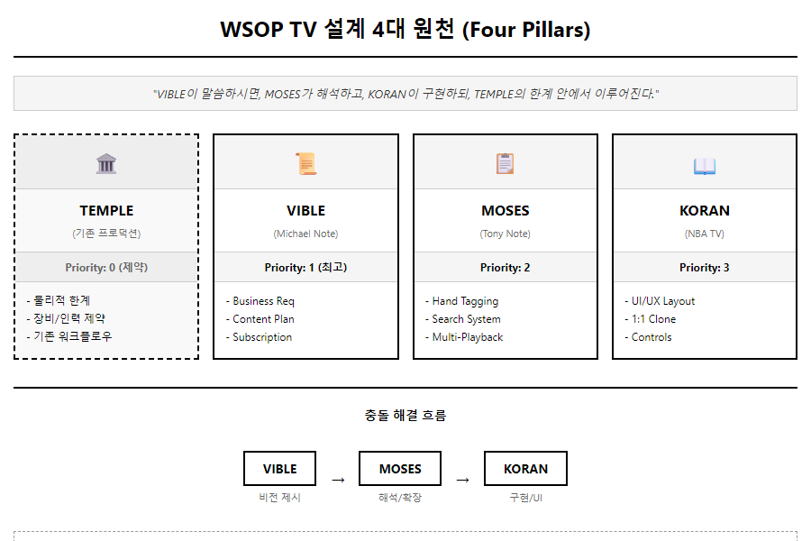

[HTML 원본](../mockups/PRD-0002/01-three-pillars.html)

> **"VIBLE이 말씀하시면, MOSES가 해석하고, KORAN이 구현하되, TEMPLE의 한계 안에서 이루어진다."**

| 원천 | 명칭 | 출처 | 역할 | 우선순위 |
|:----:|------|------|------|:--------:|
| 🏛️ | **TEMPLE** | 기존 방송 프로덕션 시스템 | 물리적 제약 조건 | 0 (제약) |
| 📜 | **VIBLE** | michael_note.md | 운영 계획의 근간, 비즈니스 요구사항 | 1 (최고) |
| 📋 | **MOSES** | tony_note.md | 첨언 및 확장, 태깅/검색 기능 | 2 |
| 📖 | **KORAN** | NBA TV League Pass | UI/UX 참조, 1:1 복제 대상 | 3 |

---

## 1. 프로젝트 개요

### 1.1 WSOP TV란?

> **"GG 생태계 내에서 포커 플레이어들이 게임 외 시간에 머무를 수 있는 '콘텐츠 놀이터'로서, GG POKER 구독의 핵심 혜택 역할을 수행하는 스트리밍 플랫폼"**

WSOP 공식 OTT 스트리밍 플랫폼. 기존 YouTube를 통해 무료로 제공하던 WSOP 라이브 스트림을 자체 플랫폼으로 이전하고, **GGPass Plus Subscription의 핵심 혜택**으로 제공하여 GG 생태계 전체의 가치를 극대화합니다.

### 1.2 왜 WSOP TV인가?

**핵심 목적: GG 생태계 Lock-in + 구독 혜택 강화**

| 비즈니스 목적 | 설명 |
|--------------|------|
| **생태계 Lock-in** | GG POKER ↔ WSOPTV 선순환으로 플레이어 이탈 방지 |
| **구독 혜택 강화** | Plus Subscription의 핵심 가치 제안 (쿠팡플레이 모델) |
| **데이터 자산화** | 시청자 행동 데이터 직접 수집 → GG POKER 마케팅 활용 |
| **플랫폼 자립** | YouTube 정책 변경 리스크 제거, 자체 브랜드 경험 |

**YouTube 전략적 재배치:**


[HTML 목업](../mockups/PRD-0002/35-youtube-strategy-flow.html)

| 채널 | 역할 | 콘텐츠 |
|------|------|--------|
| YouTube | 마케팅 채널 (무료 티저) | 하이라이트, 예고편, 인터뷰 클립 |
| WSOP TV | 프리미엄 채널 (유료 풀버전) | 풀 라이브, VOD, 멀티뷰, 핸드 검색 |

> **핵심 메시지**: "YouTube에서는 맛보기, WSOP TV에서 진짜 경험"

**구독자 전환 가치 (왜 유료를 내는가?):**

| 가치 | 설명 |
|------|------|
| **Timeshift** | 라이브 중 놓친 순간 즉시 되감기 |
| **영구 아카이브** | YouTube 비공개 전환 없이 영구 VOD |
| **Multi-view** | 4개 테이블 동시 시청 (NBA League Pass 방식) |
| **Hand Search** | 특정 핸드/선수 검색 (Phase 2) |
| **광고 없음** | Plus+ 구독 시 광고 제거 |

### 1.3 타깃 사용자

| 사용자 유형 | 니즈 | WSOP TV 제공 가치 |
|------------|------|-------------------|
| **캐주얼 팬** | 주요 경기 시청 | 라이브 스트리밍 + VOD |
| **포커 플레이어** | 전략 분석 | Player Stats, Hand History |
| **하드코어 팬** | 멀티 모니터링 | Multi-view, Player Cam |

### 1.4 플랫폼 개요

| 항목 | 내용 |
|------|------|
| **런칭 목표** | 2027년 3월 1일 전 |
| **플랫폼** | Web, iOS, Android, Samsung TV, LG TV |
| **구독 모델** | $9.99 WSOP Plus / $49.99 WSOP Plus+ |
| **화질** | 1080p Full HD |
| **자막** | 20개국 다국어 지원 |

---

## 2. 콘텐츠 아키텍처 (Content Architecture)

> **상세 문서**: [STRAT-0008 콘텐츠 소싱 전략](../strategies/STRAT-0008-content-sourcing-architecture.md)

### 2.1 OVP vs STREAM 이원화 구조


[HTML 원본](../mockups/PRD-0002/16-ovp-stream-architecture.html)

| 구분 | OVP (다시보기) | STREAM (라이브) |
|------|---------------|----------------|
| **소스** | 기존 아카이브 | 실시간 프로덕션 |
| **의존성** | 낮음 (데이터 이관) | 높음 (🏛️ TEMPLE 제약) |
| **복잡도** | 표준 VOD | 멀티뷰 / 직캠 옵션 |
| **이슈 수준** | LOW | **HIGH** |

### 2.2 OVP (다시보기) - 이슈 수준: LOW

| 단계 | 작업 |
|:----:|------|
| 1 | 기존 업체에서 영상 데이터 이관 |
| 2 | 미국 로컬 스토리지 → AWS 클라우드 |
| 3 | 카탈로그 + 메타 태그 |
| 4 | 재생 / 목록화 |

> **특징**: 기존 아카이브 자산 활용, 표준 VOD 워크플로우

### 2.3 STREAM (라이브) - 이슈 수준: HIGH

| 항목 | 상태 |
|------|------|
| **🏛️ TEMPLE 이해** | ⚠️ 현재 프로덕션 시스템 완벽 이해 필요 |
| **Michael Note** | ⚠️ 재확인 필요 |
| **프로덕션 의존성** | 높음 (장비/인력 제약 확인 필요) |

### 2.4 STREAM 송출 옵션


[HTML 원본](../mockups/PRD-0002/17-stream-option-comparison.html)

#### 옵션 2.1: 피처 테이블별 멀티뷰


[HTML 원본](../mockups/PRD-0002/17-stream-option-2-1.html)

| 항목 | 내용 |
|------|------|
| **소스** | 테이블별 스위처 컷편집본 (GFX 포함) |
| **처리 주체** | GG Production (한국) |
| **송출 방식** | 멀티뷰 (2x2) 레이아웃 |
| **장점** | 기존 워크플로우 활용, NBA TV 방식 동일 |
| **단점** | 개별 플레이어 집중 불가 |

#### 옵션 2.2: 멀티뷰 + 인물별 직캠

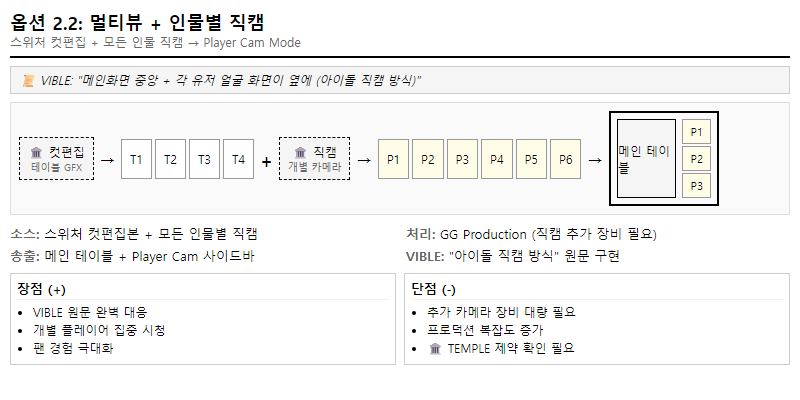

[HTML 원본](../mockups/PRD-0002/17-stream-option-2-2.html)

> 📜 **VIBLE 원문**: "메인화면이 중앙에 있고, 각 유저들의 얼굴을 잡고 있는 화면이 옆에 또 있는 방식 (아이돌 직캠 카메라)"

| 항목 | 내용 |
|------|------|
| **소스** | 스위처 컷편집본 + 모든 인물별 직캠 |
| **처리 주체** | GG Production (직캠 추가 장비 필요) |
| **송출 방식** | 메인 테이블 + Player Cam 사이드바 |
| **장점** | VIBLE 원문 완벽 대응, 팬 경험 극대화 |
| **단점** | 추가 카메라 대량 필요, 🏛️ TEMPLE 협의 필요 |

#### 옵션 2.3: 인물 팔로업 방식 ⭐ **현재 구축 시스템**

> **GG Production 현재 프로덕션 방식** - 현재 운영 중인 프로덕션 시스템

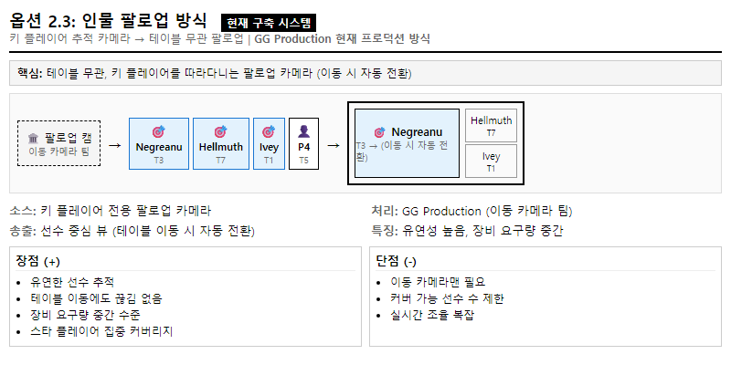

[HTML 원본](../mockups/PRD-0002/17-stream-option-2-3.html)

| 항목 | 내용 |
|------|------|
| **소스** | 키 플레이어 전용 팔로업 카메라 |
| **처리 주체** | GG Production (이동 카메라 팀) |
| **송출 방식** | 선수 중심 뷰 (테이블 이동 시 자동 전환) |
| **장점** | 유연한 선수 추적, 장비 요구량 중간 |
| **단점** | 이동 카메라맨 필요, 커버 선수 수 제한 |
| **상태** | ⭐ **현재 프로덕션 구축 완료** |

#### 옵션 선택 가이드

| 조건 | 권장 옵션 |
|------|----------|
| MVP 빠른 출시, 기존 워크플로우 유지 | **옵션 2.1** |
| VIBLE 원문 완벽 구현, 추가 투자 가능 | **옵션 2.2** |
| 스타 플레이어 집중, 중간 투자 | **옵션 2.3** ⭐ 현재 시스템 |

### 2.5 Video Streaming Architecture

> **버전**: v8 (2026-01-28 업데이트)
>
> **v8 주요 변경**: LiveU Cloud 아키텍처 수정 - Cloud Channel 추가, Output Protocol 확장, SRT 전송 적용


[HTML 원본](../mockups/PRD-0002/28-streaming-architecture-v8.html)

#### 아키텍처 개요

| Section | 구성요소 | 역할 |
|---------|---------|------|
| **A** | On-Site Production (Las Vegas) | Feature Table → Switcher → LiveU Unit |
| **B** | LiveU CLOUD (SaaS) | Cloud Channel → Matrix → Output Protocols |
| **C** | GG Production (Seoul) | Hand Split → Rating → Render → Broadcast |
| **E-1** | YouTube Path | Free/Teaser 배포 |

#### Section B: LiveU CLOUD 상세

| 컴포넌트 | 역할 |
|---------|------|
| **Cloud Channel** | LRT™ Bonded Stream 수신, 패킷 재조립, 디코딩 |
| **LiveU Matrix** | Share/Receive/Record 플랫폼, Cloud Recording 내장 |
| **LiveU Central** | 오케스트레이션 (Unit Monitor, Video Multiview, Drag & Drop Routing) |
| **Output Protocols** | LRT™, SRT, RTMP, NDI, HLS, MPEG-TS |

#### 전송 프로토콜

| 구간 | 프로토콜 | 이유 |
|------|---------|------|
| LiveU Unit → Cloud | **LRT™** | Bonded Cellular 최적화 |
| Cloud → Seoul | **SRT** | 대륙 간 전송에 적합 (RTMP 대비 에러 복구 우수) |
| Seoul → YouTube | **RTMP** | YouTube Ingest 표준 |

#### 딜레이 구성

| 구간 | 딜레이 |
|------|--------|
| LiveU Transport | 3-8초 |
| GG Production (Hand Split → Broadcast) | 1-2시간 |
| YouTube Stream | 15-30초 추가 |

### 2.6 WSOP 콘텐츠 Tier 구조

| Tier | 카테고리 | 콘텐츠 | 설명 |
|:----:|----------|--------|------|
| **1** | WSOP Vegas | WSOP Vegas (Las Vegas) | 메인 시리즈 (본거지) |
| **2** | WSOP 글로벌 | WSOPE (Prague), WSOP Paradise (Bahamas) | 글로벌 시리즈 |
| **3** | Super Circuit | 전세계 각지 | 글로벌 라이브 서킷 |
| **E** | 예능 | Poker After Dark, Game of Gold | 엔터테인먼트 콘텐츠 |

**Super Circuit 개최지 (예시)**:

| 지역 | 대회명 | 개최지 |
|------|--------|--------|
| **유럽** | SC Cyprus | Cyprus |
| | SC London | London, UK |
| **북미** | SC Toronto | Toronto, Canada |
| **아시아** | SC Manila | Manila, Philippines |
| | SC Macau | Macau |
| **남미** | SC São Paulo | São Paulo, Brazil |
| | SC Buenos Aires | Buenos Aires, Argentina |
| **오세아니아** | SC Melbourne | Melbourne, Australia |

**예능 콘텐츠 (Tier E)**:

| 프로그램 | 설명 | 형식 |
|----------|------|------|
| **Poker After Dark** | 심야 포커 예능, 유명 프로 대결 | VOD (에피소드) |
| **Game of Gold** | 서바이벌 포커 리얼리티 쇼 | VOD (시즌제) |

> **범위**: WSOP 공식 라이브 대회 + 예능 콘텐츠 포함. 온라인 전용 이벤트는 제외.

### 2.7 소스별 프로덕션 파트너

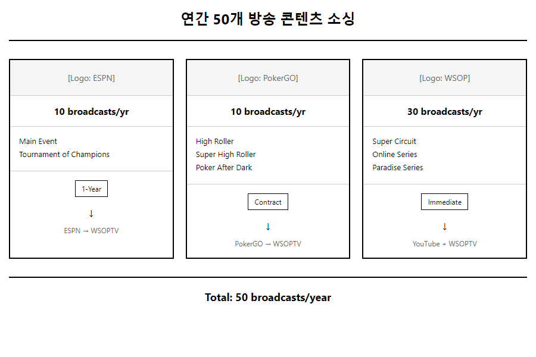

[HTML 원본](../mockups/PRD-0002/02-content-sourcing.html)

| 프로덕션 파트너 | 담당 대회 | 이벤트 범위 |
|----------------|----------|------------|
| **ESPN** | WSOP Vegas | Main Event만 |
| **PokerGO** | WSOP Vegas | Main Event 외 전체 |
| **Triton Poker** | WSOP Paradise | 전체 |
| **PokerCaster** | WSOPE | 유럽 지역 전체 |

### 2.8 콘텐츠 플로우


[HTML 원본](../mockups/PRD-0002/15-content-flow.html)

**GG Production 역할**: 모든 프로덕션 파트너 소스를 받아 종편(Post-Production) 작업 수행

### 2.9 YouTube vs WSOPTV 설정 비교

| 설정 | YouTube | WSOPTV |
|------|---------|--------|
| DVR (Timeshift) | ❌ 비활성화 | ✅ 활성화 |
| 종료 후 | 비공개 전환 | 영구 보존 |
| 역할 | 맛보기/유입 채널 | 본 서비스 |

---

## 3. 구독 모델

> **레퍼런스**: NBA League Pass 구독 모델 1:1 대응

### 3.1 구독 플랜 와이어프레임


[HTML 목업](../mockups/PRD-0002/34-subscription-plans.html)

> **레거시 목업**: [03-subscription-plans.html](../mockups/PRD-0002/03-subscription-plans.html)

> **레퍼런스 이미지**: [NBA League Pass 구독 페이지](../images/leaguepass/)

### 3.2 NBA League Pass vs WSOP Plus 매핑

| 항목 | NBA League Pass | NBA League Pass Premium | WSOP Plus | WSOP Plus+ |
|------|-----------------|------------------------|-----------|------------|
| **가격 (월간)** | $14.99/월 | $22.99/월 | **$9.99/월** | **$49.99/월** |
| **설명** | 1개 기기에서 경기 생중계 및 VOD | 최대 3개 기기, 오프라인 시청, 다운로드 | 1개 기기에서 대회 생중계 및 VOD | 최대 3개 기기, 오프라인 시청, 다운로드 |
| **광고** | 광고 포함 | 광고 없음 (휴식 시간 현장 생중계) | 광고 포함 | 광고 없음 |
| **오프라인 시청** | 불포함 | 포함 | 불포함 | 포함 |
| **동시 스트리밍** | 1개 기기 | 최대 3개 기기 | 1개 기기 | 최대 3개 기기 |
| **대체 방송** | 포함 | 포함 | 포함 | 포함 |
| **멀티뷰** | 최대 4개 경기 | 최대 4개 경기 | 최대 4개 테이블 | 최대 4개 테이블 |

### 3.3 2티어 구독 상세

| 티어 | 가격 | 명칭 | 주요 기능 |
|------|------|------|----------|
| Basic | **$9.99/월** | **WSOP Plus** | 1개 기기, 라이브, VOD, Timeshift, 광고 포함, 멀티뷰 4개 |
| Premium | **$49.99/월** | **WSOP Plus+** | 최대 3개 기기, 광고 없음, 오프라인 시청, 다운로드, 멀티뷰 4개 |

### 3.4 프로모션 전략

| Flow | 설명 |
|------|------|
| GG POKER → WSOPTV | $9.99 칩 구매 → WSOPTV Plus 구독권 자동 발급 |
| WSOPTV → GG POKER | Plus $9.99 구독 → GG POKER $9.99 칩 제공 |

---

## 4. Advanced Mode

Advanced Mode는 세 가지 **완전히 독립적인** 기능으로 구성됩니다.

### 4.1 Table Multi-view (여러 Feature Table 동시 시청)

> **설계 원칙**: NBA TV MultiView 1:1 대응
>
> **출처**: 📋 **MOSES** - "각각 다른 대회, 테이블 재생" (VIBLE에서 직접 요청되지 않음, 필요 여부 확인 필요)
>
> **정의**: 하나의 이벤트 내 여러 Feature Table을 동시에 시청하는 방식. 간혹 다른 이벤트 테이블도 포함 가능.

#### 진입 플로우 (NBA TV 방식) - Step 1


[HTML 원본](../mockups/PRD-0002/04-multiview-step1.html)

#### 진입 플로우 (NBA TV 방식) - Step 2


[HTML 원본](../mockups/PRD-0002/04-multiview-step2.html)

#### 단계별 설명

> **핵심 원칙**: Ticker 선택 → **즉시 시청** → 비디오 플레이어 컨트롤 바 내 MultiView 버튼 → 팝업 선택

| 단계 | 사용자 액션 | 시스템 반응 |
|:----:|------------|------------|
| 1 | Tournament Ticker에서 테이블 클릭 | **즉시 Single View 시청 시작** |
| 2 | 컨트롤 바 "MultiView ⊞" 버튼 클릭 | MultiView 레이아웃 선택 팝업 표시 |
| 3 | 팝업에서 레이아웃 선택 (1/1:1/2x2) | 선택한 레이아웃으로 변경 |
| 4 | Tournament Ticker에서 추가 테이블 클릭 | 자동으로 2 VIEW / 4 VIEW 전환 |
| 5 | 멀티뷰 내 화면 클릭 | 해당 테이블로 오디오 전환 (🔊 표시) |

#### View Mode 옵션

| 모드 | 레이아웃 | 자동 전환 조건 |
|:----:|:--------:|---------------|
| **1** | 단일 화면 | 기본 (Single View) |
| **1:1** | 좌우 2분할 | 2개 테이블 선택 시 |
| **2x2** | 2x2 그리드 | 3~4개 테이블 선택 시 |

#### 기능 명세

| 기능 | 설명 | NBA TV 대응 |
|------|------|-------------|
| **즉시 시청** | Ticker 선택 시 바로 시청 시작 | 동일 (핵심 UX) |
| **점진적 확장** | 테이블 추가 시 자동 뷰 모드 확장 | 동일 |
| **MultiView 버튼** | 비디오 플레이어 컨트롤 바 내 위치 | 동일 |
| 오디오 선택 | 화면 클릭으로 오디오 소스 전환 | 동일 |
| 다른 이벤트 추가 | 간혹 다른 이벤트 테이블 추가 가능 | 동일 |

#### NBA TV 방식 핵심 원칙

- **즉시 시청**: Ticker에서 테이블 선택 → 바로 시청 시작 (추가 단계 없음)
- **선택적 확장**: MultiView는 시청 중 선택적으로 활성화
- **점진적 추가**: 테이블 추가 시 자동으로 뷰 모드 확장 (1→2→4)
- **원클릭 오디오**: 화면 클릭만으로 오디오 소스 전환

### 4.2 Player Cam (아이돌 직캠 방식)

> **출처**: 📜 **VIBLE** 원문 - "메인화면이 중앙에 있고, 각 유저들의 얼굴을 잡고 있는 화면이 옆에 또 있는 방식 (아이돌 직캠 카메라)"
>
> **⚠️ 중요**: VIBLE 원문에서 "Multi-view"라고 표현한 기능이 바로 이 Player Cam입니다. 현재 문서의 "Table Multi-view"(섹션 4.1)와 혼동하지 마세요.
>
> **정의**: 특정 Feature Table의 개별 플레이어 카메라를 제공하는 방식. **모든 테이블에서 제공되지 않음**.

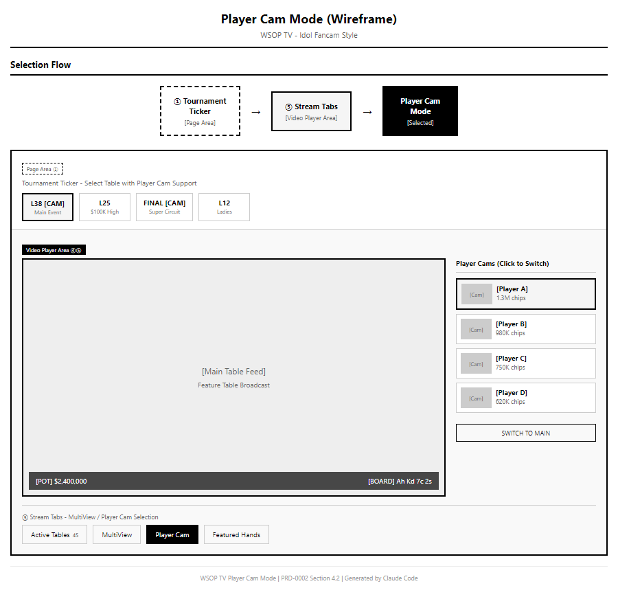

[HTML 원본](../mockups/PRD-0002/14-player-cam-mode.html)

#### 기능 스펙

| 기능 | 설명 |
|------|------|
| 메인 화면 | Feature Table 메인 방송 (중앙 대형) |
| Player Cam | 각 플레이어 얼굴을 잡는 개별 카메라 (주변 소형) |
| 선택적 전환 | 특정 플레이어 캠을 메인으로 전환 가능 |

#### 소스 구성

| 컴포넌트 | 소스 | 설명 |
|----------|------|------|
| Main Video | Feature Table Feed | 테이블 메인 방송 |
| Player Cam | Camera + GFX | 플레이어 얼굴 + 오버레이 정보 (이름, 칩, 홀카드) |

> ASCII 원본은 [아카이브](../archive/PRD-0002-ascii-mockups.md#5-player-cam-소스-구성-섹션-42) 참조

#### 진입 플로우

| 단계 | 영역 | 화면 | 주요 액션 |
|:----:|:----:|------|----------|
| 1 | Page Area ① | Tournament Ticker | Player Cam 지원 테이블 선택 ([CAM] 표시) |
| 2 | Video Player Area ⑤ | Stream Tabs | "Player Cam" 탭 선택 |
| 3 | Video Player Area ④ | Player Cam Mode | 메인 테이블 + 우측 플레이어 캠 사이드바 |

#### 인터랙션

- 플레이어 캠 클릭 → 메인 화면으로 전환
- "SWITCH TO MAIN" 버튼 → 원래 테이블 방송으로 복귀

#### 가용성 제한

| 항목 | 설명 |
|------|------|
| **제공 테이블** | Player Cam 가능 테이블만 (별도 지정) |
| **미제공 테이블** | 일반 Feature Table (메인 방송만) |
| **결정 요소** | 프로덕션 장비 구성, 테이블 중요도 |

#### Table Multi-view vs Player Cam 비교

| 구분 | Table Multi-view | Player Cam |
|------|------------------|------------|
| **출처** | 📋 MOSES (확장 제안) | 📜 VIBLE (원문 요청) |
| **대상** | 여러 Feature Table | 한 테이블의 여러 플레이어 |
| **소스** | 테이블별 메인 방송 | 플레이어 캠 + GFX 오버레이 |
| **가용성** | 모든 Feature Table | Player Cam 지원 테이블만 |
| **NBA TV 대응** | ✅ 1:1 대응 | ❌ WSOP TV 고유 |
| **레이아웃** | 2x2 그리드 (동등 크기) | 메인 + 주변 캠 (비대칭) |
| **용도** | 여러 테이블 동시 모니터링 | 특정 플레이어 집중 시청 |
| **필요 여부** | ⬜ 확인 필요 | ✅ 확정 |

### 4.3 StatsView (통계가 표시된 영상)

> **출처**: 📜 **VIBLE** 원문 - "허드같이 그 유저의 수치라든가, 플랍에서 베팅할 확률같은거, 이런게 띄어져있는 **영상**"
>
> **⚠️ 중요**: VIBLE은 "영상" 자체를 언급했습니다. 오버레이 기능이 아니라 **별도의 View Mode**로 해석해야 합니다. Production 단계에서 통계가 포함된 영상을 송출하는 방식일 가능성이 있습니다.

**세 가지 구현 방식 제안**:

#### Option A: NBA TV 방식 (Info Tabs)

> 시청에 방해되지 않도록 **별도 하단 패널**에 표시


| 특징 | 설명 |
|------|------|
| **위치** | 영상 하단 Info Tabs 영역 |
| **표시 방식** | Player Stats 탭 선택 시 표시 |
| **장점** | 시청 방해 없음, NBA TV 1:1 대응 |
| **처리 주체** | OTT (WSOP TV) |

| 탭 | NBA TV | WSOP TV |
|----|--------|---------|
| Summary | Summary | Summary |
| Box Score | Box Score | **Player Stats** |
| Game Charts | Game Charts | Hand Charts |
| Play-By-Play | Play-By-Play | Hand History |

#### Option B: GGM$ 방식 (영상 오버레이)

> 시청에 **직접적인 역할**을 하도록 영상 위에 오버레이

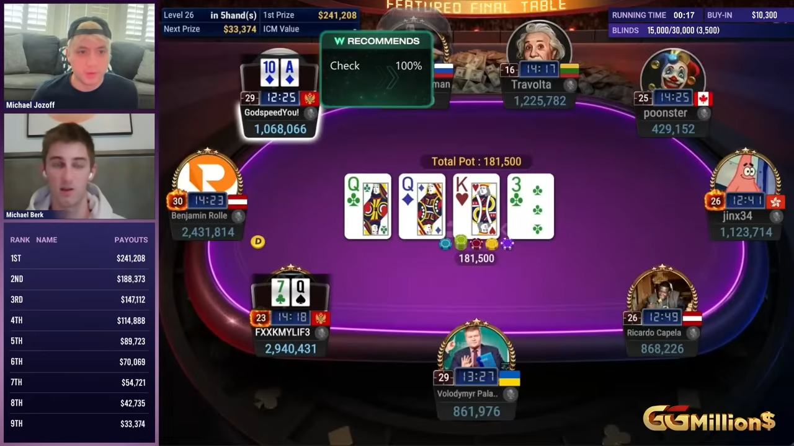

| 특징 | 설명 |
|------|------|
| **위치** | 영상 내 플레이어 옆 |
| **표시 방식** | HUD 스타일 상시 표시 |
| **장점** | 즉각적인 정보 확인 |
| **처리 주체** | **Production** (GG Production) |

**Option B 처리 위치 결정**:

| 처리 위치 | 장점 | 단점 |
|----------|------|------|
| **Production (권장)** | GGM$ 동일 프로세스, 직관적 | 영상에 고정됨 |
| OTT | 동적 on/off 가능 | Production 클론 TF 구성 필요 |

> **권장**: Option B 선택 시 GGM$와 동일하게 **Production 단계에서 처리**

#### Option C: GGPOKER 방식 (플레이어 팝업 정보)

> 플레이어 클릭 시 **실시간 통계/프로필 오버레이 팝업** 표시


[HTML 원본](../mockups/PRD-0002/15-content-flow-option-c.html)


| 특징 | 설명 |
|------|------|
| **트리거** | 화면 내 플레이어 영역 클릭/탭 |
| **데이터** | 플레이어 DB + 실시간 핸드 통계 |
| **표시** | 오버레이 팝업 (영상 재생 유지) |
| **닫기** | 팝업 외부 클릭 또는 X 버튼 |

**팝업 정보 항목**:
- 기본 정보: 이름, 국적, 프로필 사진
- WSOP 기록: Bracelets 수, 총 상금
- 실시간 통계: VPIP, PFR, AF (핸드 진행 중 업데이트)

**StatsView 표시 정보**:

| 요소 | 표시 정보 | VIBLE 원문 대응 |
|------|----------|----------------|
| 플레이어 HUD | VPIP, PFR, 3-Bet%, AF | "그 유저의 수치" |
| 베팅 확률 | 플랍 베팅 확률, Pot Odds | "플랍에서 베팅할 확률" |
| 스택 정보 | 칩 카운트, BB 기준 스택 | - |

---

## 5. Featured Hands (핸드 검색)

> **설계 원칙**: NBA TV Key Plays 1:1 대응 - **동일 레이아웃으로 처리**

### 5.1 NBA TV Key Plays 매핑

| 항목 | NBA TV (Key Plays) | WSOP TV (Featured Hands) |
|------|-------------------|-------------------------|
| **버튼 위치** | 컨트롤 바 상단 (좌측 정렬) | 컨트롤 바 상단 "🔥 Key Plays" 버튼 |
| 버튼 명칭 | Key Plays | 🔥 Key Plays (Featured Hands) |
| **표시 방식** | 팝업 | **중앙 모달 배너** (v3.2) |
| 목록 콘텐츠 | 주요 플레이 목록 | 주요 핸드 목록 |
| 항목 정보 | 플레이어, 시간, 설명 | 플레이어, 핸드, 결과 |
| 인터랙션 | 클릭 → 해당 시점 이동 | 클릭 → 해당 핸드 시점 이동 (동일) |
| **YouTube Link** | - | ✅ YouTube에서 보기 버튼 (v3.1 추가) |
| 필터 | 팀, 플레이어, 유형 | 플레이어, 핸드, 결과 |

> **버튼 레이아웃 (v3.1)**: 컨트롤 바 상단에 좌측 정렬 배치
> ```
> [Streams] [MultiView ⊞] [🔥 Key Plays]
> ```

> **팝업 방식 (v3.2)**: Streams/Key Plays 클릭 시 **비디오 플레이어 중앙에 대형 모달 배너**로 표시 (백드롭 오버레이 + 닫기 버튼)

### 5.2 Featured Hands UI (Key Plays 동일 레이아웃)

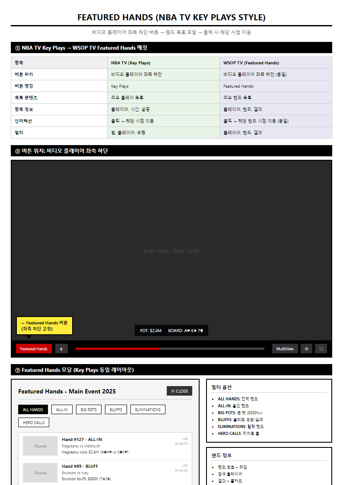

[HTML 원본](../mockups/PRD-0002/05-hand-search.html)

| 컴포넌트 | NBA TV Key Plays | WSOP TV Featured Hands |
|----------|-----------------|------------------------|
| 목록 항목 | 썸네일 + 설명 | 썸네일 + 핸드 설명 |
| 필터 | 팀, 플레이어, 유형 | **플레이어, 핸드, 결과** |
| 정렬 | 시간순 | 핸드 번호순 |

### 5.3 필터 옵션

| 필터 | 설명 |
|------|------|
| **ALL HANDS** | 전체 핸드 |
| **ALL-IN** | 올인 핸드 |
| **BIG POTS** | 큰 팟 ($49.990K+) |
| **BLUFFS** | 블러프 성공/실패 |
| **ELIMINATIONS** | 탈락 핸드 |
| **HERO CALLS** | 히어로 콜 |

### 5.4 핸드 정보 구조

| 항목 | 설명 | 예시 |
|------|------|------|
| 핸드 번호 | 고유 식별자 | Hand #127 |
| 타입 | 핸드 분류 | ALL-IN, BLUFF, ELIM |
| 참여 플레이어 | 해당 핸드에 참여한 선수 | Negreanu vs Hellmuth |
| 결과 | 핸드 결과 + 홀카드 | Negreanu wins $2.4M (A♠A♥ vs K♠K♥) |
| Level | 토너먼트 레벨 | L38 |
| 타임스탬프 | 핸드 시작 시간 | 02:34 |

### 5.5 핸드 단위 태깅 (메타데이터)

| 태그 항목 | 설명 |
|----------|------|
| Hand 기준 | 핸드 번호, 타임스탬프 |
| 참여 플레이어 | 해당 핸드에 참여한 선수 목록 |
| 각 플레이어 Hands | 홀카드 정보 |
| Community Card | 보드 카드 (플롭/턴/리버) |
| 최종 Winner | 핸드 승자 |

### 5.6 검색 기능

**검색 예제**:
- A 선수와 B 선수가 함께 했던 대회/동영상 검색
- 포카드(Four of a Kind)를 쥔 플레이어가 로열 스트레이트 플러시에게 패한 핸드
- 특정 핸드(AA, KK 등)로 이기거나 진 상황

---

## 6. 전체 페이지 레이아웃

> **레퍼런스**: NBA TV League Pass 1:1 대응
>
> **구조**: 메인 스트리밍 UI (상단) + Info Tabs (하단)

### 6.1 전체 페이지 와이어프레임

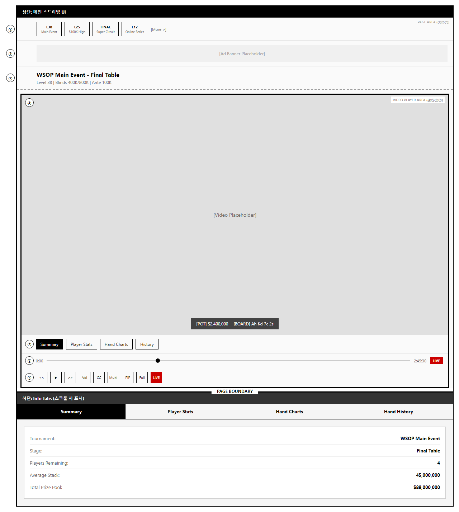

[HTML 원본](../mockups/PRD-0002/09-full-page-layout.html)

### 6.2 페이지 구조

> 상세 와이어프레임은 [09-full-page-layout.html](../mockups/PRD-0002/09-full-page-layout.html) 참조
>
> ASCII 원본은 [아카이브](../archive/PRD-0002-ascii-mockups.md#2-페이지-구조-섹션-62) 참조

| 영역 | 레이어 | 컴포넌트 |
|------|:------:|----------|
| **상단: 메인 스트리밍 UI** | | |
| Page Area | ①②③ | Tournament Ticker, Ad Banner, Tournament Header |
| Video Player Area | ④⑤⑥⑦ | Video Player, Stream Tabs, Timeline, Controls |
| **하단: Info Tabs** | | Summary, Player Stats, Hand Charts, Hand History |

### 6.3 영역 분류

| 영역 | 레이어 | 설명 |
|------|:------:|------|
| **Page Area** | ①②③ | 페이지 레벨 컴포넌트 (헤더, 네비게이션) |
| **Video Player Area** | ④⑤⑥⑦ | 비디오 플레이어 컴포넌트 (재생 관련) |
| **Info Tabs Area** | - | 하단 정보 탭 (스크롤 시 표시) |

---

## 7. 메인 스트리밍 UI (상단)

> **7단 레이아웃**: Page Area (①②③) + Video Player Area (④⑤⑥⑦)

### 7.1 레이아웃 와이어프레임

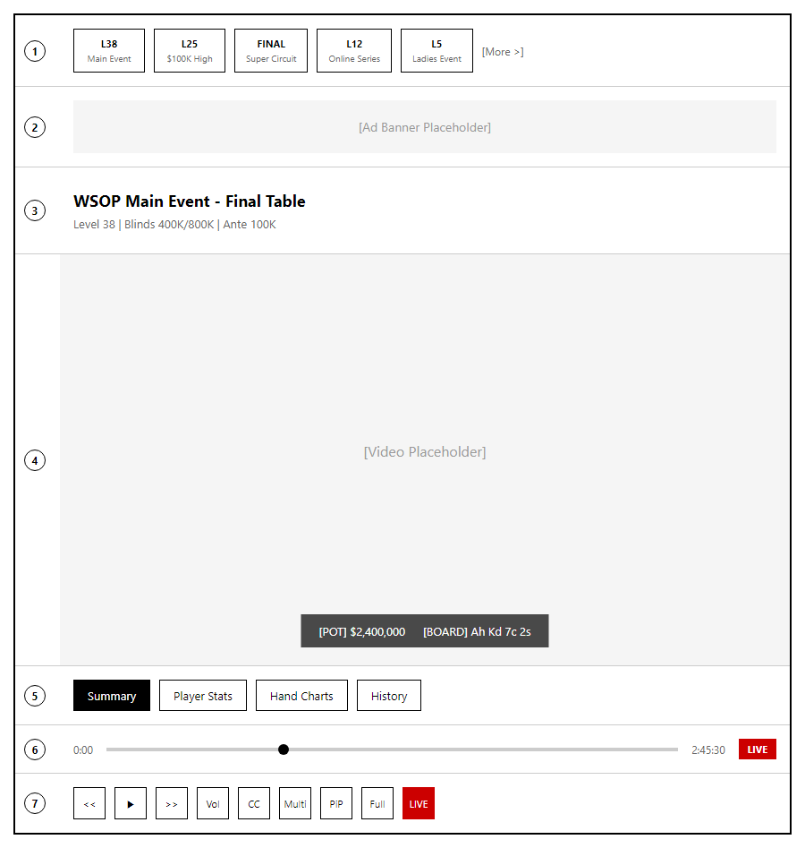

[HTML 원본](../mockups/PRD-0002/06-main-layout.html)

### 7.2 Page Area (①②③)

| 레이어 | NBA TV 컴포넌트 | WSOP TV 컴포넌트 |
|:------:|-----------------|------------------|
| ① | Scoreboard Ticker | Tournament Ticker |
| ② | Ad Banner | Ad Banner |
| ③ | Game Header | Tournament Header |

### 7.3 Video Player Area (④⑤⑥⑦) - v3.1 오버레이 컨트롤

> **v3.1 변경**: YouTube/Netflix 스타일 오버레이 컨트롤 - 마우스 호버 시 표시, 3초 후 자동 숨김

| 레이어 | NBA TV 컴포넌트 | WSOP TV 컴포넌트 (v3.1) |
|:------:|-----------------|------------------------|
| ④ | Video Player | Video Player + POT/BOARD (16:9 고정) |
| ⑤ | Stream Tabs | **오버레이 컨트롤 바** (타임라인 위) |
| ⑥ | Timeline | Timeline (오버레이) |
| ⑦ | Controls | Controls (오버레이) |

**v3.1 컨트롤 바 구조**:
```
┌───────────────────────────────────────────────────────────────┐
│  Streams  MultiView⊞  🔥Key Plays  [GFX/HUD 배지]            │ ← 버튼 행 (좌측 정렬)
├───────────────────────────────────────────────────────────────┤
│  01:38:59 ════════════════════════════════════════════ LIVE  │ ← 타임라인
├───────────────────────────────────────────────────────────────┤
│  ⏵  ⏪10  10⏩  🔊──                           CC  ⚙  ⛶      │ ← 재생 컨트롤
└───────────────────────────────────────────────────────────────┘
```

### 7.4 용어 매핑

| NBA TV | WSOP TV | 비고 |
|--------|---------|------|
| Scoreboard Ticker | Tournament Ticker | 상단 스코어/대회 표시 |
| Q3 3:05 | L38 LIVE | Quarter→Level |
| Clippers 77 / Bulls 90 | Negreanu 1.3M | 점수→칩 리더 |
| Key Plays | Featured Hands | 주요 플레이/핸드 |
| Box Score | Player Stats | 통계 탭 |
| Play-By-Play | Hand History | 액션 로그 |

---

## 8. Info Tabs (하단)

> **위치**: 메인 스트리밍 UI 하단, 스크롤 시 표시

### 8.1 탭 와이어프레임

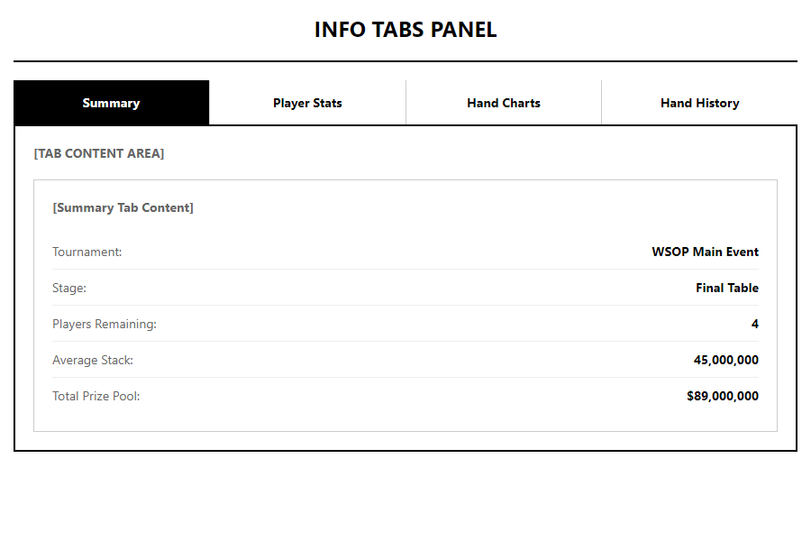

[HTML 원본](../mockups/PRD-0002/07-info-tabs.html)

### 8.2 탭 구조

| 탭 | NBA TV | WSOP TV |
|----|--------|---------|
| 1 | Summary | Summary |
| 2 | Box Score | Player Stats |
| 3 | Game Charts | Hand Charts |
| 4 | Play-By-Play | Hand History |

### 8.3 Player Stats 컬럼 매핑 (StatsView Option A)

> StatsView NBA TV 방식: 시청에 방해되지 않도록 Info Tabs에서 제공

| NBA TV | WSOP TV | 설명 |
|--------|---------|------|
| MIN | HANDS | 플레이 시간/핸드 |
| FGM | WINS | 성공 횟수 |
| FG% | WIN% | 성공률 |
| 3PM | VPIP | 팟 참여율 |
| REB | CHIPS | 칩 카운트 |

---

## 9. UX 워크플로우

> **설계 원칙**: NBA TV PRD 섹션 14 패턴 적용 - 사용자 여정(User Journey)과 화면 전환 흐름 시각화

### 9.1 Entry Flow (랜딩 → 시청)

> 상세 흐름은 [10-viewing-flow.html](../mockups/PRD-0002/10-viewing-flow.html) 참조
>
> ASCII 원본은 [아카이브](../archive/PRD-0002-ascii-mockups.md#3-entry-flow-섹션-91) 참조

| 단계 | 화면 | 주요 액션 |
|:----:|------|----------|
| 1 | Landing | 앱 진입, 로그인 버튼 클릭 |
| 2 | 구독 확인 | GGPass SSO 인증, WSOP Plus/Plus+ 상태 확인 |
| 3 | Ticker | Tournament Ticker에서 진행 중인 대회 확인 |
| 4 | 테이블 선택 | Feature Table 목록에서 시청할 테이블 선택 |
| 5 | LIVE | 라이브 스트리밍 시작 |

### 9.2 Viewing Flow (시청 중 인터랙션)

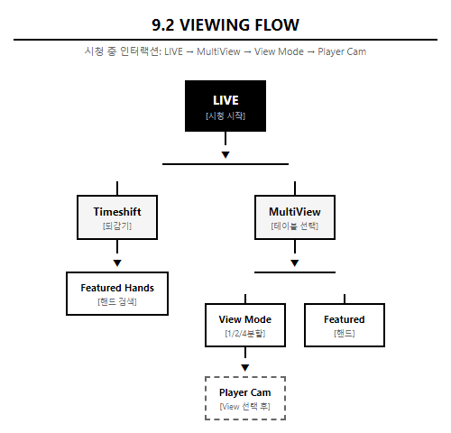

[HTML 원본](../mockups/PRD-0002/10-viewing-flow.html)

**계층 구조** (Sequential Flow):

```
LIVE → MultiView → View Mode (1/2/4) → Player Cam
                 → Featured Hands
     → Timeshift → Featured Hands
```

> **Player Cam 진입 조건**: MultiView 활성화 후 **View Mode 선택 필수** (Level 3)

**컨트롤 바 버튼** (Video Player Area ⑤ - v3.1 오버레이):

| 버튼 | 기능 | 팝업 내용 | NBA TV 대응 |
|------|------|----------|-------------|
| **Streams** | 스트림 목록 표시 | 활성 테이블 목록 + 상태 | Streams |
| **MultiView ⊞** | 멀티뷰 레이아웃 선택 | 1 / 1:1 / 2x2 선택 | MultiView |
| **🔥 Key Plays** | 주요 핸드 목록 | 핸드 목록 + YouTube 링크 | Key Plays |
| Player Cam | 아이돌 직캠 모드 | **View Mode 선택 후** | WSOP TV 고유 |

### 9.3 Featured Hands Flow (핸드 탐색)


[HTML 원본 (1/2)](../mockups/PRD-0002/11-featured-hands-flow-1.html)


[HTML 원본 (2/2)](../mockups/PRD-0002/11-featured-hands-flow-2.html)

**필터 옵션**:

| 필터 | 설명 |
|------|------|
| ALL HANDS | 전체 핸드 |
| ALL-IN | 올인 핸드 |
| BIG POTS | 큰 팟 ($49.990K+) |
| BLUFFS | 블러프 성공/실패 |
| ELIMINATIONS | 탈락 핸드 |
| HERO CALLS | 히어로 콜 |

**Street 타임라인**: PREFLOP → FLOP → TURN → RIVER → SHOWDOWN

> 상세 다이어그램은 [11-featured-hands-flow-1.html](../mockups/PRD-0002/11-featured-hands-flow-1.html), [11-featured-hands-flow-2.html](../mockups/PRD-0002/11-featured-hands-flow-2.html) 참조
>
> ASCII 원본은 [아카이브](../archive/PRD-0002-ascii-mockups.md#4-street-타임라인-섹션-93) 참조

**복귀 경로**:
- `HAND LIST` 버튼 → 핸드 목록 모달
- `JUMP TO LIVE` 버튼 → LIVE STREAMING

### 9.4 Info Tabs Flow (하단 정보 탭)

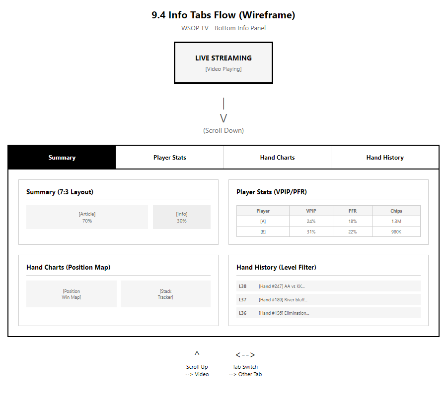

[HTML 원본](../mockups/PRD-0002/12-info-tabs-flow.html)

**탭 콘텐츠**:

| 탭 | 레이아웃 | 콘텐츠 |
|----|----------|--------|
| Summary | 7:3 비율 | 토너먼트 기사 + Info 사이드바 |
| Player Stats | 전체 테이블 | VPIP, PFR, 3BET, AF, CHIPS |
| Hand Charts | 차트 그리드 | Position Map, Stack Tracker |
| Hand History | 타임라인 | Level 필터 + 액션 로그 |

### 9.5 상태 전환 다이어그램

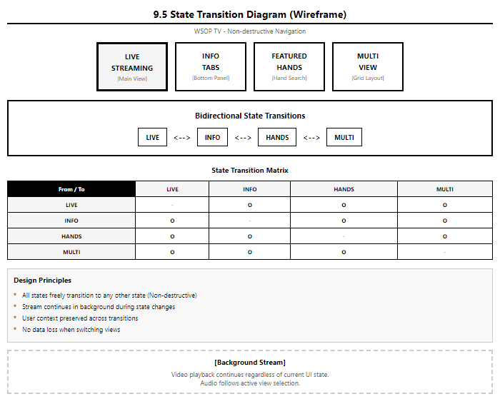

[HTML 원본](../mockups/PRD-0002/13-state-transition.html)

**설계 원칙**:
- 각 상태에서 다른 상태로 자유롭게 전환 가능 (비파괴적)
- 시청 중 스트림은 백그라운드에서 계속 유지

### 9.6 Player Cam Mode Flow

> Player Cam Mode 상세는 [섹션 4.2](#42-player-cam-mode-아이돌-직캠-방식) 참조

---

## 10. 개발 로드맵

> **Phase별 점진적 구현** - MVP에서 시작하여 Advanced Mode까지 단계적 확장


[HTML 목업](../mockups/PRD-0002/36-development-roadmap.html)

### 10.1 Phase 개요

| Phase | 마감 | 핵심 목표 | NBA TV 대응 |
|:-----:|------|----------|-------------|
| **MVP (P1)** | 2027.03.01 | 기본 시청 경험 | Video Player, Ticker, Controls |
| **P2** | TBD | 멀티 시청 + 검색 | MultiView, Key Plays |
| **P3** | TBD | 정보 탭 확장 | Info Tabs 전체 |
| **P4** | TBD | 고급 기능 | Player Cam, StatsView |

### 10.2 Phase별 기능 상세

| Phase | 기능 목록 |
|:-----:|----------|
| **MVP** | Video Player, Tournament Ticker, Timeline, Stream Tabs, Controls, GGPass SSO, 구독 모델 ($9.99/$49.99) |
| **P2** | MultiView 레이아웃 (1:2, 2x2), Featured Hands 모달/플레이어, Camera/Commentary 선택, 핸드 단위 태깅, 선수/핸드 검색 |
| **P3** | Summary (7:3 레이아웃), Player Stats (VPIP/PFR), Hand Charts (Position Map), Hand History (Level 필터) |
| **P4** | Player Cam Mode (아이돌 직캠), StatsView 영상 오버레이, 3x3 MultiView (파이널용), 멀티 재생 |

### 10.3 기능 → Phase 매핑

> **핵심 개념**: Tournament Ticker = Multi-view 진입점
> - Tournament Ticker 자체가 멀티뷰를 선택할 수 있는 인터페이스
> - Ticker에서 테이블 클릭 → 즉시 시청, MultiView 버튼으로 추가 테이블 선택

| 기능 카테고리 | MVP | P2 | P3 | P4 | 비고 |
|--------------|:---:|:--:|:--:|:--:|------|
| 라이브 스트리밍 | ✅ | | | | |
| **Tournament Ticker / Multi-view** | ✅ | ✅ | | | MVP: Single View, P2: Multi-view 레이아웃 |
| GGPass SSO | ✅ | | | | |
| 구독 모델 | ✅ | | | | |
| Featured Hands | | ✅ | | | |
| 핸드 태깅/검색 | | ✅ | | | |
| Info Tabs | | | ✅ | | |
| Player Cam | | | | ✅ | View Mode 선택 후 진입 |
| StatsView 오버레이 | | | | ✅ | |

---

## 부록 A. 용어 매핑 (NBA TV → WSOP TV)

> **설계 원칙**: NBA TV 용어를 WSOP TV 도메인에 맞게 1:1 변환

| NBA TV | WSOP TV | 비고 |
|--------|---------|------|
| Scoreboard Ticker | Tournament Ticker | 상단 스코어/대회 표시 |
| Q3 3:05 | L38 LIVE | Quarter → Level |
| Clippers 77 / Bulls 90 | Negreanu 1.3M | 점수 → 칩 리더 |
| League Pass | WSOP Plus | 구독 서비스명 |
| CLIPPERS @ BULLS | [♠] MAIN EVENT 2024 | 팀 → 이벤트 |
| Bulls (In-Arena) | Main Table Cam | 카메라 옵션 |
| Streams 9 | Active Tables 45 | 스트림 수 |
| Key Plays | Featured Hands | 주요 플레이/핸드 |
| Summary | Summary | 동일 |
| Box Score | Player Stats | 통계 탭 |
| Game Charts | Hand Charts | 차트 탭 |
| Play-By-Play | Hand History | 액션 로그 |

---

## 부록 B. 용어 정의 (Glossary)

> **용어 혼동 방지를 위한 공식 정의표** - 출처별로 구분

### B.1 기능 용어 정의

| 용어 | 정의 | 출처 | 상태 |
|------|------|:----:|:----:|
| **Selected View** | 원하는 테이블/스트림을 선택하여 시청하는 기본 기능 | 일반 OTT | ✅ 확정 |
| **Player Cam** | 한 테이블의 메인 방송 + 각 플레이어 직캠 동시 표시 (아이돌 직캠 방식) | 📜 VIBLE | ✅ 확정 |
| **Table Multi-view** | 서로 다른 테이블/대회를 동시 시청 (2x2 그리드) | 📋 MOSES | ⬜ 확인 필요 |
| **StatsView** | 플레이어 통계(VPIP, PFR 등)가 표시된 **영상** (View Mode) | 📜 VIBLE | ✅ 확정 |
| **Featured Hands** | 주요 핸드(올인, 빅팟 등) 태깅 및 검색 | 📋 MOSES | ✅ 확정 |
| **Timeshift** | 라이브 중 되감기/일시정지 | 📜 VIBLE | ✅ 확정 |

### B.2 VIBLE의 "Multi-view" 오해 정리

| 구분 | VIBLE 원문 | 현재 PRD 매핑 |
|------|-----------|--------------|
| **VIBLE이 말한 Multi-view** | "메인화면이 중앙에 있고, 각 유저들의 얼굴을 잡고 있는 화면이 옆에 또 있는 방식 (아이돌 직캠 카메라)" | **Player Cam** (섹션 4.2) |
| **PRD의 Table Multi-view** | 여러 Feature Table 동시 시청 (NBA TV 방식) | **Table Multi-view** (섹션 4.1) |

> **⚠️ 핵심**: VIBLE 원문의 "Multi-view"는 현재 PRD의 "Player Cam"에 해당합니다. "Table Multi-view"(여러 테이블 동시 시청)는 MOSES에서 확장된 아이디어입니다.

---

## 부록 C. 확인 필요 사항 (Open Questions)

> **VIBLE/MOSES에서 정의되지 않아 추가 확인이 필요한 항목**

### C.1 최우선 (기획 방향 결정)

| # | 질문 | 영향 | 상태 |
|:-:|------|------|:----:|
| 1 | **Table Multi-view(여러 테이블 동시 시청)가 필요한가?** VIBLE은 Player Cam만 요청, MOSES가 추가 제안 | MVP 범위 | ⬜ |
| 2 | **$9.99 Plus에 어떤 기능이 포함되는가?** | 구독 모델 | ⬜ |
| 3 | **$49.99 Plus+에 어떤 기능이 포함되는가?** | 구독 모델 | ⬜ |
| 4 | **Advanced Mode(Player Cam, StatsView)는 어느 티어에 포함되는가?** | 구독 모델 | ⬜ |

### C.2 높은 우선순위

| # | 질문 | 영향 | 상태 |
|:-:|------|------|:----:|
| 5 | **무료 사용자에게 제공되는 콘텐츠가 있는가?** | 마케팅 전략 | ⬜ |
| 6 | **Player Cam은 모든 Feature Table에서 제공되는가?** | 프로덕션 비용 | ⬜ |
| 7 | **StatsView는 Production에서 제공하는가, OTT에서 오버레이하는가?** | 기술 아키텍처 | ⬜ |

### C.3 보통 우선순위

| # | 질문 | 영향 | 상태 |
|:-:|------|------|:----:|
| 8 | 동시 시청 기기 수 제한은? | 플랫폼 설계 | ⬜ |
| 9 | 오프라인 다운로드 기능 포함 여부 | 기능 범위 | ⬜ |
| 10 | 연간 구독 할인 플랜 제공 여부 | 가격 전략 | ⬜ |

### C.4 서비스 범위 확인 현황

**VIBLE에서 명시된 것 (확정)**:

| 항목 | VIBLE 원문 | 상태 |
|------|-----------|:----:|
| 라이브 스트리밍 | "WSOP TV도 같이 라이브 중계" | ✅ |
| Timeshift | "뒤로 가게도 할수 있게 하고" | ✅ |
| VOD | "끝나면 영상 남아있고" | ✅ |
| Player Cam | "메인화면이 중앙에 있고, 각 유저들의 얼굴..." | ✅ |
| StatsView | "허드같이 그 유저의 수치라든가..." | ✅ |
| 아카이브 | "역대 모든 WSOP 영상들도 다 업로드" | ✅ |
| 구독 모델 | "$10, $50 두개 있음" | ✅ |
| GGPass 로그인 | "GGPass 로 로그인" | ✅ |
| 플랫폼 | "Appstore, Playstore, Samsung TV, LG TV... Web" | ✅ |
| 광고 정책 | "굳이 고려할 필요없음" | ✅ 불필요 |

**VIBLE에서 명시되지 않은 것 (미확인)**:

| 항목 | 상태 | 비고 |
|------|:----:|------|
| 무료 콘텐츠 범위 | ⬜ | VIBLE/MOSES 언급 없음 |
| Table Multi-view | ⬜ | MOSES 아이디어, VIBLE 직접 요청 아님 |
| $9.99 기능 상세 | ⬜ | 추가 확인 필요 |
| $49.99 기능 상세 | ⬜ | 추가 확인 필요 |
| 동시 시청 기기 수 | ⬜ | MOSES 언급만 ("동시 시청 기기 제한") |
| 오프라인 다운로드 | ⬜ | MOSES 언급만 ("모바일 동영상 다운받기") |

---

## Revision History

| 버전 | 날짜 | 작성자 | 내용 |
|------|------|--------|------|
| 1.0 | 2026-01-07 | Claude Code | 최초 작성 |
| 2.0 | 2026-01-16 | Claude Code | Problem Statement 수정, 3계층 구조 |
| 3.0 | 2026-01-19 | Claude Code | STRAT-0001 참조, YouTube 대비 차별점 |
| 4.0 | 2026-01-22 | Claude Code | NBA TV 1:1 구조로 개편 |
| 5.0 | 2026-01-22 | Claude Code | 3대 원천 기반 전면 개편: VIBLE > MOSES > KORAN 우선순위 체계 |
| 5.1 | 2026-01-23 | Claude Code | B&W 와이어프레임 전면 추가 |
| 5.2 | 2026-01-23 | Claude Code | 3대 원천 외 기능 제거: Extension 전면 삭제 |
| 5.3 | 2026-01-23 | Claude Code | 구독 모델 NBA League Pass 1:1 대응: 시즌/월간 탭, 광고/오프라인/동시스트리밍/멀티뷰 기능 매핑, 학생 할인(UNiDAYS 40%) 추가 |
| 5.4 | 2026-01-23 | Claude Code | 본문에서 VIBLE/MOSES/KORAN 제거: 섹션 0에서만 정의 유지, 본문 전체에서 원천 표기/라벨/인용 삭제 |
| 5.5 | 2026-01-23 | Claude Code | ASCII 와이어프레임 → HTML 목업 교체: 8개 ASCII 다이어그램을 HTML 목업 + PNG 스크린샷으로 대체 |
| 5.6 | 2026-01-23 | Claude Code | Advanced Mode 재정의 및 콘텐츠 소싱 아키텍처: Multi-view(NBA TV) vs Player Cam(아이돌 직캠) 분리, StatsView VIBLE 해석, 3-Tier 대회 구조 및 프로덕션 파트너 정의 (STRAT-0008) |
| 5.7 | 2026-01-23 | Claude Code | Advanced Mode 상세 스펙: Multi-view(Feature Table)/Player Cam(플레이어 캠+GFX) 완전 분리, StatsView 두 가지 방식(NBA TV Info Tabs vs GGM$ 오버레이) 제안, Featured Hands=Key Plays 동일 레이아웃 |
| 5.8 | 2026-01-23 | Claude Code | 전체 페이지 레이아웃 재구성: 메인 스트리밍 UI(상단) + Info Tabs(하단) 통합 구조, Page Area(①②③) vs Video Player Area(④⑤⑥⑦) 분리, 전체 페이지 와이어프레임 추가 |
| 6.0 | 2026-01-23 | Claude Code | NBA TV PRD 기반 전면 재설계: 섹션 9~16 제거 (구현 단계 불필요), 섹션 9 UX 워크플로우 신규 작성 (Entry/Viewing/Featured Hands Flow) |
| 6.1 | 2026-01-23 | Claude Code | 용어 매핑 위치 변경: 섹션 0.4에서 부록 A로 이동 (본문 집중도 향상) |
| 6.2 | 2026-01-23 | Claude Code | Phase별 로드맵 및 대회 지역 정보 추가: Executive Summary에 MVP/P2/P3/P4 개발 로드맵, 콘텐츠 소싱에 Super Circuit 글로벌 개최지 (유럽/북미/아시아/남미/오세아니아) |
| 6.3 | 2026-01-23 | Claude Code | UX 워크플로우 HTML 목업 전환: 섹션 9.2~9.5 ASCII 다이어그램 → HTML 와이어프레임으로 교체, 섹션 9.6 Player Cam Mode Flow 신규 추가 (아이돌 직캠 방식 진입 플로우) |
| 6.4 | 2026-01-23 | Claude Code | ASCII 아카이브 및 중복 통합: 2.3/6.2/9.1 ASCII 다이어그램 → HTML 참조로 교체, 4.2+9.6 Player Cam Mode 통합 (기능 정의+UX 플로우 단일 섹션화) |
| 7.0 | 2026-01-23 | Claude Code | 문서 구조 재설계: 섹션 1 "프로젝트 개요"로 개편 (Why/What/Who 중심), 개발 로드맵 섹션 10으로 이동 (후반부 배치), 개념적 흐름 → 상세 스펙 → 구현 계획 순서로 재구성 |
| 7.1 | 2026-01-23 | Claude Code | 콘텐츠 정리: 학생 할인 삭제 (성인 전용 서비스), SC Las Vegas 제거 (WSOP Vegas와 중복), Multi-view 목업 전면 재설계 (A4 세로 크기, Tournament Ticker → View Mode → 레이아웃 비교 포함) |
| 7.2 | 2026-01-23 | Claude Code | ASCII 아카이브 분리: 섹션 2.3 콘텐츠 플로우 ASCII 다이어그램 복원, PRD-0002-ascii-archive.md 파일로 전체 ASCII 와이어프레임 아카이브 생성 |
| 7.3 | 2026-01-23 | Claude Code | ASCII 아카이브 참조 완료: 섹션 2.3/6.2/9.1/9.3/4.2에 ASCII 원본 아카이브 참조 링크 추가, 모든 ASCII 목업 → HTML 교체 + 아카이브 참조 처리 완료 |
| 7.4 | 2026-01-23 | Claude Code | Multi-view 워크플로우 NBA TV 방식으로 수정: Ticker 선택 → 즉시 시청 → 비디오 플레이어 내 MultiView 활성화 → Ticker에서 추가 (점진적 확장 UX), Featured Hands 버튼 위치 명시 (비디오 플레이어 좌측 하단) |
| 7.5 | 2026-01-23 | Claude Code | 예능 콘텐츠 카테고리 추가: Tier E (예능) 신설 - Poker After Dark, Game of Gold 포함, 콘텐츠 범위 확장 (라이브 대회 + 예능), 온라인 전용 이벤트만 제외 |
| 7.6 | 2026-01-23 | Claude Code | 목업 이미지 최적화 및 텍스트 분리: Featured Hands Flow 2장 분리 (1/2, 2/2), 필터 옵션/핸드 정보 구조 섹션 5에 텍스트로 보강 (5.3, 5.4 신설), Multi-view/Featured Hands/Player Cam 목업 컴팩트화 (A4 크기 최적화) |
| 7.7 | 2026-01-26 | Claude Code | 4대 원천 확장 및 OVP/STREAM 이원화: 🏛️ TEMPLE(기존 방송 프로덕션 시스템) 원천 추가, OVP(다시보기)/STREAM(라이브) 아키텍처 분리, STREAM 송출 옵션 3가지 목업 추가 |
| 7.8 | 2026-01-26 | Claude Code | 옵션 C 추가: 2.7 콘텐츠 플로우에 GGPOKER 방식 플레이어 팝업 정보 옵션 추가 (플레이어 클릭 → 실시간 통계/프로필 오버레이 팝업) |
| 7.9 | 2026-01-26 | Claude Code | 옵션 C 위치 수정 및 이미지 최적화: GGPOKER 방식 플레이어 팝업 정보를 2.7 → 4.3 StatsView로 이동, 6개 이미지 잘림/여백 문제 수정 |
| 8.0 | 2026-01-26 | Claude Code | 목업 이미지 전면 최적화: 7개 목업 여백 제거, Multi-view 2장 분리 (Step1/Step2), Featured Hands UI Modal 방식 재설계, Viewing Flow 계층형 트리 재설계, viewport 표준화 |
| 8.1 | 2026-01-26 | Claude Code | Viewing Flow 계층 수정: Player Cam 진입 조건 변경 - MultiView → View Mode 선택 후에만 Player Cam 접근 가능 (Level 3 신설) |
| 8.2 | 2026-01-26 | Claude Code | 목업 여백 최적화 및 기능 매핑 명확화: 9.2/9.3/9.5/2.1/4.1 목업 여백 제거, 10.3 기능 매핑에 "Tournament Ticker = Multi-view 진입점" 명시 (동일 기능 통합) |
| 8.3 | 2026-01-26 | Claude Code | 옵션 2.3 현재 시스템 표기 및 Viewing Flow 재설계: STREAM 옵션 2.3(인물 팔로업 방식)을 "현재 구축 시스템"으로 표시 (목업+비교표 뱃지 추가), 9.2 Viewing Flow 목업 가로 500px로 재설계 (가독성 향상: 폰트/노드 크기 확대) |
| 8.4 | 2026-01-26 | Claude Code | Google Docs 직접 삽입 이미지 동기화: Option B (GGM$ 영상 오버레이), Option C (GGPOKER 팝업 상세) 이미지 2개 Google Docs에서 다운로드 후 로컬 PRD에 추가 |
| 8.5 | 2026-01-27 | Claude Code | Option A 이미지 추가: NBA TV 방식 (Info Tabs) 섹션에 Google Docs에서 복사된 이미지 다운로드 후 추가 (20-option-a-nba-tv-info-tabs.png) |
| 8.6 | 2026-01-27 | Claude Code | v3.1 POC 동기화: 오버레이 컨트롤 설계 반영 - 컨트롤 바 상단 버튼 배치 (Streams/MultiView⊞/🔥Key Plays 좌측 정렬), View Mode 1:1로 수정, Key Plays에 YouTube 링크 추가 |
| 8.7 | 2026-01-27 | Claude Code | v3.2 POC 동기화: Streams/Key Plays 클릭 시 중앙 모달 배너 팝업으로 변경 (대형 카드, 백드롭 오버레이, 닫기 버튼) |
| 9.0 | 2026-01-30 | Claude Code | GG 생태계 관점 전면 재설계: 섹션 -1 "GG 생태계 내 WSOPTV 역할" 신설 (최상단 배치), GGPass 구독 구조 다이어그램 추가, 쿠팡플레이 케이스 스터디, "콘텐츠 놀이터" 철학, Dual Flywheel 이중 선순환 구조, Multi-view/Player Cam 생태계적 의미 재해석, 핵심 메시지 변경 (독립 OTT → 생태계 콘텐츠 놀이터) |
| 9.1 | 2026-01-30 | Claude Code | Tony Note 십계명 반영: 가격 수정 ($10/$50 → $9.99/$49.99), 쿠팡플레이 비교 역순 구조 재작성 (WSOPTV가 중심), Reader App 전략 추가 (앱스토어 수수료 면제), 프리미엄 구독 혜택 전략 섹션 -1.6 신설 (Multi-view 대안 혜택), GGPoker 트래픽 연동 섹션 -1.7 신설, GGPoker.TV 스크린샷 추가 (현재 YouTube 연동 → WSOPTV 전환 시나리오) |
| **10.0** | **2026-01-30** | **Claude Code** | **용어 재정의 및 출처 명시**: Multi-view → Table Multi-view로 변경 (MOSES 출처 명시), Player Cam = VIBLE 원문의 "Multi-view" 대응임을 명확히, StatsView = 별도 View Mode로 재해석 (오버레이 아님), 용어 정의표(부록 B) 추가, 확인 필요 사항(부록 C) 추가, 미확인 항목 공란 처리 |
