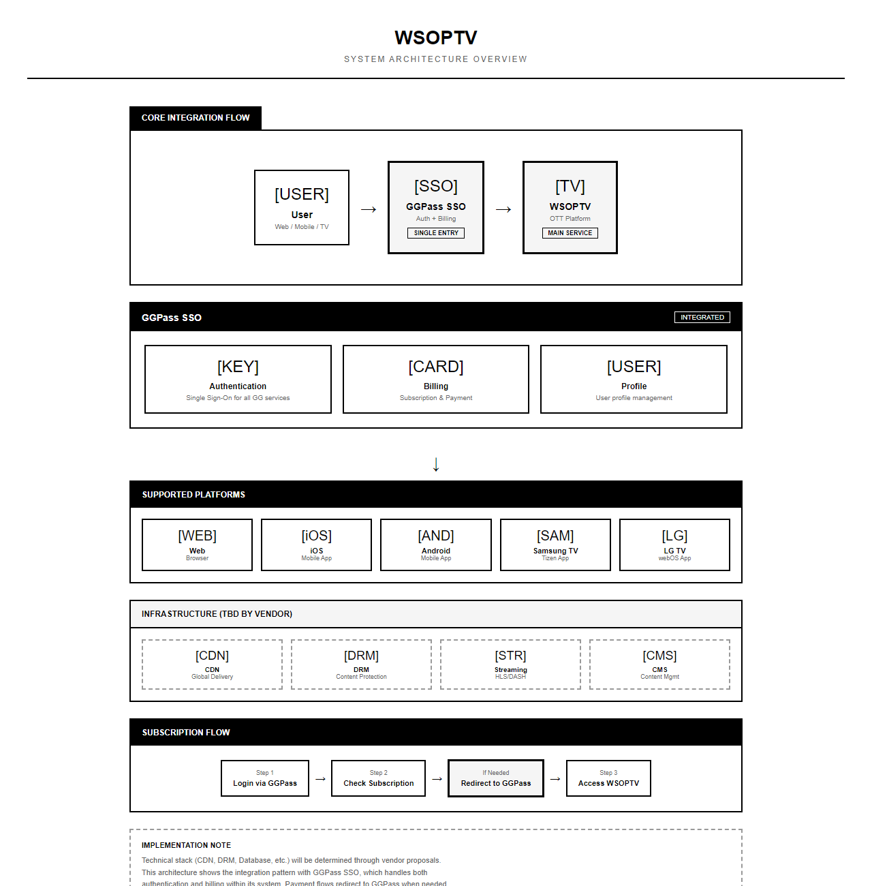
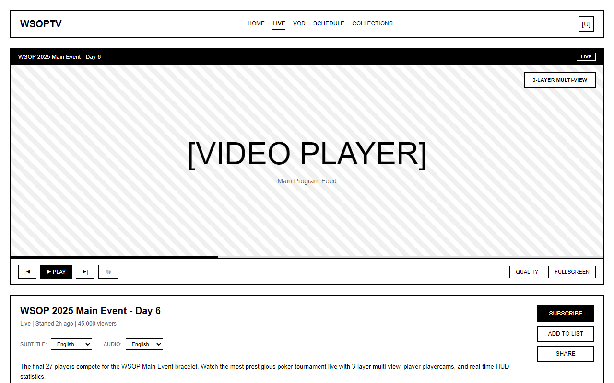
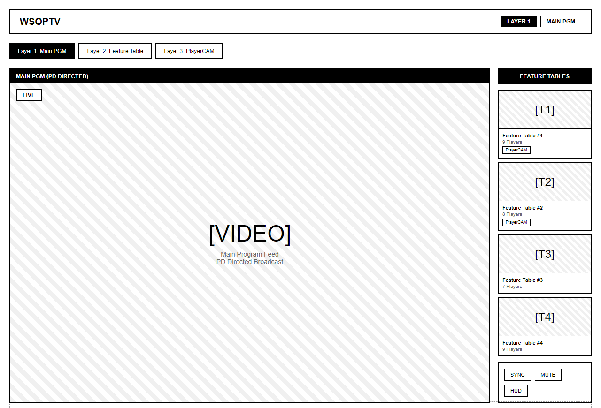
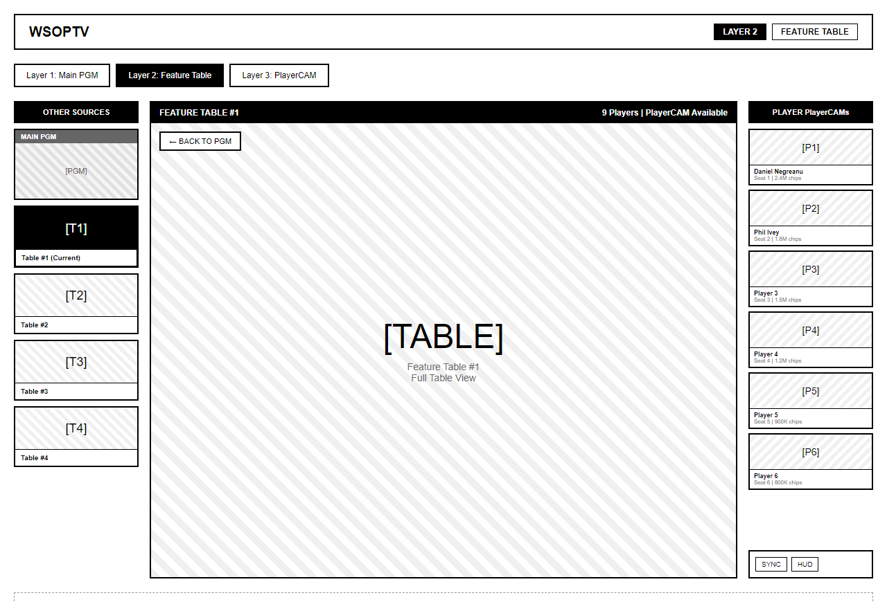
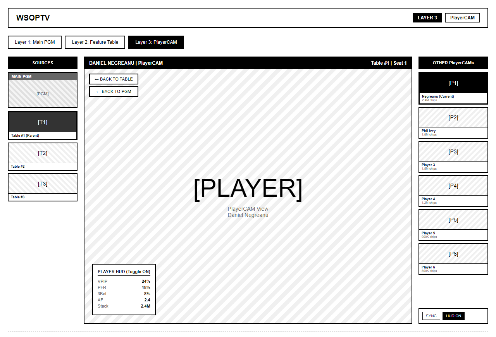
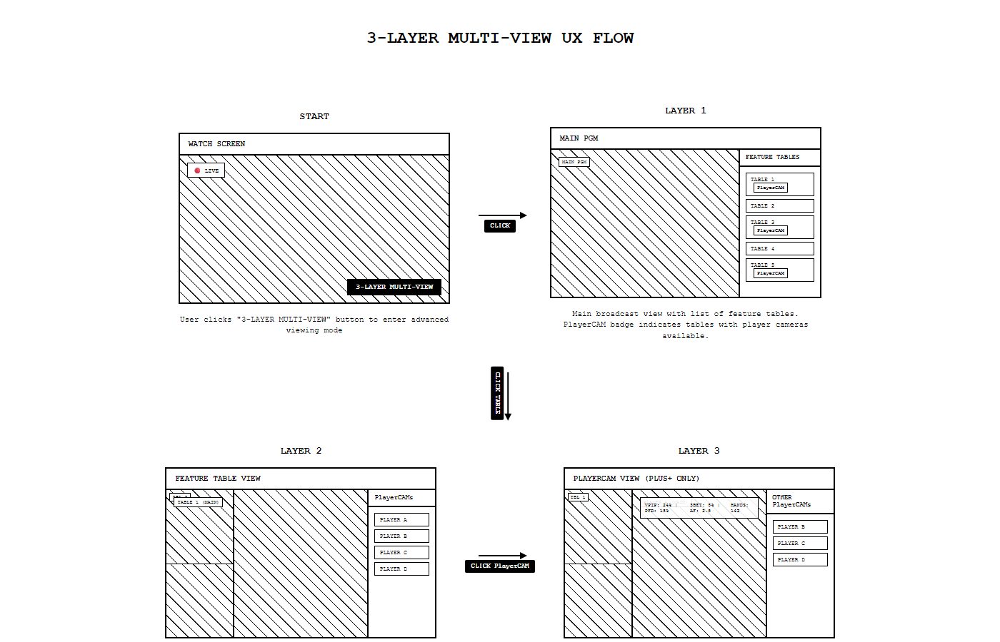
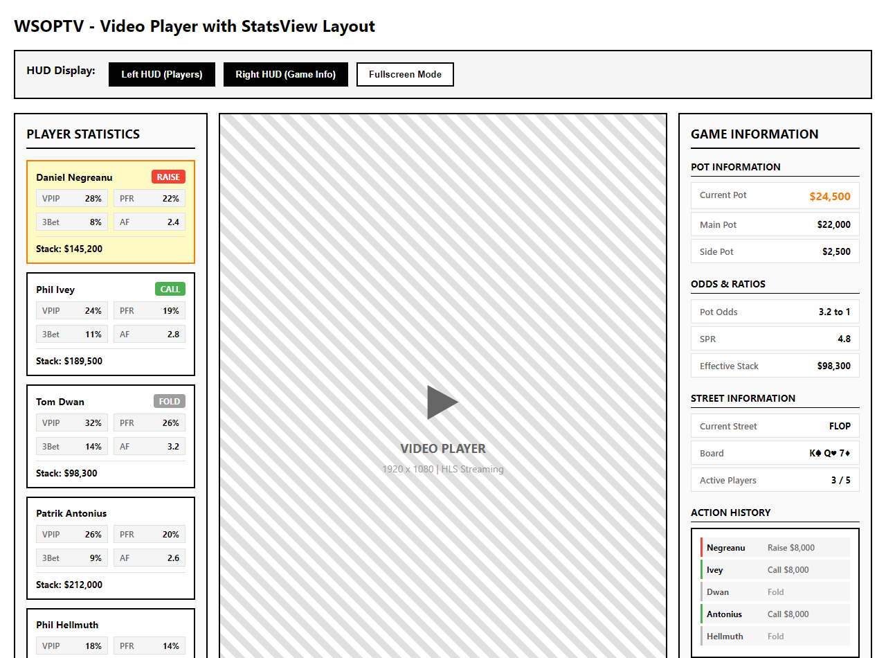
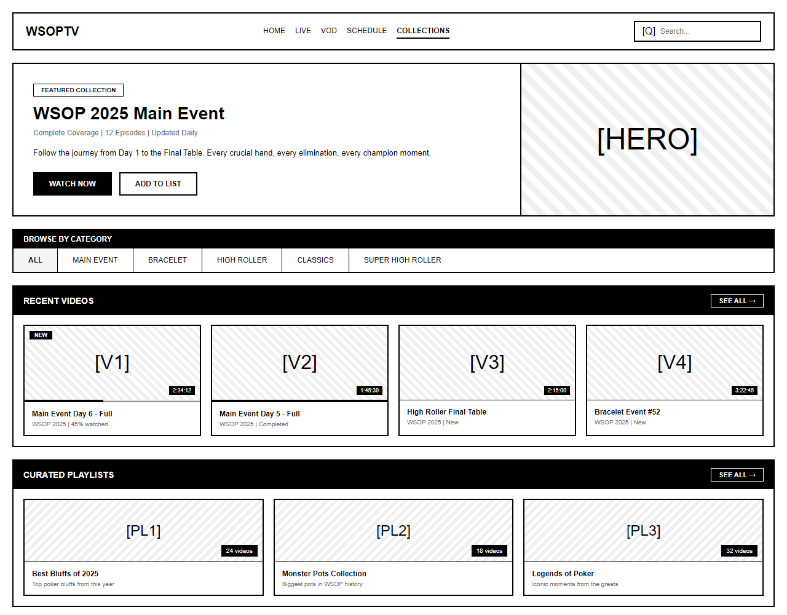

# PRD-0002: WSOPTV OTT Platform MVP

| 항목 | 값 |
|------|---|
| **Version** | 3.0 |
| **Status** | Draft |
| **Priority** | P0 |
| **Created** | 2026-01-07 |
| **Updated** | 2026-01-19 |
| **Author** | Claude Code |
| **Source** | [STRAT-0001](../strategies/STRAT-0001-viewer-experience-vision.md), michael_note.md, tony_note.md |

---

## Executive Summary

WSOP 공식 OTT 스트리밍 플랫폼. **YouTube 대비 4가지 핵심 차별점**을 제공하는 프리미엄 포커 방송 서비스.

### YouTube 대비 핵심 차별점

| # | 차별점 | YouTube | WSOPTV |
|:-:|--------|---------|--------|
| 1 | **Timeshift** | 뒤로 가기 불가 | 라이브 중 되감기 지원 |
| 2 | **아카이브** | 종료 시 비공개 | 영구 보존 + VOD 전환 |
| 3 | **Advanced Mode** | 없음 | Multi-view + StatsView |
| 4 | **검색** (Phase 2) | 없음 | 핸드/선수 기반 정밀 검색 |

> **전략 기준**: [STRAT-0001 시청자 경험 비전](../strategies/STRAT-0001-viewer-experience-vision.md)

### 서비스 개요

- **플랫폼**: Web, iOS, Android, Samsung TV, LG TV
- **구독 모델**: $10 WSOP Plus / $50 WSOP Plus+ (2티어)
- **화질**: 1080p Full HD
- **자막**: 20개국 다국어 지원

---

## Problem Statement

### 현재 상황
- WSOP 인수로 기존 PokerGo에서 운영하던 WSOP OTT 서비스 이관
- Michael의 비전(Insight)을 반영한 신규 WSOPTV OTT 서비스 런칭 필요
- GG POKER 생태계와 통합된 프리미엄 포커 방송 플랫폼 구축

### 해결 방안
- 통합 OTT 플랫폼 구축
- GGPass SSO 연동으로 기존 사용자 활용 (인증 + 빌링 통합)
- YouTube 대비 차별화된 프리미엄 기능 제공

### 프로모션 전략 (양방향 상호 보완)

**Flow 1: GG POKER → WSOPTV**
- GG POKER $10 칩 구매 → WSOPTV Plus 구독권 자동 발급

**Flow 2: WSOPTV → GG POKER**
- WSOPTV Plus $10 구독 → GG POKER $10 칩 제공
- WSOPTV Plus+ $50 구독 → GG POKER $50 칩 제공
- GGPass SSO 통합으로 GG POKER 접속 시 칩이 이미 생성되어 있음

> **참고 모델**: 쿠팡플레이 (로켓와우 ↔ 쿠팡플레이)


---

## Target Users

| 사용자 유형 | 설명 | 주요 니즈 |
|------------|------|----------|
| **포커 팬** | WSOP 시청자 | 라이브 경기, 하이라이트 |
| **GGPoker 회원** | 기존 플랫폼 사용자 | 심리스한 로그인, 연계 서비스 |
| **글로벌 시청자** | 비영어권 사용자 | 다국어 자막, 현지화 |

---

## Requirements

### Functional Requirements

#### FR-1: 라이브 스트리밍
| 요구사항 |
|---------|
| 1080p Full HD 라이브 방송 |
| HLS 프로토콜 기반 스트리밍 |

> **참고**: 지연 처리는 프로덕션 방송에서 담당. TV 솔루션은 받는대로 즉시 송출.

#### FR-2: VOD & Quick VOD
| 요구사항 |
|---------|
| 라이브→VOD 즉시 전환 (Quick VOD) |
| 시청 이력 및 이어보기 |
| 챕터/구간 탐색 |
| 다운로드 오프라인 시청 |

#### FR-3: Timeshift (YouTube 대비 차별화)

| 플랫폼 | DVR (Timeshift) | 라이브 종료 후 | 차별화 |
|--------|:---------------:|:-------------:|--------|
| **YouTube** | 비활성화 | 비공개 전환 | 맛보기 역할 |
| **WSOP TV** | **활성화** | **VOD로 보존** | 본 서비스 |

| 요구사항 |
|---------|
| 라이브 중 되감기 (Timeshift) |
| 라이브 종료 즉시 VOD 자동 전환 (Quick VOD) |
| Catchup TV (처음부터 재시청) |

#### FR-4: Advanced Mode (Plus+ 전용) - NBA TV 1:1 매핑

> **상세 스펙**: [PRD-0006 Advanced Mode](PRD-0006-advanced-mode.md)
>
> **UX 참조**: [NBA TV 분석 리포트](../reports/REPORT-2026-01-19-nbatv-reference-analysis.md)

##### FR-4.1: Tournament Strip (NBA Score Strip 매핑)

상단 고정 가로 스크롤 바 - 현재 진행 중인 대회/테이블 실시간 표시

```
┌─────────────────────────────────────────────────────────────────────────┐
│ 🔴 Main Event  │ 🔴 High Roller │ ▶ $1K Daily │ ▶ Super Circuit #12    │
│ POT: $2.4M     │ POT: $890K     │ POT: $420K  │ Final Table            │
│ Blinds: 50K/100K│ Blinds: 25K/50K│ Blinds: 5K/10K │ POT: $1.1M         │
└─────────────────────────────────────────────────────────────────────────┘
```

| 요구사항 | 우선순위 |
|---------|:--------:|
| 상단 Tournament Strip (진행 중 대회/테이블 가로 스크롤) | P0 |
| 실시간 팟 크기/블라인드 표시 | P0 |
| LIVE 인디케이터 (라이브/VOD 구분) | P1 |
| Quick Add to Multiview (클릭으로 슬롯 추가) | P1 |

##### FR-4.2: 4분할 Multiview (NBA Multiview 매핑)

```
┌─────────────────────────────────────────────────────────────┐
│  ┌───────────────────────┐  ┌───────────────────────────┐   │
│  │  WSOP Main Event      │  │  $100K High Roller        │   │
│  │  Final Table          │  │  Day 2                    │   │
│  │  POT: $2.4M           │  │  POT: $890K               │   │
│  │  🔊 AUDIO             │  │                           │   │
│  └───────────────────────┘  └───────────────────────────┘   │
│  ┌───────────────────────┐  ┌───────────────────────────┐   │
│  │  Add Table from       │  │  Super Circuit #12        │   │
│  │  Tournament Strip     │  │  Heads Up                 │   │
│  │                       │  │  POT: $420K               │   │
│  └───────────────────────┘  └───────────────────────────┘   │
├─────────────────────────────────────────────────────────────┤
│  [Tables] [MultiView] [Key Hands]     [1] [2] [4] Layout    │
└─────────────────────────────────────────────────────────────┘
```

| 요구사항 | 우선순위 |
|---------|:--------:|
| 4분할 그리드 레이아웃 (최대 4개 동시 시청) | P0 |
| 빈 슬롯 가이드 ("Add Table from Tournament Strip") | P0 |
| 1/2/4 분할 전환 버튼 | P0 |
| 오디오 선택 (4개 중 1개만 활성화) | P1 |
| POT/Blinds Overlay | P1 |

##### FR-4.3: Player Controls (NBA Controls 매핑)

```
┌─────────────────────────────────────────────────────────────────────────┐
│                        [비디오 플레이어 영역]                             │
│                                                              🔴 LIVE    │
├─────────────────────────────────────────────────────────────────────────┤
│  ▶/⏸  [────────●───────────────────────────────]  🔊  ⬜  ⛶            │
├─────────────────────────────────────────────────────────────────────────┤
│  [🎥 Tables (5)] [📺 MultiView] [⭐ Key Hands]        [1] [2] [4]       │
└─────────────────────────────────────────────────────────────────────────┘
```

| 요구사항 | 우선순위 |
|---------|:--------:|
| Tables 버튼 (사용 가능한 테이블/뷰 선택) | P0 |
| MultiView 버튼 (멀티뷰 모드 진입) | P0 |
| Key Hands 버튼 (주요 핸드 목록 모달) | P0 |
| LIVE 인디케이터 (우측 상단) | P1 |

##### FR-4.4: Key Hands (NBA Key Plays 매핑)

```
┌─────────────────────────────────────────┐
│              KEY HANDS                   │
├─────────────────────────────────────────┤
│  [썸네일] Phil Ivey 4-bet bluff         │
│           Hand #47 • Blinds 50K/100K    │
│           ▶ Jump to this hand           │
├─────────────────────────────────────────┤
│  [썸네일] AA cracked by runner-runner   │
│           Hand #52 • POT $1.2M          │
│           ▶ Jump to this hand           │
└─────────────────────────────────────────┘
```

| 요구사항 | 우선순위 |
|---------|:--------:|
| Key Hands 모달 목록 (썸네일 + 핸드 설명 + 타임스탬프) | P0 |
| 클릭 시 해당 핸드 시점으로 점프 | P0 |
| 오버레이 네비게이션 ("1 of N Key Hands" + 화살표) | P1 |
| AI 자동 추출 (주요 핸드 자동 태깅) | P2 |

##### FR-4.5: Hand-by-Hand Log (NBA Play-by-Play 매핑)

```
┌─────────────────────────────────────────────────────────────┐
│  [Hand #47] [All]  |  Filter: [All Players ▼]               │
│  ☑ Auto Next Hand   ☐ Latest First                          │
├─────────────────────────────────────────────────────────────┤
│  [👤 Ivey]   UTG    RAISE $50,000        │ POT: $75,000     │
│  [👤 Negreanu]  BTN    3-BET $150,000    │ POT: $225,000    │
│  ─────────── FLOP: A♥ K♠ 7♦ ───────────                     │
│  [👤 Ivey]         RAISE $600,000        │ POT: $1,125,000  │
│  [👤 Negreanu]     FOLD                  │                   │
│  ─────────── RESULT: Ivey wins $950,000 ───────────         │
└─────────────────────────────────────────────────────────────┘
```

| 요구사항 | 우선순위 |
|---------|:--------:|
| 실시간 액션 로그 (프리플롭/플롭/턴/리버) | P1 |
| 선수 필터 (특정 선수 액션만 표시) | P1 |
| Auto Next Hand 토글 | P2 |
| 타임스탬프 링크 (클릭 시 해당 시점 이동) | P2 |

##### FR-4.6: StatsView (2가지 구조)

**구조 1: GGPoker HUD 연동** (MVP)
- 데이터 소스: GGPoker HUD DB
- 통계: VPIP, PFR, 3-Bet%, AF, Flop CB%, 칩 카운트
- 우선순위: P0 (MVP)

**구조 2: 대회 실시간 연동** (Phase 2)
- 데이터 소스: 대회 실시간 데이터
- 정보: 현재 액션, 베팅 금액, Pot Odds, 예상 액션
- 우선순위: P1 (Phase 2)

| 요구사항 | 우선순위 |
|---------|:--------:|
| GGPoker HUD 연동 StatsView | P0 |
| HUD ON/OFF 토글 | P0 |
| 대회 실시간 연동 StatsView | P1 |

> **제약사항**: TV 앱에서는 Advanced Mode 미지원 (리모컨 UX 제약)

#### FR-5: 자막
| 요구사항 |
|---------|
| 20개국 언어 자막 지원 |
| 영어 기반 번역 |
| VOD 자막 우선 지원 |
| 라이브 자막 (인력 투입) |

#### FR-6: 인증 & 결제
| 요구사항 |
|---------|
| GGPass SSO 연동 (인증 + 빌링 통합) |
| 구독 플랜 관리 (Plus/Plus+) |
| 결제 필요 시 GGPass로 리다이렉트 |

#### FR-7: 구독 모델

| 티어 | 가격 | 명칭 | 주요 기능 |
|------|------|------|----------|
| Basic | $10/월 | **WSOP Plus** | 라이브, VOD, Timeshift, 자막 |
| Premium | $50/월 | **WSOP Plus+** | Plus 기능 + Advanced Mode (Multi-view, StatsView) |

> **참고**: Exclusive Content (behind-the-scenes)는 별도 제작하지 않음 → Advanced Mode가 Plus+의 유일한 차별화 포인트

### Non-Functional Requirements

#### NFR-1: 성능
| 요구사항 | 목표치 |
|---------|-------|
| 동시접속 | 50만 사용자 |
| 초기 버퍼링 | < 3초 |
| 재버퍼링 비율 | < 1% |

#### NFR-2: 보안
| 요구사항 | 목표치 |
|---------|-------|
| DRM | Widevine, FairPlay, PlayReady |
| VPN 감지 | 80-90% 정확도 |
| 국가별 블랙아웃 | 지원 |

#### NFR-3: 가용성
| 요구사항 | 목표치 |
|---------|-------|
| 서비스 가용성 | 99.9% |

---

## Technical Architecture

### 플랫폼 구성



### 시스템 연동

> **시스템 아키텍처**는 위 다이어그램 참조

**GGPass SSO 통합**:
- 로그인: GGPass SSO 처리
- Billing: GGPass 내부에서 처리
- 결제 필요 시: GGPass 페이지로 이동하여 처리

> **참고**: 기술 스택 (CDN, DRM, Database 등)은 향후 협업사 제안에 따라 결정

---

## UI/UX Design

### Watch Screen

> **UX 참조**: NBA TV Player Controls 스타일 적용 - [PRD-0006 플레이어 컨트롤](PRD-0006-advanced-mode.md#3-플레이어-컨트롤-ui-nba-player-controls-스타일)



**주요 기능**:
- 대형 플레이어 (히어로 영역)
- 라이브 뱃지 표시
- 3계층 멀티뷰 전환 버튼
- 20개국 자막 선택
- Quick VOD 하이라이트 섹션

### Multi-View (3계층 동적 레이아웃)

#### Layer 1: Main PGM



**레이아웃**: 메인에 PGM, 우측에 피처 테이블 목록만

#### Layer 2: Feature Table



**레이아웃**: 좌측에 PGM+다른 테이블, 메인에 선택한 테이블, 우측에 PlayerCAM 목록

#### Layer 3: PlayerCAM



**레이아웃**: 좌측에 PGM+피처 테이블, 메인에 선택한 PlayerCAM, 우측에 다른 PlayerCAM

**주요 기능**:
- 3계층 동적 레이아웃 (PGM → 피처 테이블 → PlayerCAM)
- 클릭으로 메인 화면 전환
- 피처 테이블별 PlayerCAM 지원 여부 표시 (PlayerCAM 뱃지)
- 동기화 상태 표시
- Layer 전환 버튼

### Multi-View UX Flow



### StatsView Video Player Layout



**레이아웃 구조**:
- 좌측: 플레이어 통계 HUD (VPIP/PFR/3Bet/AF/Stack)
- 중앙: 비디오 플레이어
- 우측: 게임 정보 HUD (Pot/Odds/SPR/Action History)
- HUD 토글 ON/OFF 지원

### Collections Screen



**주요 기능**:
- 히어로 배너 (Featured Collection)
- 필터 탭 (Main Event, Bracelet, High Roller, Classics)
- 시청 진행률 표시
- 큐레이티드 플레이리스트
- 검색 기능 (Elasticsearch 기반 - [STRAT-0007](../strategies/STRAT-0007-content-sourcing.md) 참조)

**검색 기능 상세**:
- 대회명, 년도, 플레이어명, 게임 타입 등 메타데이터 기반 전문 검색
- 필터링: 년도, 시리즈, 게임 타입별 필터 지원
- 50년+ 아카이브 콘텐츠(1973년~현재) 검색 가능

---

## Scope

### In Scope (MVP)
| 항목 | 설명 |
|------|------|
| 플랫폼 | Web, iOS, Android, Samsung TV, LG TV |
| 화질 | 1080p Full HD |
| 멀티뷰 | 3계층 동적 레이아웃 (Web/Mobile만) |
| 자막 | 20개국 |
| 메뉴 | Watch + Collections 2개만 |

### Out of Scope
| 항목 | 사유 |
|------|------|
| 4K 지원 | 장비/인프라 비용 과다 |
| VLM (비디오 AI 분석) | 고비용, 별도 업체 필요 |
| 뉴스 섹션 | 불필요 |
| 전적/플레이어 정보 | WSOP.com 링크 연결 |
| 티켓팅 | 온라인 구독만 |
| Roku/Fire TV | Phase 2 |

---

## Cost Factors

### 비용 절감 포인트
| 항목 | 내용 | 영향도 |
|------|------|:------:|
| GGPass SSO | 로그인/가입 개발 불필요 | 높음 |
| 빌링 시스템 | GGPass 내부 처리 | 높음 |
| 스케줄 API | 내부 DB 연동 | 중간 |
| 사이트 범위 | 2개 메뉴만 | 높음 |

### 비용 증가 요소
| 항목 | 내용 | 영향도 |
|------|------|:------:|
| TV 앱 | 플랫폼별 개발 | 중간 |

---

## Timeline (Phase) - 시청자 관점 우선순위

> **기준**: [STRAT-0001 시청자 경험 비전](../strategies/STRAT-0001-viewer-experience-vision.md)

### Phase 1: 핵심 차별점 확립 (MVP)

YouTube 대비 핵심 차별점 우선 구현:

| 기능 | 차별점 # | 설명 |
|------|:--------:|------|
| Web + Mobile 앱 | - | 5개 플랫폼 중 3개 |
| **Timeshift** | 1 | 라이브 중 되감기 |
| **아카이브** | 2 | 종료 후 VOD 보존 |
| **Multi-view 4분할** | 3 | NBA 스타일 |
| **StatsView (HUD)** | 3 | GGPoker HUD 연동 |
| GGPass SSO 연동 | - | 인증 + 빌링 통합 |

### Phase 2: 검색 & 탐색 강화

Tony 기획 (Moses Commentary) 기능 구현:

| 기능 | 출처 | 설명 |
|------|------|------|
| Key Hands 점프 | Michael | 주요 핸드 탐색 |
| Hand-by-Hand Log | NBA 매핑 | 액션 로그 |
| **핸드 태깅 시스템** | Tony | 핸드 단위 메타데이터 |
| **선수/핸드 검색** | Tony | 차별점 #4 |
| TV 앱 (Samsung, LG) | - | 5개 플랫폼 완성 |
| StatsView 구조 2 | Michael | 대회 실시간 연동 |

> **상세 스펙**: [PRD-0009 Hand Tagging & Search](PRD-0009-hand-tagging-search.md)

### Phase 3: 프리미엄 확장

| 기능 | 설명 |
|------|------|
| 3계층 Multi-view | PGM → 테이블 → PlayerCAM |
| Position Analysis | 포지션별 성적 시각화 |
| AI Key Hands 자동 추출 | VLM 기반 |
| 4K 화질 | 프리미엄 품질 |
| Roku/Fire TV | 추가 플랫폼 |

---

## Open Questions

1. TV 미러링/캐스팅 지원 여부
2. 블랙아웃 정책 (사이트 단위 vs 영상 단위)

---

## References

### 기능 문서
- [PRD-0006 Advanced Mode](PRD-0006-advanced-mode.md) - Advanced Mode 상세 스펙 (NBA TV 1:1 매핑)
- [PRD-0009 Hand Tagging & Search](PRD-0009-hand-tagging-search.md) - 핸드 태깅 및 검색 (Phase 2)

### 아키텍처 문서
- [ADR-0001 Multi-view Rationale](../adrs/ADR-0001-multiview-3layer-rationale.md) - 3계층 Multi-view 설계 근거
- [ADR-0002 Database Schema](../adrs/ADR-0002-database-schema-design.md) - DB 스키마 설계

### 전략 문서
- [STRAT-0001 Viewer Experience Vision](../strategies/STRAT-0001-viewer-experience-vision.md) - 시청자 경험 비전 (핵심)
- [STRAT-0003 Cross-Promotion Strategy](../strategies/STRAT-0003-cross-promotion.md) - 양방향 프로모션
- [STRAT-0007 Content Sourcing](../strategies/STRAT-0007-content-sourcing.md) - 콘텐츠 소싱

### 리포트
- [REPORT-2026-01-19 NBA TV 분석](../reports/REPORT-2026-01-19-nbatv-reference-analysis.md) - NBA TV/League Pass UX 참조

---

## Revision History

| 버전 | 날짜 | 작성자 | 내용 |
|------|------|--------|------|
| 1.0 | 2026-01-07 | Claude Code | 최초 작성 |
| 2.0 | 2026-01-16 | Claude Code | Problem Statement 수정, FR-4 3계층 구조로 재설계, StatsView 2구조 추가, GGPass SSO+Billing 통합 |
| 2.1 | 2026-01-16 | Claude Code | FANCAM→PlayerCAM 용어 변경, 프로모션 양방향 흐름 추가 |
| 2.2 | 2026-01-19 | Claude Code | NBA TV 분석 리포트 참조 추가 |
| 3.0 | 2026-01-19 | Claude Code | STRAT-0001 참조, YouTube 대비 4가지 차별점 명확화, Phase 시청자 관점 재정렬 |
| **3.1** | **2026-01-19** | **Claude Code** | **FR-4 NBA TV 1:1 매핑 전면 반영: Tournament Strip, 4분할 Multiview, Player Controls, Key Hands, Hand-by-Hand Log 추가** |
| **2.2** | **2026-01-19** | **Claude Code** | **NBA TV 분석 리포트 참조 추가 (FR-4, Watch Screen, References 섹션)** |
