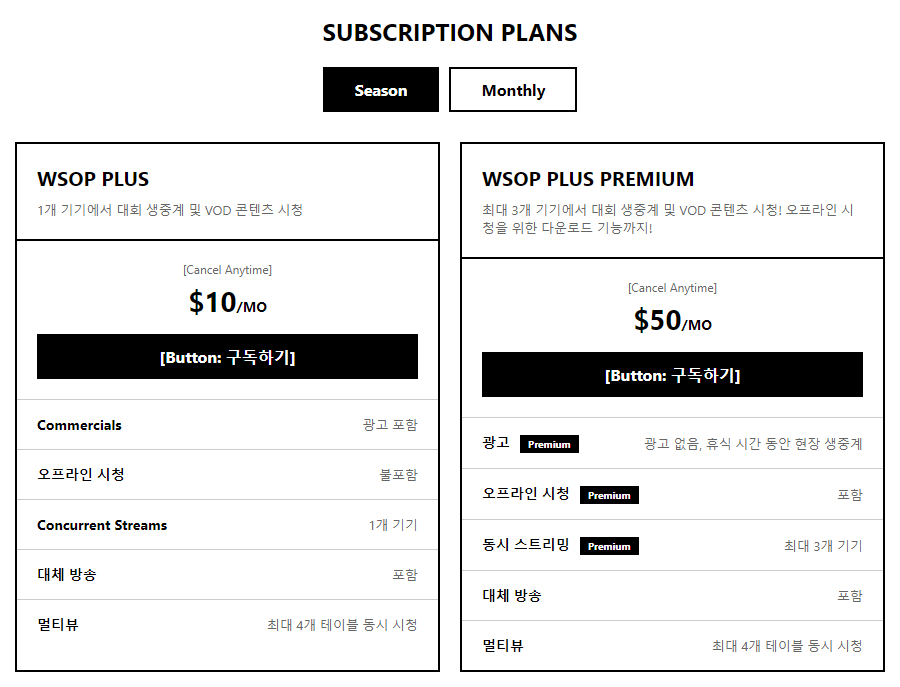
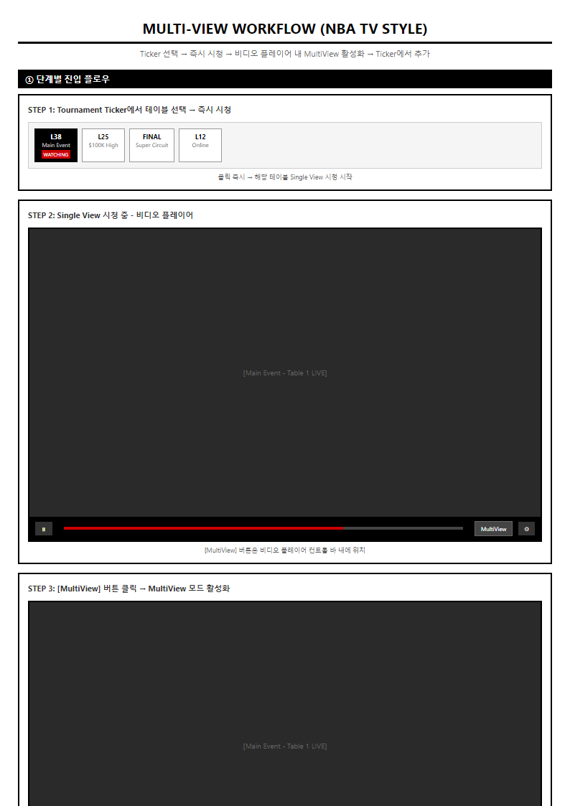
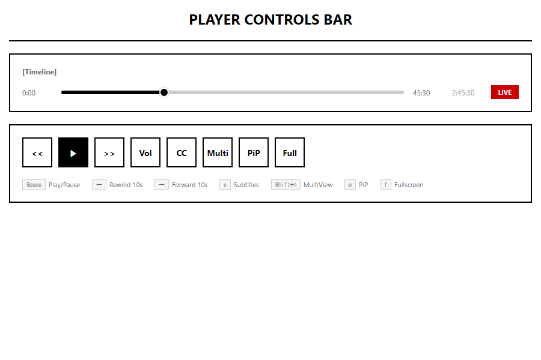

# PRD-0002: WSOPTV OTT Platform MVP

| 항목 | 값 |
|------|---|
| **Version** | 5.7 |
| **Status** | Draft |
| **Priority** | P0 |
| **Created** | 2026-01-07 |
| **Updated** | 2026-01-23 |
| **Author** | Claude Code |
| **Launch Target** | Q3 2026 |

---

## 0. 3대 원천 기반 설계 원칙

### 0.1 3대 원천 (Three Pillars)


[HTML 원본](../mockups/PRD-0002/01-three-pillars.html)

| 원천 | 명칭 | 출처 | 역할 | 우선순위 |
|:----:|------|------|------|:--------:|
| 📜 | **VIBLE** | michael_note.md | 운영 계획의 근간, 비즈니스 요구사항 | 1 (최고) |
| 📋 | **MOSES** | tony_note.md | 첨언 및 확장, 태깅/검색 기능 | 2 |
| 📖 | **KORAN** | NBA TV League Pass | UI/UX 참조, 1:1 복제 대상 | 3 |

### 0.2 충돌 해결 원칙

> **VIBLE이 말씀하시면, MOSES가 해석하고, KORAN이 구현한다.**

| 상황 | 해결 방법 |
|------|----------|
| VIBLE ↔ MOSES 충돌 | VIBLE 우선 |
| VIBLE ↔ KORAN 충돌 | VIBLE 우선 |
| MOSES ↔ KORAN 충돌 | MOSES 우선 |
| 모두 언급 없음 | KORAN 기본 패턴 적용 |

### 0.3 기능 분류

| 분류 | 원천 | 정의 | 예시 |
|------|:----:|------|------|
| **Core-Vible** | 📜 | VIBLE에서 명시한 필수 기능 | Advanced Mode, GGPass, 구독 모델 |
| **Core-Moses** | 📋 | MOSES에서 제안한 확장 기능 | 핸드 태깅, 검색, 멀티 재생 |
| **Core-Koran** | 📖 | KORAN 1:1 대응 기능 | Ticker, MultiView, Info Tabs |

> **중요**: 3대 원천에 명시되지 않은 기능은 구현 범위에서 **제외**됩니다.

---

## 1. Executive Summary

### 1.1 프로젝트 개요

WSOP 공식 OTT 스트리밍 플랫폼. 프리미엄 포커 방송 서비스.

| 항목 | 내용 |
|------|------|
| **런칭 목표** | Q3 2026 (2027년 3월 1일 전) |
| **플랫폼** | Web, iOS, Android, Samsung TV, LG TV |
| **구독 모델** | $10 WSOP Plus / $50 WSOP Plus+ |
| **화질** | 1080p Full HD |
| **자막** | 20개국 다국어 지원 |

### 1.2 YouTube 대비 핵심 차별점

| # | 차별점 | YouTube | WSOPTV |
|:-:|--------|---------|--------|
| 1 | **Timeshift** | 뒤로 가기 불가 | 라이브 중 되감기 지원 |
| 2 | **아카이브** | 종료 시 비공개 | 영구 보존 + VOD 전환 |
| 3 | **Advanced Mode** | 없음 | Multi-view + StatsView |
| 4 | **검색** | 없음 | 핸드/선수 기반 정밀 검색 |

---

## 2. 콘텐츠 소싱 전략

> **상세 문서**: [STRAT-0008 콘텐츠 소싱 전략](../strategies/STRAT-0008-content-sourcing-architecture.md)

### 2.1 WSOP 콘텐츠 Tier 구조

| Tier | 대회 | 설명 |
|:----:|------|------|
| **1** | WSOP Vegas | 메인 시리즈 (라스베가스) |
| **2** | WSOPE / WSOP Paradise | 유럽 시리즈 / 바하마 시리즈 |
| **3** | Super Circuit | 온라인 시리즈 |

> **범위**: WSOP 공식 대회만 포함. Poker After Dark, Game of Gold 등 예외 콘텐츠 제외.

### 2.2 소스별 프로덕션 파트너


[HTML 원본](../mockups/PRD-0002/02-content-sourcing.html)

| 프로덕션 파트너 | 담당 대회 | 이벤트 범위 |
|----------------|----------|------------|
| **ESPN** | WSOP Vegas | Main Event만 |
| **PokerGO** | WSOP Vegas | Main Event 외 전체 |
| **Triton Poker** | WSOP Paradise | 전체 |
| **PokerCaster** | WSOPE | 유럽 지역 전체 |

### 2.3 콘텐츠 플로우

```
[프로덕션 파트너]          [중앙 처리]           [배포]
     │                        │                   │
     ├─ ESPN ────────────────►│                   │
     ├─ PokerGO ─────────────►│                   │
     ├─ Triton Poker ────────►├─► GG Production ─►├─► WSOP TV
     ├─ PokerCaster ─────────►│   (종편 작업)     ├─► YouTube
     │                        │                   │
```

**GG Production 역할**: 모든 프로덕션 파트너 소스를 받아 종편(Post-Production) 작업 수행

### 2.4 YouTube vs WSOPTV 설정 비교

| 설정 | YouTube | WSOPTV |
|------|---------|--------|
| DVR (Timeshift) | ❌ 비활성화 | ✅ 활성화 |
| 종료 후 | 비공개 전환 | 영구 보존 |
| 역할 | 맛보기/유입 채널 | 본 서비스 |

---

## 3. 구독 모델

> **레퍼런스**: NBA League Pass 구독 모델 1:1 대응

### 3.1 구독 플랜 와이어프레임



[HTML 원본](../mockups/PRD-0002/03-subscription-plans.html)

> **레퍼런스 이미지**: [NBA League Pass 구독 페이지](../images/leaguepass/)

### 3.2 NBA League Pass vs WSOP Plus 매핑

| 항목 | NBA League Pass | NBA League Pass Premium | WSOP Plus | WSOP Plus+ |
|------|-----------------|------------------------|-----------|------------|
| **가격 (월간)** | $14.99/월 | $22.99/월 | **$10/월** | **$50/월** |
| **설명** | 1개 기기에서 경기 생중계 및 VOD | 최대 3개 기기, 오프라인 시청, 다운로드 | 1개 기기에서 대회 생중계 및 VOD | 최대 3개 기기, 오프라인 시청, 다운로드 |
| **광고** | 광고 포함 | 광고 없음 (휴식 시간 현장 생중계) | 광고 포함 | 광고 없음 |
| **오프라인 시청** | 불포함 | 포함 | 불포함 | 포함 |
| **동시 스트리밍** | 1개 기기 | 최대 3개 기기 | 1개 기기 | 최대 3개 기기 |
| **대체 방송** | 포함 | 포함 | 포함 | 포함 |
| **멀티뷰** | 최대 4개 경기 | 최대 4개 경기 | 최대 4개 테이블 | 최대 4개 테이블 |

### 3.3 2티어 구독 상세

| 티어 | 가격 | 명칭 | 주요 기능 |
|------|------|------|----------|
| Basic | **$10/월** | **WSOP Plus** | 1개 기기, 라이브, VOD, Timeshift, 광고 포함, 멀티뷰 4개 |
| Premium | **$50/월** | **WSOP Plus+** | 최대 3개 기기, 광고 없음, 오프라인 시청, 다운로드, 멀티뷰 4개 |

### 3.4 학생 할인

> **레퍼런스**: NBA League Pass UNiDAYS 학생 40% 할인

| 대상 | 할인율 | WSOP Plus | WSOP Plus+ |
|------|--------|-----------|------------|
| 일반 | 0% | $10/월 | $50/월 |
| 학생 (UNiDAYS) | 40% | $6/월 | $30/월 |

### 3.5 프로모션 전략

| Flow | 설명 |
|------|------|
| GG POKER → WSOPTV | $10 칩 구매 → WSOPTV Plus 구독권 자동 발급 |
| WSOPTV → GG POKER | Plus $10 구독 → GG POKER $10 칩 제공 |

---

## 4. Advanced Mode

Advanced Mode는 세 가지 **완전히 독립적인** 기능으로 구성됩니다.

### 4.1 Multi-view (여러 Feature Table 동시 시청)

> **설계 원칙**: NBA TV MultiView 1:1 대응
>
> **정의**: 하나의 이벤트 내 여러 Feature Table을 동시에 시청하는 방식. 간혹 다른 이벤트 테이블도 포함 가능.



[HTML 원본](../mockups/PRD-0002/04-multiview.html)

| 기능 | 설명 | NBA TV 대응 |
|------|------|-------------|
| Feature Table 동시 시청 | 같은 이벤트의 여러 Feature Table | MultiView |
| 레이아웃 옵션 | 1x1, 1:2, 2x2 | 동일 |
| 테이블 추가 | Tournament Ticker에서 추가 | 동일 |
| 오디오 선택 | 한 테이블의 오디오만 활성화 | 동일 |
| 다른 이벤트 추가 | 간혹 다른 이벤트 테이블 추가 가능 | 동일 (다른 경기 추가) |

**프로덕션 특성**:
- 하나의 이벤트(예: Main Event)에서 여러 Feature Table이 동시 진행
- 시청자가 관심 테이블을 선택하여 동시 모니터링
- 각 테이블은 독립적인 스트림으로 제공

### 4.2 Player Cam Mode (아이돌 직캠 방식)

> **설계 원칙**: VIBLE 원문 - "메인화면이 중앙에 있고, 각 유저들의 얼굴을 잡고 있는 화면이 옆에 또 있는 방식 (아이돌 직캠 카메라)"
>
> **정의**: 특정 Feature Table의 개별 플레이어 카메라를 제공하는 방식. **모든 테이블에서 제공되지 않음**.

| 기능 | 설명 |
|------|------|
| 메인 화면 | Feature Table 메인 방송 (중앙 대형) |
| Player Cam | 각 플레이어 얼굴을 잡는 개별 카메라 (주변 소형) |
| 선택적 전환 | 특정 플레이어 캠을 메인으로 전환 가능 |

**소스 구성**:
```
Player Cam 소스 = 플레이어 카메라 영상 + GFX 오버레이
                  │                      │
                  ▼                      ▼
              얼굴 클로즈업         플레이어명, 칩 카운트,
                                   홀카드 표시 등
```

**가용성 제한**:

| 항목 | 설명 |
|------|------|
| **제공 테이블** | Player Cam 가능 테이블만 (별도 지정) |
| **미제공 테이블** | 일반 Feature Table (메인 방송만) |
| **결정 요소** | 프로덕션 장비 구성, 테이블 중요도 |

**Multi-view vs Player Cam 완전 분리**:

| 구분 | Multi-view | Player Cam |
|------|-----------|------------|
| **대상** | 여러 Feature Table | 한 테이블의 여러 플레이어 |
| **소스** | 테이블별 메인 방송 | 플레이어 캠 + GFX 오버레이 |
| **가용성** | 모든 Feature Table | Player Cam 지원 테이블만 |
| **NBA TV 대응** | ✅ 1:1 대응 | ❌ WSOP TV 고유 |
| **레이아웃** | 2x2 그리드 (동등 크기) | 메인 + 주변 캠 (비대칭) |
| **용도** | 여러 테이블 동시 모니터링 | 특정 플레이어 집중 시청 |

### 4.3 StatsView (통계 표시)

> **설계 원칙**: VIBLE 원문 - "허드같이 그 유저의 수치라든가, 플랍에서 베팅할 확률같은거, 이런게 띄어져있는 영상"

**두 가지 구현 방식 제안**:

#### Option A: NBA TV 방식 (Info Tabs)

> 시청에 방해되지 않도록 **별도 하단 패널**에 표시

| 특징 | 설명 |
|------|------|
| **위치** | 영상 하단 Info Tabs 영역 |
| **표시 방식** | Player Stats 탭 선택 시 표시 |
| **장점** | 시청 방해 없음, NBA TV 1:1 대응 |
| **처리 주체** | OTT (WSOP TV) |

| 탭 | NBA TV | WSOP TV |
|----|--------|---------|
| Summary | Summary | Summary |
| Box Score | Box Score | **Player Stats** |
| Game Charts | Game Charts | Hand Charts |
| Play-By-Play | Play-By-Play | Hand History |

#### Option B: GGM$ 방식 (영상 오버레이)

> 시청에 **직접적인 역할**을 하도록 영상 위에 오버레이

| 특징 | 설명 |
|------|------|
| **위치** | 영상 내 플레이어 옆 |
| **표시 방식** | HUD 스타일 상시 표시 |
| **장점** | 즉각적인 정보 확인 |
| **처리 주체** | **Production** (GG Production) |

**Option B 처리 위치 결정**:

| 처리 위치 | 장점 | 단점 |
|----------|------|------|
| **Production (권장)** | GGM$ 동일 프로세스, 직관적 | 영상에 고정됨 |
| OTT | 동적 on/off 가능 | Production 클론 TF 구성 필요 |

> **권장**: Option B 선택 시 GGM$와 동일하게 **Production 단계에서 처리**

**StatsView 표시 정보**:

| 요소 | 표시 정보 | VIBLE 원문 대응 |
|------|----------|----------------|
| 플레이어 HUD | VPIP, PFR, 3-Bet%, AF | "그 유저의 수치" |
| 베팅 확률 | 플랍 베팅 확률, Pot Odds | "플랍에서 베팅할 확률" |
| 스택 정보 | 칩 카운트, BB 기준 스택 | - |

---

## 5. Featured Hands (핸드 검색)

> **설계 원칙**: NBA TV Key Plays 1:1 대응 - **동일 레이아웃으로 처리**

### 5.1 NBA TV Key Plays 매핑

| NBA TV (Key Plays) | WSOP TV (Featured Hands) |
|--------------------|-------------------------|
| Key Plays 버튼 | Featured Hands 버튼 |
| 주요 플레이 목록 | 주요 핸드 목록 |
| 플레이어, 시간, 설명 | 플레이어, 핸드, 결과 |
| 클릭 → 해당 시점 이동 | 클릭 → 해당 핸드 시점 이동 |

### 5.2 Featured Hands UI (Key Plays 동일 레이아웃)


[HTML 원본](../mockups/PRD-0002/05-hand-search.html)

| 컴포넌트 | NBA TV Key Plays | WSOP TV Featured Hands |
|----------|-----------------|------------------------|
| 목록 항목 | 썸네일 + 설명 | 썸네일 + 핸드 설명 |
| 필터 | 팀, 플레이어, 유형 | **플레이어, 핸드, 결과** |
| 정렬 | 시간순 | 핸드 번호순 |

### 5.3 핸드 단위 태깅 (메타데이터)

| 태그 항목 | 설명 |
|----------|------|
| Hand 기준 | 핸드 번호, 타임스탬프 |
| 참여 플레이어 | 해당 핸드에 참여한 선수 목록 |
| 각 플레이어 Hands | 홀카드 정보 |
| Community Card | 보드 카드 (플롭/턴/리버) |
| 최종 Winner | 핸드 승자 |

### 5.4 검색 기능

**검색 예제**:
- A 선수와 B 선수가 함께 했던 대회/동영상 검색
- 포카드(Four of a Kind)를 쥔 플레이어가 로열 스트레이트 플러시에게 패한 핸드
- 특정 핸드(AA, KK 등)로 이기거나 진 상황

---

## 6. 메인 스트리밍 UI - 7단 레이아웃

> **레퍼런스**: NBA TV League Pass 1:1 대응

### 6.1 레이아웃 와이어프레임


[HTML 원본](../mockups/PRD-0002/06-main-layout.html)

### 6.2 레이아웃 구조

| 레이어 | NBA TV 컴포넌트 | WSOP TV 컴포넌트 |
|:------:|-----------------|------------------|
| ① | Scoreboard Ticker | Tournament Ticker |
| ② | Ad Banner | Ad Banner |
| ③ | Game Header | Tournament Header |
| ④ | Video Player | Video Player + POT/BOARD |
| ⑤ | Stream Tabs | Stream Tabs |
| ⑥ | Timeline | Timeline |
| ⑦ | Controls | Controls |

### 6.3 용어 매핑

| NBA TV | WSOP TV | 비고 |
|--------|---------|------|
| Scoreboard Ticker | Tournament Ticker | 상단 스코어/대회 표시 |
| Q3 3:05 | L38 LIVE | Quarter→Level |
| Clippers 77 / Bulls 90 | Negreanu 1.3M | 점수→칩 리더 |
| Key Plays | Featured Hands | 주요 플레이/핸드 |
| Box Score | Player Stats | 통계 탭 |
| Play-By-Play | Hand History | 액션 로그 |

---

## 7. Info Tabs

### 7.1 탭 와이어프레임


[HTML 원본](../mockups/PRD-0002/07-info-tabs.html)

### 7.2 탭 구조

| 탭 | NBA TV | WSOP TV |
|----|--------|---------|
| 1 | Summary | Summary |
| 2 | Box Score | Player Stats |
| 3 | Game Charts | Hand Charts |
| 4 | Play-By-Play | Hand History |

### 7.3 Player Stats 컬럼 매핑

| NBA TV | WSOP TV | 설명 |
|--------|---------|------|
| MIN | HANDS | 플레이 시간/핸드 |
| FGM | WINS | 성공 횟수 |
| FG% | WIN% | 성공률 |
| 3PM | VPIP | 팟 참여율 |
| REB | CHIPS | 칩 카운트 |

---

## 8. Player Controls

### 8.1 Controls 와이어프레임



[HTML 원본](../mockups/PRD-0002/08-player-controls.html)

### 8.2 Core 컨트롤

| 컨트롤 | 툴팁 | 단축키 |
|--------|------|--------|
| Play/Pause | Play/Pause | Space |
| Rewind | Rewind 10s | ← |
| Forward | Forward 10s | → |
| Volume | Volume | - |
| CC | Subtitles | c |
| MultiView | MultiView | Shift+m |
| PIP | Picture in Picture | p |
| Fullscreen | Fullscreen | f |
| Live | Jump to Live | Shift+→ |

---

## 9. 플랫폼 요구사항

### 9.1 필수 요구사항

| 요구사항 | 상세 |
|----------|------|
| **GGPass 로그인** | OAuth2 SSO 연동 |
| **구독 모델** | $10 Plus / $50 Plus+ |
| **역대 영상 업로드** | 모든 WSOP 영상 아카이브 |
| **5개 스토어 배포** | App Store, Play Store, Samsung TV, LG TV, Web |
| **Web 제공** | WSOP.TV 도메인 |
| **View Mode 전환** | Normal ↔ Advanced Mode |

### 9.2 제외 항목

| 항목 | 사유 |
|------|------|
| 광고 시스템 | 불필요 |
| Exclusive Content | 별도 제작 불필요 |

---

## 10. 기술 요구사항

### 10.1 스트리밍 프로토콜

| 항목 | 스펙 |
|------|------|
| 프로토콜 | HLS, DASH |
| 화질 | 1080p Full HD |
| 비트레이트 | 3-15 Mbps 어댑티브 |
| 지연 | 30초 (라이브), 30분 (홀카드) |

### 10.2 비기능 요구사항

| 항목 | 목표치 |
|------|-------|
| 동시접속 | 50만 사용자 |
| 초기 버퍼링 | < 3초 |
| 재버퍼링 비율 | < 1% |
| DRM | Widevine, FairPlay, PlayReady |
| 서비스 가용성 | 99.9% |

---

## 11. 구현 우선순위 (Phase)

> **설계 원칙**: NBA TV League Pass 1:1 대응

### Phase 1: Core MVP

> **마감**: 2027년 3월 1일 전

| 기능 | NBA TV 대응 |
|------|-------------|
| 라이브 스트리밍 플레이어 | Video Player |
| Tournament Ticker | Scoreboard Ticker |
| 기본 컨트롤 바 | Player Controls |
| Stream Tabs | Stream Tabs |
| Timeline | Timeline |
| GGPass SSO 연동 | - |
| $10/$50 구독 모델 | - |

### Phase 2: Core 확장

| 기능 | NBA TV 대응 |
|------|-------------|
| MultiView (1x1, 1:2, 2x2) | MultiView |
| Featured Hands 모달 | Key Plays 모달 |
| Featured Hands 플레이어 | Key Plays 플레이어 |
| Streaming Options | Streaming Options |
| 핸드 단위 태깅 시스템 | - |
| 선수/핸드 검색 | - |

### Phase 3: Core 완성

| 기능 | NBA TV 대응 |
|------|-------------|
| Info - Summary | Summary |
| Info - Player Stats | Box Score |
| Info - Hand Charts | Game Charts |
| Info - Hand History | Play-By-Play |
| 멀티 재생 (다른 대회/테이블) | - |

---

## 12. Scope

### In Scope (MVP)

| 항목 | 설명 |
|------|------|
| 플랫폼 | Web, iOS, Android, Samsung TV, LG TV |
| 화질 | 1080p Full HD |
| Multi-view | 1x1, 1:2, 2x2 |
| 자막 | 20개국 |
| 메뉴 | Watch + Collections |

### Out of Scope

| 항목 | 사유 |
|------|------|
| 광고 시스템 | 불필요 |
| Exclusive Content | 별도 제작 불필요 |
| 4K 지원 | 미정의 |
| Roku/Fire TV | 5개 플랫폼만 지원 |
| Equity Calculator | 미정의 |
| Hand Range Display | 미정의 |
| 3x3 MultiView | NBA TV 미지원 (2x2까지만) |

---

## 13. 앱 배포 계획

### 13.1 배포 앱 목록

| 앱 | 설명 | 마감 |
|----|------|------|
| WSOP Live | WSOP+에서 이름 변경 필요 | 2027.03.01 |
| **WSOP TV** | 본 서비스 | 2027.03.01 |
| WSOP Academy | 교육 콘텐츠 | TBD |
| PokerStake | 스테이킹 서비스 | TBD |

### 13.2 배포 스토어

- Apple App Store
- Google Play Store
- Samsung TV Store
- LG TV Store
- Web (WSOP.TV)

---

## 14. Open Questions

1. TV 미러링/캐스팅 지원 여부
2. 블랙아웃 정책 (사이트 단위 vs 영상 단위)
3. 핸드 태깅 자동화 vs 수동 입력 비율

---

## 15. References

### 3대 원천 문서
- 📜 **VIBLE**: [michael_note.md](../vible/michael_note.md) - 운영 계획의 근간
- 📋 **MOSES**: [tony_note.md](../vible/tony_note.md) - 첨언 및 확장
- 📖 **KORAN**: [WSOP-TV-PRD.md](C:\claude\wsoptv_nbatv_clone\docs\guides\WSOP-TV-PRD.md) - NBA TV 1:1 대응

### 기능 문서
- [PRD-0006 Advanced Mode](PRD-0006-advanced-mode.md) - Advanced Mode 상세 스펙
- [PRD-0009 Hand Tagging & Search](PRD-0009-hand-tagging-search.md) - 핸드 태깅 및 검색

### 전략 문서
- [STRAT-0001 Viewer Experience Vision](../strategies/STRAT-0001-viewer-experience-vision.md) - 시청자 경험 비전
- [STRAT-0008 Content Sourcing Architecture](../strategies/STRAT-0008-content-sourcing-architecture.md) - 콘텐츠 소싱 아키텍처

---

## Revision History

| 버전 | 날짜 | 작성자 | 내용 |
|------|------|--------|------|
| 1.0 | 2026-01-07 | Claude Code | 최초 작성 |
| 2.0 | 2026-01-16 | Claude Code | Problem Statement 수정, 3계층 구조 |
| 3.0 | 2026-01-19 | Claude Code | STRAT-0001 참조, YouTube 대비 차별점 |
| 4.0 | 2026-01-22 | Claude Code | NBA TV 1:1 구조로 개편 |
| 5.0 | 2026-01-22 | Claude Code | 3대 원천 기반 전면 개편: VIBLE > MOSES > KORAN 우선순위 체계 |
| 5.1 | 2026-01-23 | Claude Code | B&W 와이어프레임 전면 추가 |
| 5.2 | 2026-01-23 | Claude Code | 3대 원천 외 기능 제거: Extension 전면 삭제 |
| 5.3 | 2026-01-23 | Claude Code | 구독 모델 NBA League Pass 1:1 대응: 시즌/월간 탭, 광고/오프라인/동시스트리밍/멀티뷰 기능 매핑, 학생 할인(UNiDAYS 40%) 추가 |
| 5.4 | 2026-01-23 | Claude Code | 본문에서 VIBLE/MOSES/KORAN 제거: 섹션 0에서만 정의 유지, 본문 전체에서 원천 표기/라벨/인용 삭제 |
| 5.5 | 2026-01-23 | Claude Code | ASCII 와이어프레임 → HTML 목업 교체: 8개 ASCII 다이어그램을 HTML 목업 + PNG 스크린샷으로 대체 |
| 5.6 | 2026-01-23 | Claude Code | Advanced Mode 재정의 및 콘텐츠 소싱 아키텍처: Multi-view(NBA TV) vs Player Cam(아이돌 직캠) 분리, StatsView VIBLE 해석, 3-Tier 대회 구조 및 프로덕션 파트너 정의 (STRAT-0008) |
| **5.7** | **2026-01-23** | **Claude Code** | **Advanced Mode 상세 스펙**: Multi-view(Feature Table)/Player Cam(플레이어 캠+GFX) 완전 분리, StatsView 두 가지 방식(NBA TV Info Tabs vs GGM$ 오버레이) 제안, Featured Hands=Key Plays 동일 레이아웃 |
