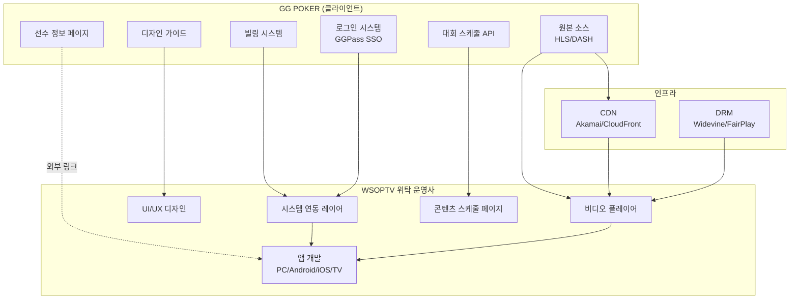
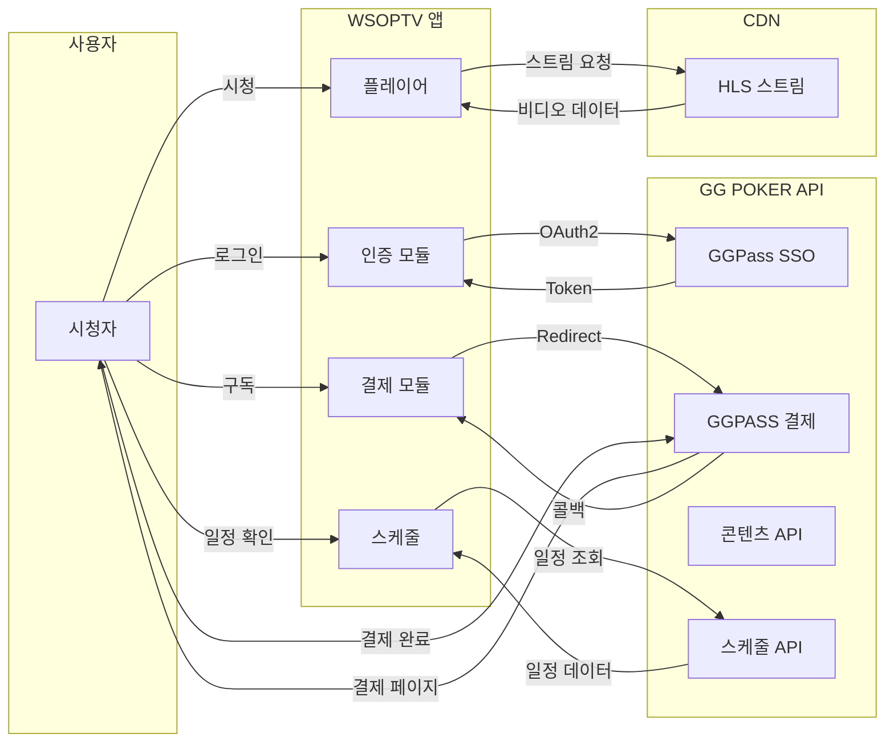
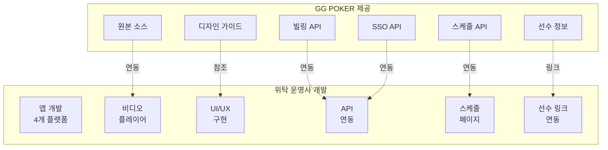

# PRD-0005: WSOP TV OTT 솔루션 RFP (Single-Stream MVP)

| 항목 | 값 |
|------|---|
| **Version** | 2.0 |
| **Status** | Draft |
| **Priority** | P0 |
| **Created** | 2026-01-08 |
| **Updated** | 2026-01-22 |
| **Author** | Claude Code |
| **Type** | RFP (Request for Proposal) |

---

## Executive Summary

WSOP(World Series of Poker) 공식 OTT 스트리밍 플랫폼 구축을 위한 위탁 운영사 제안 요청서(RFP)입니다. 본 문서는 GG POKER(클라이언트)와 위탁 운영사 간의 역할 분담, 기능 요구사항, 연동 인터페이스를 정의합니다.

> **참고**: 본 RFP는 **단일 스트리밍 MVP** 버전입니다. Multi-view 기능은 Phase 2 이후 검토 대상이며, MVP 범위에서 제외됩니다.
>
> **참조 문서**: [PRD-0002 MVP 스펙](PRD-0002-wsoptv-ott-platform-mvp.md), [REPORT-2026-01-21 멀티뷰 이슈 검토](../reports/REPORT-2026-01-21-multiview-production-issues.md)

### 프로젝트 개요

| 항목 | 내용 |
|------|------|
| **프로젝트명** | WSOP TV OTT 플랫폼 구축 (Single-Stream MVP) |
| **발주사** | GG POKER |
| **대상 플랫폼** | PC Web, Android, iOS, Samsung TV, LG TV |
| **제안 요청 범위** | 앱 개발, 플레이어 개발, UI 구현, 시스템 연동 |

### YouTube 대비 핵심 차별점

> **출처**: [STRAT-0001 시청자 경험 비전](../strategies/STRAT-0001-viewer-experience-vision.md)

| # | 차별점 | YouTube | WSOPTV |
|:-:|--------|---------|--------|
| 1 | **Timeshift** | 뒤로 가기 불가 | 라이브 중 되감기 지원 |
| 2 | **아카이브** | 종료 시 비공개 | 영구 보존 + VOD 전환 |
| 3 | **StatsView** (MVP) | 없음 | GGPoker HUD 연동 |
| 4 | **검색** (Phase 2) | 없음 | 핸드/선수 기반 정밀 검색 |

> **참고**: Multi-view는 Phase 2 이후 별도 검토 (프로덕션 워크플로우 변경 필요)

---

## 1. 역할 분담 (Responsibility Matrix)

### 1.1 GG POKER (클라이언트) 제공 항목

GG POKER는 다음 항목을 위탁 운영사에 제공합니다:

| # | 제공 항목 | 설명 | 제공 형식 |
|:-:|----------|------|----------|
| 1 | **디자인 가이드** | 브랜드 가이드라인, UI 컴포넌트 스펙 | 문서/Figma |
| 2 | **빌링 시스템** | 결제/구독 API 엔드포인트 | REST API |
| 3 | **로그인 시스템** | GGPass SSO OAuth2 연동 API | OAuth2 스펙 |
| 4 | **원본 소스** | VOD/라이브 콘텐츠 스트림 소스 | HLS/DASH URL |
| 5 | **대회 스케줄 정보** | 대회 일정 API 또는 데이터 피드 | REST API |
| 6 | **선수 정보 페이지** | WSOP.com 선수 프로필 링크 | URL |

### 1.2 위탁 운영사 개발 범위

위탁 운영사는 다음 항목을 개발합니다:

| # | 개발 항목 | 플랫폼 | 설명 |
|:-:|----------|--------|------|
| 1 | **WSOPTV 앱 개발** | PC/Android/iOS/TV | 크로스 플랫폼 OTT 앱 |
| 2 | **비디오 플레이어 개발** | 공통 | 커스텀 플레이어 개발 |
| 3 | **디자인 개발** | 공통 | GG POKER 가이드 기반 UI 구현 |
| 4 | **빌링 시스템 연동** | 공통 | GG POKER 빌링 API 통합 |
| 5 | **로그인 시스템 연동** | 공통 | GGPass SSO 통합 |
| 6 | **원본 소스 연동** | 공통 | 콘텐츠 스트림 파이프라인 |
| 7 | **콘텐츠 스케줄 페이지** | 공통 | 대회 스케줄 표시 페이지 개발 |
| 8 | **선수 정보 링크 연동** | 공통 | 외부 페이지 연동 |

---

## 2. 시스템 아키텍처

### 2.1 전체 시스템 연동 구조



### 2.2 데이터 흐름도



### 2.3 역할 분담 매트릭스



---

## 3. 기능 요구사항

### 3.1 플랫폼별 필수 기능 (Single-Stream MVP)

| 플랫폼 | 라이브 | VOD | Timeshift | StatsView | 자막 | DRM | 비고 |
|--------|:------:|:---:|:---------:|:---------:|:----:|:---:|------|
| **PC Web** | O | O | O | O | O | O | 브라우저 DRM 지원 필수 |
| **Android** | O | O | O | O | O | O | - |
| **iOS** | O | O | O | O | O | O | - |
| **Samsung TV** | O | O | O | X | O | O | StatsView 미지원 (리모컨 UX 제약) |
| **LG TV** | O | O | O | X | O | O | StatsView 미지원 (리모컨 UX 제약) |

> **참고**: Multi-view는 MVP 범위에서 제외됩니다. (Phase 2 이후 별도 검토)

### 3.2 핵심 기능 상세

#### 3.2.1 라이브 스트리밍
| 요구사항 | 상세 |
|----------|------|
| 화질 | 1080p Full HD |
| 프로토콜 | HLS 기반 |
| 동시접속 | 50만 사용자 대응 |

> **참고**: 지연 처리는 프로덕션 방송에서 담당. TV 솔루션은 받는대로 즉시 송출.

#### 3.2.2 VOD & Quick VOD
| 요구사항 | 상세 |
|----------|------|
| Quick VOD | 라이브 → VOD 즉시 전환 |
| 이어보기 | 시청 이력 및 이어보기 지원 |
| 챕터 | 구간 탐색 지원 |
| 다운로드 | 오프라인 시청 지원 |

#### 3.2.3 Timeshift (YouTube 대비 핵심 차별화)

> **출처**: [STRAT-0001](../strategies/STRAT-0001-viewer-experience-vision.md) - YouTube 대비 차별점 #1

| 플랫폼 | DVR (Timeshift) | 라이브 종료 후 | 차별화 |
|--------|:---------------:|:-------------:|--------|
| **YouTube** | 비활성화 | 비공개 전환 | 맛보기 역할 |
| **WSOP TV** | **활성화** | **VOD로 보존** | 본 서비스 |

| 요구사항 | 상세 |
|----------|------|
| Timeshift | 라이브 중 되감기 지원 |
| Quick VOD | 라이브 종료 즉시 VOD 자동 전환 |
| Catchup TV | 처음부터 재시청 지원 |

#### 3.2.4 StatsView (Plus+ 전용, Web/Mobile만)

> **참조**: [PRD-0006 Advanced Mode](PRD-0006-advanced-mode.md)

GGPoker HUD 연동 스타일의 통계 오버레이 기능:

| 요구사항 | 상세 |
|----------|------|
| 데이터 소스 | GGPoker HUD DB 연동 |
| 표시 정보 | VPIP, PFR, 3-Bet%, AF, Flop CB%, 칩 카운트 |
| UI | HUD ON/OFF 토글 지원 |
| 플랫폼 | PC Web, Android, iOS (TV 미지원 - 리모컨 UX 제약) |

> **참고**: Multi-view 기능은 MVP에서 제외. [REPORT-2026-01-21](../reports/REPORT-2026-01-21-multiview-production-issues.md)에서 프로덕션 워크플로우 이슈로 Phase 2 이후 검토 권장.

#### 3.2.5 자막
| 요구사항 | 상세 |
|----------|------|
| 언어 | 20개국 자막 지원 |
| 기준 언어 | 영어 기반 번역 |
| 우선순위 | VOD 자막 우선 지원 |
| 라이브 자막 | 인력 투입 필요 |

### 3.3 구독 모델

> **참조**: [PRD-0002](PRD-0002-wsoptv-ott-platform-mvp.md), [STRAT-0001](../strategies/STRAT-0001-viewer-experience-vision.md)

| 티어 | 가격 | 명칭 | 주요 기능 |
|------|------|------|----------|
| Basic | $10/월 | **WSOP Plus** | 라이브, VOD, Timeshift, 자막 |
| Premium | $50/월 | **WSOP Plus+** | Plus 기능 + StatsView (HUD 연동) |

> **참고**: Exclusive Content (behind-the-scenes)는 별도 제작하지 않음 → StatsView가 Plus+의 유일한 차별화 포인트 (MVP 기준)

### 3.4 비기능 요구사항

#### 3.4.1 성능
| 항목 | 목표치 |
|------|-------|
| 동시접속 | 50만 사용자 |
| 초기 버퍼링 | < 3초 |
| 재버퍼링 비율 | < 1% |

#### 3.4.2 보안
| 항목 | 요구사항 |
|------|---------|
| DRM | Widevine, FairPlay, PlayReady |
| VPN 감지 | 80-90% 정확도 |
| 블랙아웃 | 국가별 지원 |

#### 3.4.3 가용성
| 항목 | 목표치 |
|------|-------|
| SLA | 99.9% |
| CDN | 멀티 CDN 구성 권장 |

---

## 4. 연동 인터페이스

### 4.1 GG POKER 제공 API

| 연동 항목 | 제공 형식 | 위탁사 구현 |
|----------|----------|------------|
| **빌링** | REST API 엔드포인트 | API 클라이언트 구현 |
| **로그인** | OAuth2 SSO 스펙 | SSO 연동 모듈 개발 |
| **콘텐츠** | HLS/DASH 스트림 URL | 플레이어 연동 |
| **스케줄** | REST API | 스케줄 표시 UI 개발 |
| **선수 정보** | 외부 URL | 링크 연동 |

### 4.2 연동 상세

#### 4.2.1 GGPass SSO 연동
```
인증 플로우: OAuth2 Authorization Code Flow
- Authorization Endpoint: GG POKER 제공
- Token Endpoint: GG POKER 제공
- User Info Endpoint: GG POKER 제공
```

#### 4.2.2 결제 시스템 연동 (GGPASS)

##### 결제 처리 방식
| 항목 | 내용 |
|------|------|
| 결제 모듈 | GGPASS 하위 결제 모듈 사용 |
| 연동 방식 | 별도 결제 페이지 호출 (Redirect) |
| 인증 연계 | GGPass SSO 로그인 세션 활용 |

##### 결제 플로우
```
1. 사용자 → WSOPTV 앱에서 구독 버튼 클릭
2. WSOPTV → GGPASS 결제 페이지로 Redirect
3. 사용자 → GGPASS에서 결제 완료
4. GGPASS → WSOPTV로 결제 결과 콜백
5. WSOPTV → 구독 상태 업데이트
```

##### API 기능
```
- 구독 상태 조회
- 결제 결과 콜백 수신 (웹훅)
- 구독 플랜 조회
```

#### 4.2.3 콘텐츠 소스 연동
```
스트림 형식: HLS (.m3u8) / DASH (.mpd)
DRM: Widevine, FairPlay, PlayReady 라이선스 서버 제공
```

#### 4.2.4 스케줄 API 연동
```
데이터 형식: JSON
갱신 주기: 실시간 또는 5분 캐시
```

---

## 5. 제안 요청 항목

제안사는 다음 항목을 제안서에 포함해야 합니다:

### 5.1 기술 제안

| 제안 항목 | 검토 기준 |
|----------|----------|
| 아키텍처 설계 | 확장성, 안정성, 유지보수성 |
| 기술 스택 선정 근거 | 적합성, 최신성, 생태계 |
| 성능 목표 및 달성 방안 | 동시접속 50만 대응 |
| 보안 설계 | DRM, 인증, 데이터 보호 |
| 인프라 구성 | CDN, 서버, 모니터링 |

### 5.2 산출물 제안

| 제안 항목 | 검토 기준 |
|----------|----------|
| 개발 산출물 목록 | 완성도, 인수 가능성 |
| 문서화 범위 | 운영 인계 충분성 |
| 테스트 계획 | 품질 보증 방안 |
| 운영 인수인계 계획 | 지식 전달 충분성 |

### 5.3 일정 제안

| 제안 항목 | 검토 기준 |
|----------|----------|
| 마일스톤 정의 | 명확성, 측정 가능성 |
| 상세 일정 | 현실성 |
| 리스크 관리 계획 | 대응 방안 적절성 |

### 5.4 비용 제안

| 제안 항목 | 검토 기준 |
|----------|----------|
| 세부 비용 내역 | 적정성, 투명성 |
| 비용 산정 근거 | 합리성 |
| 추가 비용 발생 조건 | 명확성 |

---

## 6. 제안서 평가 기준

| 평가 항목 | 배점 |
|----------|:----:|
| 기술 역량 및 아키텍처 | 30% |
| 유사 프로젝트 경험 | 20% |
| 개발 일정 및 리소스 | 20% |
| 비용 적정성 | 20% |
| 유지보수 및 지원 계획 | 10% |

---

## 7. 제안 일정

| 단계 | 내용 | 비고 |
|------|------|------|
| RFP 배포 | 제안 요청서 전달 | - |
| 질의응답 | 제안사 질의 접수 | 서면 질의 |
| 제안서 제출 | 제안서 마감 | - |
| 기술 평가 | 제안서 검토 | - |
| PT 발표 | 제안 발표 | 필요 시 |
| 우선협상대상 선정 | 최종 업체 선정 | - |
| 계약 체결 | 계약 완료 | - |

---

## 8. 콘텐츠 소싱 전략

> **상세**: [STRAT-0007 Content Sourcing](../strategies/STRAT-0007-content-sourcing.md)

### 8.1 콘텐츠 3단계 구조

| 소스 | 수량 | 특징 | 독점 기간 |
|------|------|------|----------|
| ESPN | 10개/년 | 1년 후 WSOPTV 유입 | 1년 |
| PokerGO | 10개/년 | 계약에 따라 유입 | 계약 기간 |
| WSOP 직접 | 30개/년 | YouTube + WSOPTV 동시 중계 | 없음 |

### 8.2 YouTube 동시 송출 전략

| 설정 | WSOP TV | YouTube |
|------|---------|---------|
| DVR (Timeshift) | 활성화 | 비활성화 |
| 종료 후 | VOD 영구 보존 | 비공개 전환 |
| 역할 | 본 서비스 | 맛보기/유입 채널 |

### 8.3 아카이브 전략

- **범위**: 1973년~현재 (50년+ 콘텐츠)
- **우선순위**: Main Event > High Roller > 주요 Bracelet
- **검색**: Elasticsearch 기반 전문 검색 (대회명, 년도, 플레이어 등)

---

## 9. 기타 사항

### 9.1 제외 범위 (Out of Scope)

| 항목 | 사유 |
|------|------|
| **Multi-view** | Phase 2 이후 검토 (프로덕션 워크플로우 변경 필요) |
| **PlayerCAM** | Phase 2 이후 검토 (현장 장비/인력 추가 필요) |
| 4K 지원 | 장비/인프라 비용 과다 |
| Roku/Fire TV | Phase 2 이후 검토 |
| VLM (비디오 AI 분석) | 고비용, 별도 업체 필요 |
| 뉴스 섹션 | 불필요 |
| 전적/플레이어 상세 | WSOP.com 링크 연결로 대체 |
| 티켓팅 | 온라인 구독만 |

> **참고**: Multi-view 제외 근거는 [REPORT-2026-01-21](../reports/REPORT-2026-01-21-multiview-production-issues.md) 참조

### 9.2 참고 문서

| 문서 | 설명 |
|------|------|
| [PRD-0002](PRD-0002-wsoptv-ott-platform-mvp.md) | WSOPTV OTT Platform MVP |
| [PRD-0006](PRD-0006-advanced-mode.md) | Advanced Mode 상세 (Phase 2 참조용) |
| [STRAT-0001](../strategies/STRAT-0001-viewer-experience-vision.md) | 시청자 경험 비전 |
| [STRAT-0007](../strategies/STRAT-0007-content-sourcing.md) | 콘텐츠 소싱 전략 |
| [REPORT-2026-01-21](../reports/REPORT-2026-01-21-multiview-production-issues.md) | 멀티뷰 이슈 검토 |

---

## Revision History

| 버전 | 날짜 | 작성자 | 내용 |
|------|------|--------|------|
| 1.0 | 2026-01-08 | Claude Code | 최초 작성 |
| 1.1 | 2026-01-09 | Claude Code | 멀티 비디오 플레이어 기능 확장, GGPASS 결제 연동 상세화 |
| **2.0** | **2026-01-22** | **Claude Code** | **Single-Stream MVP로 전면 개정**: Multi-view 제외 (Phase 2), YouTube 대비 차별점 반영 (Timeshift, 아카이브), StatsView 추가, 콘텐츠 소싱 전략 반영, REPORT-2026-01-21 멀티뷰 이슈 검토 결과 반영 |
