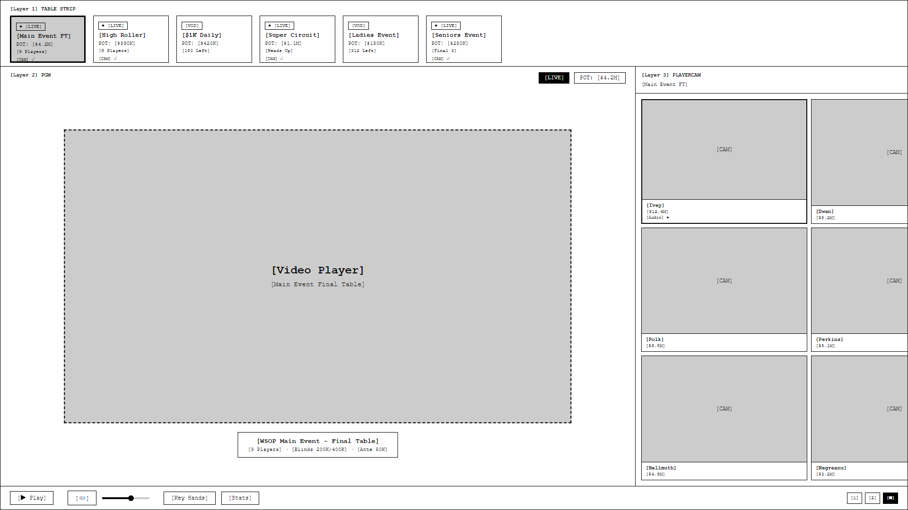

# PRD-0006: WSOPTV Advanced Mode - 3계층 구조

| 항목 | 값 |
|------|---|
| **Version** | 4.0 |
| **Status** | Draft |
| **Priority** | P0 |
| **Created** | 2026-01-15 |
| **Updated** | 2026-01-21 |
| **Author** | Claude Code |

---

## Executive Summary

WSOP TV의 프리미엄 시청 경험을 제공하는 **Advanced Mode** 기능 정의. Plus+ ($50) 구독자 전용으로 **3계층 구조**의 멀티 스크린 경험을 제공합니다.

### 3계층 구조 개요

```
┌─────────────────────────────────────────────────────────────────────┐
│  Layer 1: Table Strip (상단)                                         │
│           └── 방송 테이블 리스트 (가로 스크롤)                         │
├─────────────────────────────────────────────────────────────────────┤
│  Layer 2: PGM (메인 영역)                                            │
│           └── 선택한 테이블의 메인 PGM 화면                           │
├─────────────────────────────────────────────────────────────────────┤
│  Layer 3: PlayerCAM (우측)                                           │
│           └── 선택한 테이블의 플레이어별 직캠                          │
└─────────────────────────────────────────────────────────────────────┘
```

### 핵심 목표

| 목표 | 설명 |
|------|------|
| **테이블 간 빠른 전환** | 상단 Strip으로 방송 중인 테이블 즉시 선택 |
| **플레이어 집중 시청** | 우측 PlayerCAM으로 특정 선수에 집중 |
| **단순한 UX** | 3계층의 명확한 구조로 직관적 인터페이스 |

---

## 용어 정의

| 용어 | 정의 | Layer |
|------|------|:-----:|
| **Table Strip** | 상단 방송 테이블 리스트 | L1 |
| **PGM** | 선택한 테이블의 메인 방송 화면 | L2 |
| **PlayerCAM** | 테이블 내 플레이어별 개별 직캠 | L3 |

---

## 3계층 상세 설계

### 전체 레이아웃

```
┌─────────────────────────────────────────────────────────────────────────────┐
│  [Layer 1] TABLE STRIP                                                       │
│  ┌────────┐ ┌────────┐ ┌────────┐ ┌────────┐ ┌────────┐                     │
│  │● Main  │ │● High  │ │  $1K   │ │● Super │ │ Ladies │  ◀─ 테이블 선택     │
│  │ Event  │ │ Roller │ │ Daily  │ │Circuit │ │ Event  │                     │
│  │ FT     │ │ FT     │ │ Day2   │ │ HU     │ │ Day1   │                     │
│  │$4.2M   │ │$890K   │ │$420K   │ │$1.1M   │ │$180K   │                     │
│  └────────┘ └────────┘ └────────┘ └────────┘ └────────┘                     │
├─────────────────────────────────────────────────────────────────────────────┤
│                                                                              │
│  ┌─────────────────────────────────────────────────┐ ┌────────────────────┐ │
│  │                                                 │ │ [Layer 3]          │ │
│  │                                                 │ │ PLAYERCAM          │ │
│  │               [Layer 2] PGM                     │ │                    │ │
│  │            Main Event Final Table               │ │ ┌──────┐ ┌──────┐ │ │
│  │                                                 │ │ │[CAM] │ │[CAM] │ │ │
│  │                                                 │ │ │Ivey  │ │Dwan  │ │ │
│  │               [Video Player]                    │ │ └──────┘ └──────┘ │ │
│  │                                                 │ │ ┌──────┐ ┌──────┐ │ │
│  │                                                 │ │ │[CAM] │ │[CAM] │ │ │
│  │                                                 │ │ │Polk  │ │Perkins││ │
│  │                                                 │ │ └──────┘ └──────┘ │ │
│  │                                                 │ │ ┌──────┐ ┌──────┐ │ │
│  │                                                 │ │ │[CAM] │ │[CAM] │ │ │
│  │                                                 │ │ │Hellmuth│Negreanu│ │
│  │                                                 │ │ └──────┘ └──────┘ │ │
│  └─────────────────────────────────────────────────┘ └────────────────────┘ │
├─────────────────────────────────────────────────────────────────────────────┤
│  [Controls] ▶ Pause  |  Volume  |  [Key Hands] [Stats]     [1] [2] [4]     │
└─────────────────────────────────────────────────────────────────────────────┘
```

---

### Layer 1: Table Strip (상단)

#### 개념

**최상단에 고정된 가로 스크롤 바**로, 현재 방송 중인 모든 테이블을 표시합니다.

#### 와이어프레임

```
┌─────────────────────────────────────────────────────────────────────────────┐
│ ┌──────────┐ ┌──────────┐ ┌──────────┐ ┌──────────┐ ┌──────────┐ ─────────▶│
│ │● [Live]  │ │● [Live]  │ │  [VOD]   │ │● [Live]  │ │  [VOD]   │           │
│ │          │ │          │ │          │ │          │ │          │           │
│ │ Main     │ │ High     │ │ $1K      │ │ Super    │ │ Ladies   │           │
│ │ Event FT │ │ Roller   │ │ Daily    │ │ Circuit  │ │ Event    │           │
│ │          │ │          │ │          │ │          │ │          │           │
│ │ POT:     │ │ POT:     │ │ POT:     │ │ POT:     │ │ POT:     │           │
│ │ $4.2M    │ │ $890K    │ │ $420K    │ │ $1.1M    │ │ $180K    │           │
│ │          │ │          │ │          │ │          │ │          │           │
│ │ 9 Players│ │ 6 Players│ │ 180 Left │ │ Heads Up │ │ 312 Left │           │
│ └──────────┘ └──────────┘ └──────────┘ └──────────┘ └──────────┘           │
│   [Selected]                                                                │
└─────────────────────────────────────────────────────────────────────────────┘
```

#### 기능 요구사항

| ID | 요구사항 | 설명 | 우선순위 |
|----|---------|------|:--------:|
| TS-1.1 | 테이블 목록 표시 | 방송 중인 테이블 가로 스크롤 | P0 |
| TS-1.2 | Live/VOD 구분 | 라이브 배지 표시 | P0 |
| TS-1.3 | POT 크기 표시 | 각 테이블 현재 팟 | P0 |
| TS-1.4 | 진행 상태 | 플레이어 수 또는 진행 단계 | P1 |
| TS-1.5 | 클릭 전환 | 테이블 클릭 시 PGM 전환 | P0 |
| TS-1.6 | CAM 지원 표시 | PlayerCAM 가능 테이블 표시 | P1 |

---

### Layer 2: PGM (메인 화면)

#### 개념

**메인 영역에 표시되는 방송 화면**으로, Table Strip에서 선택한 테이블의 PGM입니다.

#### 와이어프레임

```
┌─────────────────────────────────────────────────────────────────────────────┐
│                                                                              │
│                                                           ┌──────┐ ┌──────┐│
│                                                           │[LIVE]│ │POT:  ││
│                                                           │      │ │$4.2M ││
│                                                           └──────┘ └──────┘│
│                                                                              │
│                                                                              │
│                         [Video Player Area]                                  │
│                                                                              │
│                         Main Event Final Table                               │
│                         9 Players · Blinds 200K/400K                         │
│                                                                              │
│                                                                              │
│                                                                              │
│                                                                              │
│ ┌──────────────────────────────────────────────────────────────────────────┐│
│ │ WSOP Main Event - Final Table                                            ││
│ │ 9 Players · Blinds 200K/400K · Ante 50K                                  ││
│ └──────────────────────────────────────────────────────────────────────────┘│
└─────────────────────────────────────────────────────────────────────────────┘
```

#### 기능 요구사항

| ID | 요구사항 | 설명 | 우선순위 |
|----|---------|------|:--------:|
| PGM-1.1 | 메인 비디오 표시 | 선택 테이블 방송 | P0 |
| PGM-1.2 | LIVE 배지 | 라이브 상태 표시 | P0 |
| PGM-1.3 | POT 오버레이 | 현재 팟 크기 | P0 |
| PGM-1.4 | 테이블 정보 | 이름, 플레이어 수, 블라인드 | P1 |
| PGM-1.5 | 풀스크린 전환 | 더블클릭 시 풀스크린 | P1 |

---

### Layer 3: PlayerCAM (우측)

#### 개념

**우측에 배치된 플레이어별 직캠 그리드**로, 선택한 테이블의 각 플레이어를 개별적으로 볼 수 있습니다.

#### 와이어프레임

```
┌────────────────────────┐
│ PLAYERCAM              │
│ Main Event FT          │
├────────────────────────┤
│ ┌─────────┐ ┌─────────┐│
│ │ [CAM]   │ │ [CAM]   ││
│ │         │ │         ││
│ │ Ivey    │ │ Dwan    ││
│ │ $12.4M  │ │ $8.2M   ││
│ │ 🔊      │ │         ││
│ └─────────┘ └─────────┘│
│ ┌─────────┐ ┌─────────┐│
│ │ [CAM]   │ │ [CAM]   ││
│ │         │ │         ││
│ │ Polk    │ │ Perkins ││
│ │ $6.8M   │ │ $5.1M   ││
│ └─────────┘ └─────────┘│
│ ┌─────────┐ ┌─────────┐│
│ │ [CAM]   │ │ [CAM]   ││
│ │         │ │         ││
│ │ Hellmuth│ │ Negreanu││
│ │ $4.5M   │ │ $3.2M   ││
│ └─────────┘ └─────────┘│
├────────────────────────┤
│ CAM 미지원 테이블 선택  │
│ 시 비활성화 안내 표시   │
└────────────────────────┘
```

#### 기능 요구사항

| ID | 요구사항 | 설명 | 우선순위 |
|----|---------|------|:--------:|
| PC-1.1 | PlayerCAM 그리드 | 플레이어별 직캠 2열 배치 | P1 |
| PC-1.2 | 플레이어 이름 | 각 캠에 이름 표시 | P1 |
| PC-1.3 | 칩 카운트 | 현재 스택 크기 | P1 |
| PC-1.4 | 오디오 선택 | 한 플레이어만 오디오 | P1 |
| PC-1.5 | 클릭 확대 | 선택 캠 PGM으로 확대 | P2 |
| PC-1.6 | 비활성 안내 | CAM 미지원 시 메시지 | P1 |

---

## 인터랙션 시나리오

### 시나리오 1: 테이블 전환

```
1. 사용자가 Table Strip에서 "High Roller" 클릭
2. PGM이 High Roller 방송으로 전환
3. PlayerCAM이 High Roller 플레이어들로 업데이트
```

### 시나리오 2: PlayerCAM 확대

```
1. 사용자가 PlayerCAM에서 "Phil Ivey" 클릭
2. Ivey 캠이 PGM 영역으로 확대
3. 기존 PGM은 Picture-in-Picture로 축소
4. 다시 클릭 시 원래 레이아웃으로 복귀
```

### 시나리오 3: CAM 미지원 테이블

```
1. Table Strip에서 "[VOD] $1K Daily" 선택
2. PGM이 해당 방송으로 전환
3. PlayerCAM 영역에 "PlayerCAM 미지원" 안내 표시
```

---

## 레이아웃 변형

### 모드 1: Standard (기본)

```
┌─────────────────────────────────────────────────────────────┐
│  [Table Strip]                                               │
├─────────────────────────────────────────────────────────────┤
│  ┌───────────────────────────────┐ ┌─────────────────────┐  │
│  │                               │ │                     │  │
│  │             PGM               │ │     PlayerCAM       │  │
│  │            (70%)              │ │       (30%)         │  │
│  │                               │ │                     │  │
│  └───────────────────────────────┘ └─────────────────────┘  │
└─────────────────────────────────────────────────────────────┘
```

### 모드 2: PlayerCAM Focus

```
┌─────────────────────────────────────────────────────────────┐
│  [Table Strip]                                               │
├─────────────────────────────────────────────────────────────┤
│  ┌───────────────────────────────────────────────────────┐  │
│  │                                                       │  │
│  │              Selected PlayerCAM (확대)                 │  │
│  │                                                       │  │
│  ├─────────────────────────────────────────────────────┤  │
│  │ [PGM] [Ivey] [Dwan] [Polk] [Perkins] [Hellmuth]      │  │
│  └───────────────────────────────────────────────────────┘  │
└─────────────────────────────────────────────────────────────┘
```

### 모드 3: Stats Overlay

```
┌─────────────────────────────────────────────────────────────┐
│  [Table Strip]                                               │
├─────────────────────────────────────────────────────────────┤
│  ┌───────────────────────────────┐ ┌─────────────────────┐  │
│  │                               │ │   Player Stats      │  │
│  │             PGM               │ ├─────────────────────┤  │
│  │     + HUD Overlay             │ │   VPIP: 28%         │  │
│  │                               │ │   PFR: 22%          │  │
│  │  [Ivey]  [Dwan]  [Polk]       │ │   3-Bet: 12%        │  │
│  │   VPIP    VPIP    VPIP        │ │   AF: 2.4           │  │
│  └───────────────────────────────┘ └─────────────────────┘  │
└─────────────────────────────────────────────────────────────┘
```

---

## PlayerCAM 지원 정책

### 지원 테이블 유형

| 테이블 유형 | CAM 지원 | 이유 |
|------------|:-------:|------|
| Main Event Final Table | ✅ | 핵심 콘텐츠 |
| High Roller Final Table | ✅ | 프리미엄 콘텐츠 |
| Super High Roller | ✅ | 스타 플레이어 집중 |
| 일반 Feature Table | ⚠️ | 선택적 지원 |
| Side Event | ❌ | 촬영 인프라 없음 |
| VOD | ❌ | 사전 편집 콘텐츠 |

### 지원 여부 표시

```
Table Strip에서 CAM 지원 테이블 표시:

┌──────────┐ ┌──────────┐ ┌──────────┐
│● Main    │ │● High    │ │  $1K     │
│ Event FT │ │ Roller   │ │ Daily    │
│ [CAM] ✓  │ │ [CAM] ✓  │ │          │  ← CAM 미표시 = 미지원
└──────────┘ └──────────┘ └──────────┘
```

---

## 컨트롤바 설계

```
┌─────────────────────────────────────────────────────────────────────────────┐
│  ▶  │  🔊 ──●───────  │  [Key Hands]  [Stats]  │  Layout: [1] [2] [■]      │
│     │                 │                         │                           │
│ Play│     Volume      │    Quick Actions        │   PlayerCAM Layout        │
└─────────────────────────────────────────────────────────────────────────────┘

Layout 옵션:
[1] = PlayerCAM 숨김 (PGM만)
[2] = 2열 PlayerCAM
[■] = 전체 그리드 (기본)
```

---

## 기술 요구사항

### 스트리밍 아키텍처

| 항목 | 권장 | 비고 |
|------|------|------|
| 구현 방식 | 서버 사이드 믹싱 | 30분 지연 활용 |
| 동기화 | SMPTE 타임코드 | ±500ms 허용 |
| 인코딩 | AWS IVS | F1 TV/NBA 검증 |

### 데이터 흐름

```
Table Strip 선택
       │
       ▼
┌─────────────────┐
│ PGM 스트림 로드  │
└────────┬────────┘
         │
         ▼
┌─────────────────┐    (CAM 지원 시)
│ PlayerCAM 로드   │◀──────────────────
└────────┬────────┘
         │
         ▼
┌─────────────────┐
│ 동기화 재생      │
└─────────────────┘
```

---

## Access Control

| 기능 | Plus ($10) | Plus+ ($50) |
|------|:----------:|:-----------:|
| Table Strip | ✅ | ✅ |
| PGM 시청 | ✅ | ✅ |
| PlayerCAM | ❌ | ✅ |
| Stats Overlay | ❌ | ✅ |
| Key Hands 점프 | ❌ | ✅ |

---

## UI 목업

### 3계층 Standard View (B&W Wireframe)



[HTML 원본](../mockups/PRD-0006/3layer-standard-bnw.html)

### 목업 목록

| # | 목업 | 파일명 | 상태 |
|:-:|------|--------|:----:|
| 1 | **3계층 Standard View (B&W)** | `3layer-standard-bnw.html` | **완료** |
| 2 | PlayerCAM Focus | `3layer-playercam-focus.html` | 대기 |
| 3 | Stats Overlay | `3layer-stats-overlay.html` | 대기 |
| 4 | CAM 미지원 상태 | `3layer-no-cam.html` | 대기 |

---

## References

- [ADR-0001 3계층 Multi-View 설계](../adrs/ADR-0001-multiview-3layer-rationale.md)
- [REPORT NBA TV 분석](../reports/REPORT-2026-01-19-nbatv-reference-analysis.md)
- [REPORT 프로덕션 이슈](../reports/REPORT-2026-01-21-multiview-production-issues.md)

---

## Revision History

| 버전 | 날짜 | 작성자 | 내용 |
|------|------|--------|------|
| 1.0 | 2026-01-15 | Claude Code | 최초 작성 |
| 2.0 | 2026-01-16 | Claude Code | 3계층 동적 구조 설계 |
| 3.0 | 2026-01-19 | Claude Code | NBA TV 매핑 적용 |
| **4.0** | **2026-01-21** | **Claude Code** | **3계층 구조 확정 (Table Strip + PGM + PlayerCAM)** |

---

*Created: 2026-01-15*
*Last Updated: 2026-01-21*
