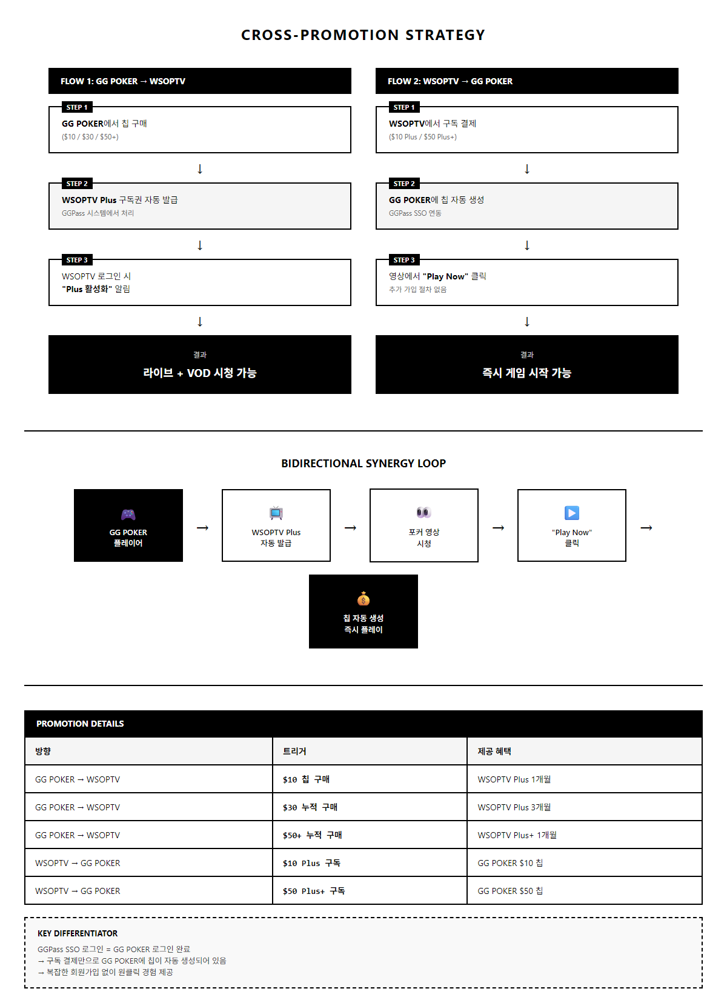

# PRD-0003: 상호 보완 프로모션 전략 (Cross-Promotion Strategy)

| 항목 | 값 |
|------|---|
| **Version** | 2.0 |
| **Status** | Proposal |
| **Priority** | P1 |
| **Created** | 2026-01-16 |
| **Last Modified** | 2026-01-16 |
| **Author** | Claude Code |
| **Related** | [PRD-0002 MVP](../prds/PRD-0002-wsoptv-ott-platform-mvp.md) |

---

## Executive Summary

WSOPTV와 GG POKER는 포커 생태계의 상보적(complementary) 서비스입니다. GGPass SSO 통합을 통해 양방향 자동 연계 구조를 구축하여, 플레이 ↔ 시청의 순환 고리를 만드는 **상호 보완 프로모션 전략**입니다.

**핵심 차별점**: 쿠팡플레이와 달리, GGPass SSO 로그인 = GG POKER 로그인이므로, 구독 결제만으로 GG POKER에 즉시 게임할 수 있는 칩이 자동 생성됩니다. 복잡한 회원가입 없이 원클릭 경험 제공.

### 전략 개요도

[HTML 원본](../mockups/STRAT-0003/cross-promotion-flow.html)

---

## 1. 개요

### 1.1 비즈니스 모델: 쿠팡플레이 참고

**쿠팡플레이 사례**:
- 쿠팡 로켓와우(결제 관문) → 쿠팡플레이(콘텐츠 구독권) 자동 제공
- 기존 e-commerce 고객 → 미디어 생태계 확장
- 결제 고객 재활용으로 CAC 절감

**WSOPTV 적용**:
- GG POKER(결제 관문) ↔ WSOPTV(구독권) 양방향 자동 연계
- 포커 플레이 생태계 ↔ 포커 시청 생태계 통합
- GGPass SSO로 구현 단순화 + 사용자 경험 극대화

---

## 2. 양방향 유입 흐름

### Flow 1: GG POKER → WSOPTV

**유입 흐름**: GG POKER 칩 구매 → WSOPTV Plus 구독권 자동 발급 → 다음 로그인 시 활성화 알림 → 라이브/VOD 시청

**구체적 프로모션**:
- $10 칩 구매 → WSOPTV Plus 1개월 자동 발급
- $30 누적 칩 구매 → WSOPTV Plus 3개월 발급
- $50+ 누적 칩 구매 → WSOPTV Plus+ 1개월 발급

**재가입 고객 유지**:
- GG POKER 월별 활성 유저(로그인 또는 거래 기록) → 매월 자동 WSOPTV 구독권 갱신

---

### Flow 2: WSOPTV → GG POKER

**유입 흐름**: 포커 영상 시청 → "Play Now" 클릭 → GGPass SSO (동일 계정) → GG POKER 접속 시 칩 이미 생성됨 → 즉시 게임 시작

**핵심 메커니즘**:
- WSOPTV $10 구독 → GG POKER에 $10 칩 자동 생성
- WSOPTV $50 구독 → GG POKER에 $50 칩 자동 생성
- GGPass SSO 로그인 = GG POKER 로그인 이미 완료
- GG POKER 접속 시 칩이 이미 계정에 있음

**전환 유도 UI**:
- 영상 내 "Play Now" 버튼 (플레이어 우측 하단)
- 플레이어 카드에 GG POKER 프로필 + 통계 + 직접 링크
- VOD 챕터별 "같은 상황 실습하기" 시뮬레이션 링크

---

## 3. 시너지 효과

### 3.1 양방향 순환 구조

**순환 고리**: GG POKER 플레이어 → WSOPTV Plus 자동 발급 → 포커 영상 시청 → "Play Now" 클릭 → GG POKER 칩 자동 생성 → 즉시 플레이 → 강화된 포커 생태계

### 3.2 사용자 세그먼트별 효과

| 세그먼트 | 효과 |
|---------|------|
| **GG POKER 기존 플레이어** | Plus 자동 발급 → 포커 관련 콘텐츠 시청 → 플레이 동기 강화 |
| **WSOPTV 신규 시청자** | "Play Now" 클릭 → 칩 자동 생성 → 즉시 게임 시작 가능 |
| **신규 포커 관심층** | WSOPTV 시청 → 플레이 관심 → GG POKER 자연스러운 진입 |
| **충성도 높은 사용자** | 플레이 + 시청 병행 → 이탈율 감소 → LTV 극대화 |

### 3.3 재정적 시너지

| 구분 | 효과 |
|------|------|
| **GG POKER** | 신규 플레이어 유입, 기존 플레이어 유지, CAC 절감 |
| **WSOPTV** | 신규 구독자 획득, 구독 유지율 향상, Plus+ 전환율 증가 |
| **통합** | 포커 생태계 강화, 고객 LTV 극대화, 경쟁 차별화 |

---

## 4. 결론

WSOPTV와 GG POKER의 상호 보완 프로모션 전략은:

1. **양방향 자동 연계**: 복잡한 수동 프로세스 없이 SSO 기반 완전 자동화
2. **즉시 게임 경험**: 구독 = 칩 자동 생성으로 추가 가입 절차 제거
3. **플레이-시청 순환**: 포커 팬의 자연스러운 오디언스 확대
4. **LTV 극대화**: 플레이 + 시청 병행으로 이탈율 극적 감소
5. **경쟁 차별화**: 통합 포커 생태계 = 포커 팬의 필수 서비스

**우선 구현**:
- Phase 1: GG POKER 결제 이벤트 감지 → WSOPTV Plus 자동 발급 (P0)
- Phase 2: WSOPTV 영상 내 "Play Now" UI + 플레이어 링크 (P1)
- Phase 3: 실시간 플레이어 상태 연동 심화 (P2)

---

## References

- [PRD-0002 WSOPTV OTT Platform MVP](../prds/PRD-0002-wsoptv-ott-platform-mvp.md)
- [STRAT-0010 Legal Compliance](STRAT-0010-legal-compliance.md) - **칩 자동 생성 국가별 규제 검토**
- [STRAT-0011 GGPass Integration](STRAT-0011-ggpass-integration-spec.md) - **GGPass/GGPoker API 스펙**
- Coupang Play Business Model (Reference Case Study)

---

## Revision History

| 버전 | 날짜 | 작성자 | 내용 |
|------|------|--------|------|
| 2.0 | 2026-01-16 | Claude Code | Flow 단순화 + 섹션 정리 (양방향 유입 핵심화) |
| 1.0 | 2026-01-16 | Claude Code | 최초 작성 |
